<p align="center">
  
</p>

<div align="center">

# <span style="color:red">**Universidad Peruana de Ciencias Aplicadas**</span>
## Carrera de Ingeniería de Software

Ciclo: 2024 - 1

Curso: Desarrollo de Aplicaciones Open Source

Sección: WX52

Profesor: Elio Jefferrson Navarrete Vilca

“Informe de Trabajo Final"

Startup: AgroTech

Producto: AgroConnect

Grupo: 1

|          Integrantes          |      Código      |
|:-----------------------------:|:-------------------:|
|   Delgado Corrales, Piero Gonzalo   |    U202210749    |
|  Lucas Coronel, Nadia Alessandra   |    U202120430    |
|   Paredes Puente, Sebastián Roberto  |    U202217239    |
|  Salinas Torres, Salvador Antonio   |    U20221B127    |
|   Valverde Mozo, Andre Gabriel   |    U202218899    |

Junio 2024

</div>


# Registro de versiones

<table>
  <thead>
    <tr>
        <th>Versión</th>
        <th>Fecha</th>
        <th>Autor</th>
        <th>Descripción de modificación</th>
    </tr>
  </thead>
  <tbody>
  <tr>
      <td><strong>TB1</strong></td>
      <td>Sábado 13 de Abril</td>
      <td>
        <ul>
          <li>Delgado Corrales, Piero Gonzalo</li>
          <li>Lucas Coronel, Nadia Alessandra</li>
          <li>Paredes Puente, Sebastián Roberto</li>
          <li>Salinas Torres, Salvador Antonio</li>
          <li>Valverde Mozo, Andre Gabriel</li>
        </ul>
      </td>
      <td>
        Se han incluído los siguientes capítulos:
        <ul>
          <li>Capítulo I: Introducción</li>
          <li>Capítulo II: Requirements Elicitation & Analysis</li>
          <li>Capítulo III: Requirements Specification</li>
          <li>Capítulo IV: Product Design</li>
          <li>Avance del Capítulo V: Product Implementation, Validation & Deployment hasta el punto 5.2.1.8</li>
          <li>Avance de Conclusiones, Bibliografía y Anexos</li>
        </ul>
      </td>
  </tr>
  <tr>
  <td><strong>TP1</strong></td>
      <td>Viernes 3 de Mayo</td>
      <td>
        <ul>
          <li>Delgado Corrales, Piero Gonzalo</li>
          <li>Lucas Coronel, Nadia Alessandra</li>
          <li>Paredes Puente, Sebastián Roberto</li>
          <li>Salinas Torres, Salvador Antonio</li>
          <li>Valverde Mozo, Andre Gabriel</li>
        </ul>
      </td>
      <td>
        <li>Correcciones levantadas.</li>
        <li>Avance del punto 5.2.2. Sprint 2.</li>
      </td>
  </tr>
  <tr>
    <td><strong>TB2</strong></td>
      <td>Domingo 9 de Junio</td>
      <td>
        <ul>
          <li>Delgado Corrales, Piero Gonzalo</li>
          <li>Lucas Coronel, Nadia Alessandra</li>
          <li>Paredes Puente, Sebastián Roberto</li>
          <li>Salinas Torres, Salvador Antonio</li>
          <li>Valverde Mozo, Andre Gabriel</li>
        </ul>
      </td>
      <td>
        <li>Correcciones levantadas.</li>
        <li>Desarrollo del Sprint 3</li>
        <li>Creación del Video About-The-Product</li>
        <li>Realización de entrevistas de validación</li>
        <li>Desarrollo de evaluación por heurísticas</li>
        <li>Avance de Conclusiones y Anexos</li>
        <li>Creación del Video About-The-Team</li>
      </td>
  </tr>
  <tr>
    <td><strong>TF</strong></td>
      <td>Martes 25 de Junio</td>
      <td>
        <ul>
          <li>Delgado Corrales, Piero Gonzalo</li>
          <li>Lucas Coronel, Nadia Alessandra</li>
          <li>Paredes Puente, Sebastián Roberto</li>
          <li>Salinas Torres, Salvador Antonio</li>
          <li>Valverde Mozo, Andre Gabriel</li>
        </ul>
      </td>
      <td>
        <li>Correcciones levantadas.</li>
        <li>Desarrollo del Sprint 4</li>
        <li>Mejora del Video About-The-Product</li>
        <li>Finalización de Conclusiones y Anexos</li>
      </td>
  </tr>
  </tbody>
</table>

# **Project Report Collaboration Insights**
URL Project Report (Github): https://github.com/AgroTech-UPC/Project-Report

Commits en el project report de la TB1:


Commits en el project report de la TP1:


Commits en el project report de la TB2:


Commits en el project report del TF:

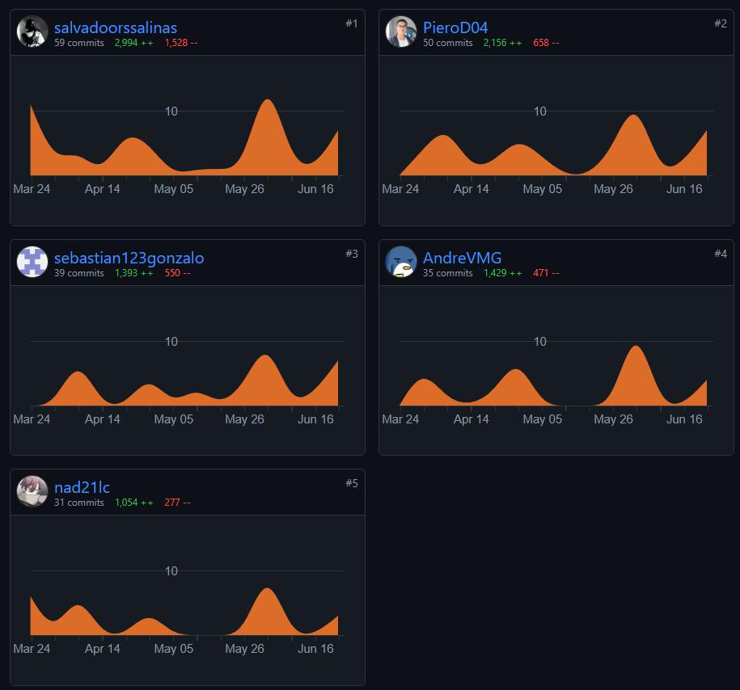


# **Tabla de Contenido**

[Registro de Versiones](#registro-de-versiones)

[Student Outcome](#student-outcome)

[Capítulo I: Introducción](#Capítulo-I-Introducción)
  - [1.1. Startup Profile](#11-startup-profile)
    - [1.1.1. Descripción de la Startup](#111-descripción-de-la-startup)
    - [1.1.2. Perfiles de integrantes del equipo](#112-perfiles-de-integrantes-del-equipo)
  - [1.2. Solution Profile](#12-solution-profile)
    - [1.2.1. Antecedentes y problemática](#121-antecedentes-y-problemática)
    - [1.2.2. Lean UX Process](#122-lean-ux-process)
      - [1.2.2.1. Lean UX Problem Statements](#1221-lean-ux-problem-statements)
      - [1.2.2.2. Lean UX Assumptions](#1222-lean-ux-assumptions)
      - [1.2.2.3. Lean UX Hypothesis Statements](#1223-lean-ux-hypothesis-statements)
      - [1.2.2.4. Lean UX Canvas](#1224-lean-ux-canvas)
  - [1.3. Segmentos objetivo](#13-segmentos-objetivo)

[Capítulo II: Requirements Elicitation & Analysis](#Capítulo-II-Requirements-Elicitation--Analysis)
  - [2.1. Competidores](#21-competidores)
    - [2.1.1. Análisis competitivo](#211-análisis-competitivo)
    - [2.1.2. Estrategias y tácticas frente a competidores](#212-estrategias-y-tácticas-frente-a-competidores)
  - [2.2. Entrevistas](#22-entrevistas)
    - [2.2.1. Diseño de entrevistas](#221-diseño-de-entrevistas)
    - [2.2.2. Registro de entrevistas](#222-registro-de-entrevistas)
    - [2.2.3. Análisis de entrevistas](#223-análisis-de-entrevistas)
  - [2.3. Needfinding](#23-needfinding)
    - [2.3.1. User Personas](#231-user-personas)
    - [2.3.2. User Task Matrix](#232-user-task-matrix)
    - [2.3.3. User Journey Mapping](#233-user-journey-mapping)
    - [2.3.4. Empathy Mapping](#234-empathy-mapping)
    - [2.3.5. As-is Scenario Mapping](#235-as-is-scenario-mapping)
  - [2.4. Ubiquitous Language](#24-ubiquitous-language)

[Capítulo III: Requirements Specification](#Capítulo-III-Requirements-Specification)
  - [3.1. To-Be Scenario Mapping](#31-to-be-scenario-mapping)
  - [3.2. User Stories](#32-user-stories)
  - [3.3. Impact Mapping](#33-impact-mapping)
  - [3.4. Product Backlog](#34-product-backlog)

[Capítulo IV: Product Design](#Capítulo-IV-Product-Design)
  - [4.1. Style Guidelines](#41-style-guidelines)
    - [4.1.1. General Style Guidelines](#411-general-style-guidelines)
    - [4.1.2. Web Style Guidelines](#412-web-style-guidelines)
  - [4.2. Information Architecture](#42-information-architecture)
    - [4.2.1. Organization Systems](#421-organization-systems)
    - [4.2.2. Labeling Systems](#422-labeling-systems)
    - [4.2.3. SEO Tags and Meta Tags](#423-seo-tags-and-meta-tags)
    - [4.2.4. Searching Systems](#424-searching-systems)
    - [4.2.5. Navigation Systems](#425-navigation-systems)
  - [4.3. Landing Page UI Design](#43-landing-page-ui-design)
    - [4.3.1. Landing Page Wireframe](#431-landing-page-wireframe)
    - [4.3.2. Landing Page Mock-up](#432-landing-page-mock-up)
  - [4.4. Web Applications UX/UI Design](#44-web-applications-uxui-design)
    - [4.4.1. Web Applications Wireframes](#441-web-applications-wireframes)
    - [4.4.2. Web Applications Wireflow Diagrams](#442-web-applications-wireflow-diagrams)
    - [4.4.3. Web Applications Mock-ups](#443-web-applications-mock-ups)
    - [4.4.4. Web Applications User Flow Diagrams](#444-web-applications-user-flow-diagrams)
  - [4.5. Web Applications Prototyping](#45-web-applications-prototyping)
  - [4.6. Domain-Driven Software Architecture](#46-domain-driven-software-architecture)
    - [4.6.1. Software Architecture Context Diagram](#461-software-architecture-context-diagram)
    - [4.6.2. Software Architecture Container Diagrams](#462-software-architecture-container-diagrams)
    - [4.6.3. Software Architecture Components Diagrams](#463-software-architecture-components-diagrams)
  - [4.7. Software Object-Oriented Design](#47-software-object-oriented-design)
    - [4.7.1. Class Diagrams](#471-class-diagrams)
    - [4.7.2. Class Dictionary](#472-class-dictionary)
  - [4.8. Database Design](#48-database-design)
    - [4.8.1. Database Diagram](#481-database-diagram)

[Capítulo V: Product Implementation, Validation & Deployment](#Capítulo-V-Product-Implementation-Validation--Deployment)
  - [5.1. Software Configuration Management](#51-software-configuration-management)
    - [5.1.1. Software Development Environment Configuration](#511-software-development-environment-configuration)
    - [5.1.2. Source Code Management](#512-source-code-management)
    - [5.1.3. Source Code Style Guide & Conventions](#513-source-code-style-guide--conventions)
    - [5.1.4. Software Deployment Configuration](#514-software-deployment-configuration)
  - [5.2. Landing Page, Services & Applications Implementation](#52-landing-page-services--applications-implementation)
    - [5.2.1. Sprint 1](#521-sprint-1)
      - [5.2.1.1. Sprint Planning 1](#5211-sprint-planning-1)
      - [5.2.1.2. Sprint Backlog 1](#5212-sprint-backlog-1)
      - [5.2.1.3. Development Evidence for Sprint Review](#5213-development-evidence-for-sprint-review)
      - [5.2.1.4. Testing Suite Evidence for Sprint Review](#5214-testing-suite-evidence-for-sprint-review)
      - [5.2.1.5. Execution Evidence for Sprint Review](#5215-execution-evidence-for-sprint-review)
      - [5.2.1.6. Services Documentation Evidence for Sprint Review](#5216-services-documentation-evidence-for-sprint-review)
      - [5.2.1.7. Software Deployment Evidence for Sprint Review](#5217-software-deployment-evidence-for-sprint-review)
      - [5.2.1.8. Team Collaboration Insights during Sprint](#5218-team-collaboration-insights-during-sprint)
    - [5.2.2. Sprint 2](#522-sprint-2)
      - [5.2.2.1. Sprint Planning 2](#5221-sprint-planning-2)
      - [5.2.2.2. Sprint Backlog 2](#5222-sprint-backlog-2)
      - [5.2.2.3. Development Evidence for Sprint Review](#5223-development-evidence-for-sprint-review)
      - [5.2.2.4. Testing Suite Evidence for Sprint Review](#5224-testing-suite-evidence-for-sprint-review)
      - [5.2.2.5. Execution Evidence for Sprint Review](#5225-execution-evidence-for-sprint-review)
      - [5.2.2.6. Services Documentation Evidence for Sprint Review](#5226-services-documentation-evidence-for-sprint-review)
      - [5.2.2.7. Software Deployment Evidence for Sprint Review](#5227-software-deployment-evidence-for-sprint-review)
      - [5.2.2.8. Team Collaboration Insights during Sprint](#5228-team-collaboration-insights-during-sprint)
    - [5.2.3. Sprint 3](#523-sprint-3)
      - [5.2.3.1. Sprint Planning 3](#5231-sprint-planning-3)
      - [5.2.3.2. Sprint Backlog 3](#5232-sprint-backlog-3)
      - [5.2.3.3. Development Evidence for Sprint Review](#5233-development-evidence-for-sprint-review)
      - [5.2.3.4. Testing Suite Evidence for Sprint Review](#5234-testing-suite-evidence-for-sprint-review)
      - [5.2.3.5. Execution Evidence for Sprint Review](#5235-execution-evidence-for-sprint-review)
      - [5.2.3.6. Services Documentation Evidence for Sprint Review](#5236-services-documentation-evidence-for-sprint-review)
      - [5.2.3.7. Software Deployment Evidence for Sprint Review](#5237-software-deployment-evidence-for-sprint-review)
      - [5.2.3.8. Team Collaboration Insights during Sprint](#5238-team-collaboration-insights-during-sprint)
    - [5.2.4. Sprint 4](#524-sprint-4)
      - [5.2.4.1. Sprint Planning 4](#5241-sprint-planning-4)
      - [5.2.4.2. Sprint Backlog 4](#5242-sprint-backlog-4)
      - [5.2.4.3. Development Evidence for Sprint Review](#5243-development-evidence-for-sprint-review)
      - [5.2.4.4. Testing Suite Evidence for Sprint Review](#5244-testing-suite-evidence-for-sprint-review)
      - [5.2.4.5. Execution Evidence for Sprint Review](#5245-execution-evidence-for-sprint-review)
      - [5.2.4.6. Services Documentation Evidence for Sprint Review](#5246-services-documentation-evidence-for-sprint-review)
      - [5.2.4.7. Software Deployment Evidence for Sprint Review](#5247-software-deployment-evidence-for-sprint-review)
      - [5.2.4.8. Team Collaboration Insights during Sprint](#5248-team-collaboration-insights-during-sprint)
  - [5.3. Validation Interviews](#53-validation-interviews)
    - [5.3.1. Diseño de Entrevistas](#531-diseño-de-entrevistas)
    - [5.3.2. Registro de Entrevistas](#532-registro-de-entrevistas)
    - [5.3.3. Evaluaciones según heurísticas](#533-evaluaciones-según-heurísticas)
  - [5.4. Video About-the-Product](#54-video-about-the-product)

[Conclusiones](#conclusiones)
  - [Conclusiones y recomendaciones](#conclusiones-y-recomendaciones)
  - [Video About-the-Team](#video-about-the-team)

[Bibliografía](#bibliografía)

[Anexos](#anexos)


# Student Outcome

ABET – EAC - Student Outcome 3

Criterio: Capacidad de comunicarse efectivamente con un rango de audiencias

<table>
  <thead>
    <tr>
      <th><strong>Criterio específico</strong></th>
      <th><strong>Acciones realizadas</strong></th>
      <th><strong>Conclusiones</strong></th>
    </tr>
  </thead>
  <tbody>
    <tr>
      <td>Comunica oralmente sus ideas y/o resultados con objetividad a público de diferentes especialidades y niveles jerárquicos, en el marco del desarrollo de un proyecto en ingeniería.</td>
      <td>
        <p><strong>Delgado Corrales, Piero Gonzalo</strong></p>
        <p><strong>TB1:</strong></p>
        <p>En esta primera entrega, se desarrolló la idea de negocio. Para lograr esto, en lo personal tuve que realizar entrevista a un criador de cuyes para obtener mayores especificaciones sobre el problema a tratar. Del mismo modo, comunique oralmente las ideas del diseño de la aplicación web y de los diagramas de arquitectura de software mediante el proyecto.</p>
        <p><strong>TP1:</strong></p>
        <p>Para este entregable, se desarrolló el sprint 2 el cual se enfocó en el desarrollo del frontend. Dichos cambios se comunicaron oralmente mediante el video del proyecto. Además, realicé una entrevista a un asesor para tener una mayor información sobre el alcance de nuestro proyecto.</p>
        <p><strong>TB2:</strong></p>
        <p>Para esta entrega, se tuvo que validar los productos desarrollados. Para ello, entrevisté a un criador de cuyes y a un asesor para obtener su retroalimentación. Asimismo, comunique los nuevos cambios al proyecto mediante el video de exposición.</p>
        <p><strong>TF:</strong></p>
        <p>Para esta entrega, se implementó el bounded context de IAM al Backend con relación a las indicaciones del profesor. Del mismo modo, se implementó el uso de APIs externas para las videoconferencias y el almacenamiento de imágenes con relación a lo mencionado por los entrevistados de áreas de mejora como era el ingreso de datos. Finalmente, me comunique oralmente mediante el video de exposición mencionando los aspectos más relevantes del proyecto como fue el problema, los segmentos objetivos, los sprints desarrollados y las conclusiones.</p>
        <p><strong>Lucas Coronel, Nadia Alessandra</strong></p>
        <p><strong>TB1:</strong></p>
        <p>En esta entrega, me enfoqué en comunicar de manera clara y objetiva nuestras ideas y resultados relacionados con el diseño y desarrollo del producto al equipo. Enfatizé la importancia de un diseño intuitivo y atractivo para los usuarios, detallando cómo las guías de estilo y las historias de usuario contribuyeron a cumplir con los requisitos del proyecto. Esta comunicación efectiva garantizó que tanto el equipo de desarrollo como las partes interesadas comprendieran la relevancia de las decisiones de diseño y su impacto en el mercado.</p>
        <p><strong>TP1:</strong></p>
        <p>Durante este entregable, demostré mi habilidad para comunicar eficazmente los cambios realizados en el diseño de la landing page, asegurando que todas las partes interesadas entendieran la importancia de estas mejoras. Expliqué cómo estos cambios se alineaban con las mejores prácticas de diseño web y cómo contribuían a la coherencia visual y eficacia del proyecto. Además, detallé las tareas completadas en el segundo sprint, incluyendo el desarrollo del front-end, la implementación de la API y la integración con el backend, asegurando una comprensión clara del progreso del proyecto.</p>
        <p><strong>TB2:</strong></p>
        <p>En esta entrega, mejoré mi capacidad para comunicar de manera objetiva las mejoras realizadas en el frontend de la aplicación web y el trabajo en el bounded context de management en el backend. Se explicó detalladamente el cómo estas mejoras permitieron gestionar la información de recursos, gastos, jaulas y animales de manera más eficiente. Además, compartí las valiosas sugerencias obtenidas de las entrevistas de validación, demostrando mi habilidad para integrar feedback de diversos segmentos y mejorar el producto en futuros sprints.</p>
        <p><strong>TF:</strong></p>
        <p>En este entregable final, destaqué mi habilidad para comunicar oralmente las validaciones añadidas al bounded context y la documentación completada con Javadoc. Se incluyó una descripción detallada de cómo estas validaciones y documentación aseguraban una comprensión clara del código. Además, mostré cómo las mejoras en el video de presentación del producto y el diseño del frontend no solo hicieron el producto más funcional, sino también estéticamente agradable y fácil de usar. Esta comunicación efectiva garantizó que el público de diferentes especialidades y niveles jerárquicos comprendiera el valor y la usabilidad del producto final.</p>
        <p><strong>Paredes Puente, Sebastián Roberto</strong></p>
        <p><strong>TB1:</strong></p>
        <p>Se puso especial énfasis en el diseño y desarrollo del producto, concentrándose en la sección “Acerca de” de la landing page, user stories, user personas y scenario mapping. Esta labor fue esencial para asegurar que el producto final cumpliera efectivamente con las necesidades de los usuarios, al delimitar las user stories, y las exigencias del mercado. Además, se llevó a cabo una investigación inicial para conocer opiniones de algunos expertos en el tema, por ello se realizó entrevistas con personas clave de nuestros segmentos objetivo, lo que facilitó el trabajo en equipo y el avance del proyecto.</p>
        <p><strong>TP1:</strong></p>
        <p>Durante este entregable, nuestro enfoque se centró en mejorar el diseño de la landing page del proyecto, implementando ciertas mejoras como adicionar información y hacer que se vea visualmente más estético y llamativo. Además, se completaron con éxito las tareas asignadas durante el segundo sprint, que incluyeron el desarrollo del front-end y la implementación de la API. Para comunicar estos cambios, se realizaron un total de 9 entrevistas a nuestros segmentos objetivos, para obtener más información sobre el alcance del proyecto en una próxima entrega.</p>
        <p><strong>TB2:</strong></p>
        <p>En esta entrega, se validaron los productos desarrollados y se llevó a cabo el Sprint 3 del proyecto. Realizamos avances en el Frontend y Backend, y llevé a cabo entrevistas de validación con un criador de cuyes y un asesor para obtener sus opiniones. Durante estas entrevistas, expliqué el trabajo realizado en la aplicación y obtuvimos valiosa retroalimentación de nuestros segmentos objetivo para seguir mejorando. </p>
        <p><strong>TF:</strong></p>
        <p>Para esta entrega, implementé mejoras y/o correcciones tanto en el Backend como en el Frontend, basándome en los comentarios obtenidos durante las entrevistas de validación con nuestros segmentos objetivos, junto con el feedback recibido en la entrega anterior. Asimismo, se mejoró el video About-The-Product para hacerlo más atractivo y no tan aburrido, de tal manera que se comunique mejor nuestros resultados.</p>
        <p><strong>Salinas Torres, Salvador Antonio</strong></p>
        <p><strong>TB1:</strong></p>
        <p>En este primer avance, primero identificamos la problemática y realizamos la investigación necesaria para identificar los requisitos que nuestra aplicación final abarca. Para ello, realizamos entrevistas de forma oral con personas de nuestros segmentos objetivo para conocer sus principales necesidades y ponernos un poco mejor en su perspectiva. Gracias a estas, es que el desarrollo del trabajo fue fluido, ya que luego en grupo nos reunimos y fuimos avanzando, realizando recomendaciones y resolviendo dudas sobre nuestros objetivos como startup.</p>
        <p><strong>TP1:</strong></p>
        <p>Para este avance nos enfocamos en mejorar un poco más la investigación del mercado a partir de los comentarios brindados por el profesor. De este modo, realicé una entrevista más para obtener una perspectiva más a tomar en cuenta en el segmento objetivo. Igualmente, realizamos mejoras en el Landing Page, para lo cual realizamos una videoconferencia para conversar en grupo y compartir ideas sobre los siguientes pasos.</p>
        <p><strong>TB2:</strong></p>
        <p>En esta tercera entrega, se desarrolló el Sprint 3 del proyecto. Para ello, realizamos los avances correspondientes en Frontend y Backend. Asimismo, realicé entrevistas de validación, en el cual expliqué lo que se trabajó en la aplicación, y pudimos obtener una buena retroalimentación de nuestros segmentos objetivo para seguir mejorando.</p>
        <p><strong>TF:</strong></p>
        <p>En esta cuarta entrega, se enfocó en la implementación de lo restante en el Frontend y Backend. Especialmente en el Backend, faltaba implementar la IAM, la cual brinda una mayor seguridad para que los usuarios registrados dentro de nuestra plataforma consuman la API de forma segura. Además, se mejoró el video About-The-Product a partir de los comentarios del profesor, el cual ahora se utiliza una forma de expresión más llamativa para nuestros potenciales usuarios.</p>
        <p><strong>Valverde Mozo, Andre Gabriel</strong></p>
        <p><strong>TB1:</strong></p>
        <p>En la fase inicial, investigamos a fondo las necesidades de nuestros usuarios mediante entrevistas directas. Esto facilitó el progreso del trabajo en equipo al ofrecer recomendaciones y aclarar dudas. Luego, nos centramos en el diseño y desarrollo del producto, priorizando un diseño intuitivo y atractivo que cumpliera con los requisitos establecidos y satisficiera las demandas del mercado.</p>
        <p><strong>TP1:</strong></p>
        <p>En el segundo sprint, nos enfocamos en profundizar nuestro conocimiento de Angular y completar tareas clave para mejorar el front-end de nuestra aplicación. Paralelamente, ajustamos el diseño de la página principal y consideramos comentarios del profesor para una mejor comprensión del mercado y las preferencias de nuestros usuarios.</p>
        <p><strong>TB2:</strong></p>
        <p>En esta entrega nos enfocamos en el Sprint 3, centrándonos en el desarrollo del backend y su integración con el frontend. Implementamos funcionalidades clave para el procesamiento de datos y la gestión de usuarios, y mejoramos la interfaz de usuario para una experiencia más intuitiva. Esta sincronización entre backend y frontend garantiza una aplicación más robusta y eficiente, acercándonos a nuestros objetivos del proyecto.</p>
        <p><strong>TF:</strong></p>
        <p>En esta entrega, se implementaron mejoras en las notificaciones de la aplicación a partir de lo indicado por nuestros segmentos objetivos en las entrevistas. También integramos APIs externas para videoconferencias y almacenamiento de imágenes, ampliando las capacidades de nuestra plataforma y facilitando una comunicación más efectiva entre segmentos.</p>
      </td>
      <td>
        <p><strong>TB1:</strong></p>
        <p>En conclusión, a través de un enfoque meticuloso, nos aseguramos de definir claramente los requisitos del proyecto, crear un diseño robusto y funcional, llevar a cabo un desarrollo cuidadoso y exhaustivo, y realizar pruebas rigurosas para garantizar la calidad y fiabilidad del producto. Parte de este proceso de definición fueron las entrevistas en las cuales nos comunicamos con nuestros segmentos objetivo para definir mejor la problemática y las funcionalidades que ayudarán a solucionarla. Estos hallazgos se vieron reflejados en la exposición del primer avance donde explicamos a detalle todos los aspectos desarrollados durante la primera entrega.</p>
        <p><strong>TP1:</strong></p>
        <p>En resumen, durante esta etapa del proyecto, implementamos las mejoras sugeridas por el profesor, las cuales incluyeron la adición de más historias técnicas y la mejora del diseño de la landing page siguiendo buenas prácticas. Además, todos los integrantes del equipo completaron con éxito todas las actividades asignadas en el segundo sprint. Este progreso se refleja claramente en el tablero de Trello correspondiente al sprint.</p>
        <p><strong>TB2:</strong></p>
        <p>En conclusión, para esta entrega se comunicó con los segmentos objetivo para obtener retroalimentación de nuestro avance con los productos de software. Asimismo, se desarrollaron los videos About-The-Product y About-The-Team que muestran de una forma creativa como hemos desarrollado nuestra propuesta.</p>
        <p><strong>TF:</strong></p>
        <p>En conclusión, para esta última entrega, nos enfocamos en implementar mejoras tanto al Backend como al Frontend en base a los comentarios de las entrevistas de validación a nuestros segmentos objetivos. Del mismo modo, a partir de los comentarios mencionados por el profesor al reunirnos para una retroalimentación anterior a esta entrega, volvimos a realizar el Video About-The-Product para que este sea más llamativo para clientes potenciales.</p>
      </td>
    </tr>
    <tr>
      <td>Comunica en forma escrita ideas y/o resultados con objetividad a público de diferentes especialidades y niveles jerárquicos, en el marco del desarrollo de un proyecto en ingeniería.</td>
      <td>
        <p><strong>Delgado Corrales, Piero Gonzalo</strong></p>
        <p><strong>TB1:</strong></p>
        <p>Durante esta primera entrega, comunique de forma escrita mis ideas mediante la realización del informe del trabajo en Github con el lenguaje Markdown. Asimismo, mostré los resultados de las entrevistas mediante tablas y gráficos que mostraban con objetividad los hallazgos obtenidos.</p>
        <p><strong>TP1:</strong></p>
        <p>Para esta entrega, comunique de forma escrita las mejoras realizadas a los diagramas de domain driven design y del diseño de la base de datos en el informe del trabajo. Del mismo modo, con los cambios realizados al landing page se pudo expresar de mejor manera nuestras funcionalidades y alcances a los segmentos objetivos.</p>
        <p><strong>TB2:</strong></p>
        <p>Para este avance, comunique de forma escrita los cambios a los productos de software que hemos creado y documente las entrevistas que realicé.</p>
        <p><strong>TF:</strong></p>
        <p>Para esta entrega, se documentaron las mejoras realizadas al backend y el frontend en el sprint 4, además de comunicar las mejoras del diseño de base de datos y los diagramas de clases respectivos. De este modo, se pudo comunicar de forma clara lo avanzado en este entregable y mostrar evidencia de los resultados obtenidos.</p>
        <p><strong>Lucas Coronel, Nadia Alessandra</strong></p>
        <p><strong>TB1:</strong></p>
        <p>Se facilitó una comunicación escrita clara y precisa en el informe sobre el diseño y desarrollo del producto a través de diferentes áreas, incluyendo el diseño de guías de estilo, historias de usuario y la base de datos. Esta comunicación efectiva, realizada de forma escrita, fue esencial para mantener informados a todos los miembros del equipo, independientemente de su nivel de experiencia técnica, y promovió una colaboración exitosa.</p>
        <p><strong>TP1:</strong></p>
        <p>En este entregable, se enfocó en mejorar el diseño de la landing page, lo cual implicó la revisión de la estructura y el contenido para optimizar la experiencia del usuario. Asimismo, se brindó apoyo en la gestión y organización del proyecto a través de la plataforma Trello, contribuyendo a la creación, actualización de tableros, documentación, asignación de tareas y seguimiento del progreso del equipo. Además, se culminó con éxito las tareas del segundo sprint, estas incluyen colaborar en el desarrollo del front-end, la implementación de la API y la integración del front-end con el backend.</p>
        <p><strong>TB2:</strong></p>
        <p>En este entregable, se documentó el backend utilizando Swagger, desarrollado con Spring Boot, para gestionar los endpoints del bounded context de Management. Además, se realizaron entrevistas de validación del producto con los segmentos objetivos, donde se documentaron los principales hallazgos y sugerencias en el informe. Estos resultados fueron comunicados de manera clara y objetiva, adaptándose a un público de diferentes especialidades y niveles jerárquicos, garantizando así una comprensión uniforme y una base sólida para el próximo sprint.</p>
        <p><strong>TF:</strong></p>
        <p>En esta entrega final, se comunicó de manera escrita con precisión y objetividad las validaciones implementadas en el bounded context asignado, junto con la documentación detallada utilizando Javadoc para asegurar una comprensión clara del código. Además, se mejoró de manera significativa la presentación del producto a través de un video profesional y atractivo. Finalmente, los cambios en el diseño del frontend fueron orientados a mejorar la experiencia del usuario y documentados en el project report.</p>
        <p><strong>Paredes Puente, Sebastián Roberto</strong></p>
        <p><strong>TB1:</strong></p>
        <p>Me concentré en comunicar mis ideas y avances a través de un informe escrito, lo cual resultó fundamental para transmitir claramente los detalles del diseño y desarrollo del producto. Durante esta etapa, me esforcé por documentar cuidadosamente cada paso del proceso utilizando lenguaje Markdown, asegurando así un informe completo y fácil de entender.</p>
        <p><strong>TP1:</strong></p>
        <p>Durante el desarrollo para esta entrega, se puso énfasis en abordar los puntos a mejorar en el feedback del trabajo anterior, como lo fueron el mejorar la redacción de algunas user stories, a su vez, agregar más user stories técnicas. Además, se desarrolló el Frontend de la aplicación web mediante el uso de Angular como framework y una API fake en formato JSON para simular la gestión de datos, la cuál se estuvo probando para su correcto funcionamiento.</p>
        <p><strong>TB2:</strong></p>
        <p>Para este avance, comuniqué de manera escrita los cambios realizados en los productos de software y documenté las entrevistas realizadas. Además para esta entrega, se avanzó con el Backend y se llevó a cabo la documentación correspondiente, mostrando evidencia del funcionamiento de los endpoints implementados. Asimismo, se integraron el Frontend y el Backend para proporcionar el máximo valor a nuestros usuarios.</p>
        <p><strong>TF:</strong></p>
        <p>Para esta entrega, se documentaron detalladamente los endpoints implementados en el Backend, incluyendo el IAM en nuestra API, que se desarrolló en este sprint con las indicaciones del profesor. Además, se utilizó el formato establecido para documentar los endpoints, describiendo claramente los parámetros y las respuestas de las solicitudes HTTP para evidenciar claramente sus características. Por último, se mostró evidencia de desarrollo de unit tests y ejecución del proyecto para la revisión del sprint en formato de video.
        </p>
        <p><strong>Salinas Torres, Salvador Antonio</strong></p>
        <p><strong>TB1:</strong></p>
        <p>Durante el desarrollo de este primer sprint, realice la documentación de forma escrita con todos los puntos requeridos a lo largo del proyecto. Así como establecer las convenciones de estilo y configuración de sistema de software, los cuales son importantes ya que de estos es que se basará el desarrollo del proyecto hasta su fin.</p>
        <p><strong>TP1:</strong></p>
        <p>Este avance parcial se enfocó principalmente en subsanar los comentarios brindados por el profesor así como en la redacción de las historias de usuario, y en la realización del Frontend de la aplicación web utilizando como framework Angular y fake API en json para simular la gestión de datos.</p>
        <p><strong>TB2:</strong></p>
        <p>Para la tercera entrega, al haber desarrollado en su mayoría gran parte del Backend, se hizo la documentación respectiva de esta y mostrar la evidencia del funcionamiento de los endpoints trabajados. Además, se hizo la conexión de Frontend y Backend, para entregar el máximo valor a nuestros usuarios.</p>
        <p><strong>TF:</strong></p>
        <p>En esta cuarta entrega, se expresa de forma escrita las evidencias trabajadas, como la evidencia de los servicios para mostrar la documentación de IAM para conocer como se hace el Sign Up y Sign In. Igualmente, se aplicaron estos cambios en el Frontend, ya que antes no se trabajaba con IAM. Por otro lado, se terminaron de redactar las Conclusiones y Recomendaciones, tomando en cuenta todo lo trabajado desde el Sprint 1 hasta el Sprint 4.</p>
        <p><strong>Valverde Mozo, Andre Gabriel</strong></p>
        <p><strong>TB1:</strong></p>
        <p>Al inicio del proyecto, me concentré en comunicar mis ideas y avances a través del informe escrito. Este informe fue esencial para transmitir claramente los detalles del diseño y desarrollo del producto, asegurando que todos los miembros del equipo estuvieran al tanto de nuestros progresos y facilitando una colaboración efectiva. Durante esta etapa, me esforcé por documentar cuidadosamente cada paso del proceso, garantizando un registro completo y accesible para todos los involucrados en el proyecto.</p>
        <p><strong>TP1:</strong></p>
        <p>En este avance parcial, nos enfocamos en mejorar la redacción de user stories, subsanar comentarios del profesor, y desarrollar el Frontend de la aplicación web utilizando Angular y una API fake en JSON. Buscamos también entender mejor las necesidades de nuestros usuarios potenciales, asegurando una buena experiencia de usuario y mejorando la calidad del trabajo anterior.</p>
        <p><strong>TB2:</strong></p>
        <p>En este avance, me comuniqué con mi grupo de trabajo para coordinar los cambios e implementaciones relacionados con el backend. Implemente los endpoints necesarios y realice la documentación correspondiente, mostrando evidencia de su funcionamiento. Además, integramos el frontend y el backend para proporcionar el máximo valor a nuestros usuarios.</p>
        <p><strong>TF:</strong></p>
        <p>En esta cuarta entrega, se integraron los servicios IAM para el registro y acceso (Sign Up y Sign In) en el frontend, junto con la documentación correspondiente. Se realizaron mejoras documentadas en el backend y frontend, y se actualizaron el diseño de la base de datos y los diagramas de clases. Además, se incluyeron conclusiones y recomendaciones que abarcan todo el trabajo en los sprints. Estas mejoras fortalecen la seguridad y funcionalidad de nuestra plataforma, y se comunicaron de manera clara y objetiva para diferentes especialidades y niveles jerárquicos.</p>
      </td>
      <td>
        <p><strong>TB1:</strong></p>
        <p>En conclusión, para esta primera entrega nos comunicamos de forma escrita mediante nuestro informe en el cual desarrollamos nuestra idea de negocio utilizando convenciones para facilitar la comprensión del proceso. Asimismo, la comunicación directa entre los miembros del equipo fue clave para la resolución de problemas y planificación de plazos para alcanzar los objetivos planteados.</p>
        <p><strong>TP1:</strong></p>
        <p>En resumen, para esta entrega se enfatizó en mejorar mediante el feedback proporcionado por el profesor y un autoanálisis. Por lo tanto, nos comunicamos de forma escrita en el informe del proyecto, buscando mejorar tanto el formato como el contenido para mostrar nuestras ideas de manera más objetiva.</p>
        <p><strong>TB2:</strong></p>
        <p>En conclusión, para esta entrega nos comunicamos de forma escrita mediante la documentación de nuestros avances en los productos de software y validaciones de dichos productos como con la evaluación de heurísticas.</p>
        <p><strong>TF:</strong></p>
        <p>Para esta entrega final, desarrollamos el Sprint Planning 4 y definimos el Sprint Backlog 4 para organizar nuestras tareas. Además, hicimos la documentación escrita de los servicios implementados en el Backend, en el cual se toma en cuenta la IAM en nuestra API que se implementó en este sprint. Para ello, seguimos el formato establecido para documentar los Endpoints, describiendo los parámetros y la respuesta de la solicitud HTTP. De este modo, evidenciamos los resultados del sprint al incluir la documentación de servicios implementados, pruebas realizadas, evidencia de despliegue de software y los "insights" sobre la colaboración del equipo para demostrar lo logrado de forma clara y objetiva.</p>
      </td>
    </tr>
  </tbody>
</table>

<br>

# Capítulo I: Introducción

## 1.1. Startup Profile

### 1.1.1. Descripción de la Startup


En AgroTech, nos especializamos en abordar los desafíos de la crianza de cuyes a través de nuestra aplicación integral AgroConnect. Nuestro enfoque principal es proporcionar asesoramiento especializado y herramientas tecnológicas para mejorar la gestión de granjas de cuyes de manera inteligente y eficiente.

**Misión:**

Empoderar a los granjeros a través de soluciones tecnológicas de vanguardia para una gestión más eficiente de sus criaderos.

**Visión:**

Liderar la innovación tecnológica en la gestión de la crianza de cuyes, promoviendo el bienestar animal y la sostenibilidad en esta industria específica, con miras a expandirnos hacia otros tipos de animales en el futuro.

<p align="center">
  
</p>

_Imagen 1. Logo de la aplicación AgroConnect_

### 1.1.2. Perfiles de integrantes del equipo

<table>
  <tr>
    <th>
      
    </th>
    <td valign="top">
      <p><b>Delgado Corrales, Piero Gonzalo</b></p>
      <p>
        Actualmente estoy en el quinto ciclo de Ingeniería de Software. Poseo destrezas en programación en C++, así como conocimientos en estructuras de datos y sus aplicaciones. Recientemente, he adquirido habilidades en diseño web utilizando HTML, CSS y herramientas como Figma. Soy una persona responsable y me esfuerzo por mantener una organización óptima para gestionar eficazmente las entregas de trabajos.
      </p>
    </td>
  </tr>
  <tr>
    <th>
      
    </th>
    <td valign="top">
      <p><b>Salinas Torres, Salvador Antonio</b></p>
      <p>
        Soy estudiante de quinto ciclo de la carrera de Ingeniería de Software. Poseo conocimientos en programación orientada a objetos en C++ y Python, desarrollo web usando HTML, CSS y JavaScript, y gestión de base de datos en SQL Server. Considero que soy una persona responsable y siempre organizo el tiempo para hacerlos tranquilamente antes de la fecha de entrega.
      </p>
    </td>
  </tr>
  <tr>
    <th>
      
    </th>
    <td valign="top">
      <p><b>Lucas Coronel, Nadia Alessandra</b></p>
      <p>
        Mi nombre es Nadia Alessandra Lucas Coronel y soy estudiante del sexto ciclo de la carrera de Ingeniería de Software. Me considero una persona entusiasta, perseverante y responsable. Cuento con conocimientos en SQL, C++, Python, HTML, CSS, JavaScript y metodologías ágiles. Me comprometo a aplicar mis conocimientos de manera efectiva para contribuir al desarrollo de soluciones de software de alta calidad.
      </p>
    </td>
  </tr>
  <tr>
    <th>
      
    </th>
    <td valign="top">
      <p><b>Paredes Puente, Sebastian Roberto</b></p>
      <p>
        Soy estudiante de quinto ciclo de la carrera de Ingeniería de Software. Dentro de mi experiencia, destaco la capacidad de analizar información y programar en lenguaje C++. Además, he completado cursos en Python, SQL Server y HTML. En cuanto a mis habilidades interpersonales, cuento con adaptabilidad, pensamiento creativo, trabajo en equipo, gestión del tiempo y capacidad analítica para resolver problemas.
      </p>
    </td>
  </tr>
  <tr>
    <th>
      
    </th>
    <td valign="top">
      <p><b>Valverde Mozo, Andre Gabriel</b></p>
      <p>
        Mi perfil se basa en ser alguien que busca soluciones creativas a todo problema. Considero que tengo una buena capacidad de análisis de problemas y un pensamiento rápido en dichos casos. Me encanta todo lo que es la programación ya que es una forma de arte para mí, solo que lo puedo hacer realidad frente a mis ojos.
      </p>
    </td>
  </tr>
</table>


<br>

## 1.2. Solution Profile

### 1.2.1 Antecedentes y problemática

- **What:** El sector de la crianza de cuyes enfrenta desafíos en la gestión eficiente de las granjas, la falta de acceso a tecnologías adecuadas y la necesidad de mejorar el bienestar animal y la sostenibilidad de las prácticas agrícolas. 
- **Where:** Nos enfocaremos en todo el territorio nacional del Perú, especialmente en los departamentos donde se concentra la mayor parte del comercio y la actividad económica del país, y donde la crianza de cuyes es más prevalente

- **When:** Actualmente, el sector agropecuario se enfrenta a estos desafíos en la gestión de la crianza de cuyes. Con el crecimiento de la población en el país y la demanda de alimentos en aumento, se requiere una mayor eficiencia en la producción agrícola. Además, las preocupaciones ambientales y de bienestar animal están impulsando la necesidad de adoptar prácticas agrícolas más sostenibles y éticas.
- **Who:** AgroTech, como empresa líder en tecnología aplicada a la agricultura, asume la responsabilidad de liderar la innovación en la gestión de la crianza de cuyes. En este proceso, trabajamos en estrecha colaboración con expertos y asesores en la crianza de cuyes, quienes aportan su conocimiento especializado para desarrollar soluciones tecnológicas específicas y efectivas. Además, involucramos activamente a los criadores de cuyes, quienes son los beneficiarios directos de estas soluciones, asegurando que se adapten a sus necesidades y realidades específicas.
- **Why:** Para abordar estos desafíos y mejorar la gestión y productividad en la crianza de cuyes, garantizando el bienestar animal y promoviendo prácticas sostenibles en la industria agropecuaria. Además, se busca mejorar la rentabilidad de los agricultores y contribuir a la seguridad alimentaria peruana.
- **How:** A través de la aplicación integral Agroconnect, que proporcionará asesoramiento especializado y herramientas tecnológicas para gestionar de manera inteligente y eficiente las granjas de cuyes. Esto incluirá sistemas de análisis predictivo para optimizar la alimentación y la salud de los animales, y la implementación de prácticas agrícolas más sostenibles.
- **How much:** Se espera que la aplicación tenga un impacto significativo en la mejora de la gestión de las granjas de cuyes, aumentando la productividad, mejorando el bienestar animal y promoviendo prácticas más sostenibles en la industria agropecuaria. Esta innovación busca mejorar la eficiencia en la crianza de los cuyes para de esta manera poder sumar a los esfuerzos del Ministerio de Desarrollo Agrario y Riego (Midagri) en este ámbito, el cuál ha informado que se logró un incremento del 20% en las crianzas de cuyes, lo que ha permitido un mayor consumo de carne de esta especie, evidenciando el impacto positivo de las tecnologías y prácticas innovadoras en la crianza de cuyes.
<br><br>Del mismo modo, hemos comprobado la necesidad del mercado gracias a las estadísticas brindadas por el Ministerio de Desarrollo Agrario y Riego (2023) ya que estas muestran que del año 2020 al 2021 hubo un aumento de 116 mil cuyes. Por lo que, se espera que siga aumentando. (Revisar [Anexo N°1: Gráfico de evolución de población de cuyes](#anexo-n1-gráfico-de-evolución-de-población-de-cuyes)).<br><br>Entonces, nuestra aplicación ayudará para  mejorar el cuidado de los cuyes, ya que suelen haber problemas como la mala nutrición o el déficit de control de enfermedades que perjudica directamente a las granjas. (Revisar [Anexo N°2: Diagrama de problemas en la crianza de cuyes](#anexo-n2-diagrama-de-problemas-en-la-crianza-de-cuyes))

### 1.2.2 Lean UX Process.

#### 1.2.2.1. Lean UX Problem Statements.

***Problem Statement 1***

|Nuestro producto tiene como objetivo mejorar la gestión de granjas de cuyes en el Perú.|
| - |
|Hemos observado que los criadores de cuyes en Perú enfrentan dificultades para gestionar eficientemente sus granjas, lo que afecta su productividad y rentabilidad.|
|¿Podría nuestra aplicación AgroConnect ayudar a los criadores de cuyes a mejorar la gestión de sus granjas y aumentar su productividad?|


***Problem Statement 2***

|Nuestro producto tiene como objetivo aumentar la rentabilidad de los criadores de cuyes en Perú.|
| - |
|Hemos observado que muchos criadores de cuyes en Perú enfrentan desafíos para lograr una rentabilidad adecuada debido a la falta de eficiencia en la gestión de sus granjas.|
|¿Podría Agroconnect ayudar a los criadores de cuyes en Perú a mejorar su rentabilidad mediante una gestión más eficiente de sus granjas?|


***Problem Statement 3***

|Nuestro producto tiene como objetivo facilitar el acceso a mercados y mejorar la comercialización de los productos de cuy en Perú.|
| - |
|Hemos observado que muchos criadores de cuyes en Perú enfrentan dificultades para acceder a mercados y comercializar sus productos de manera efectiva.|
|¿Podría Agroconnect ayudar a los criadores de cuyes en Perú a acceder a mercados y mejorar la comercialización de sus productos?|


#### 1.2.2.2. Lean UX Assumptions.

1. **¿Quién es el usuario?** 

   El usuario principal de nuestro producto es el criador de cuyes en Perú. También pueden incluirse otros actores involucrados en la cadena de producción y comercialización de productos cárnicos de cuy, como los trabajadores de las granjas, los compradores de cuyes y los consumidores finales.

1. **¿Dónde encaja nuestro producto en su trabajo o vida?**

   Nuestro producto encaja en la vida del criador de cuyes al proporcionarle herramientas tecnológicas y asesoramiento especializado para mejorar la gestión de sus granjas. Agroconnect se integra en su trabajo diario al ofrecer soluciones para la gestión eficiente de la crianza de cuyes, la mejora del bienestar animal, la adopción de prácticas sostenibles y la comercialización de sus productos.

1. **¿Qué problemas tiene nuestro producto? ¿Resolver?**

   Actualmente, nuestro producto presenta un inconveniente, ya que no está configurado para enfocarse en la crianza de animales distintos al cuy. Por otra parte, aborda varios problemas que enfrentan los criadores de cuyes en Perú, como la falta de acceso a tecnologías adecuadas, la gestión ineficiente de las granjas, la necesidad de mejorar el bienestar animal, la baja rentabilidad y el impacto ambiental negativo de las prácticas agrícolas. Agroconnect resuelve estos problemas al proporcionar herramientas y conocimientos para una gestión más eficiente, prácticas agrícolas sostenibles, mejoramiento del bienestar animal, aumento de la rentabilidad y reducción del impacto ambiental.

1. **¿Cuándo y cómo es nuestro producto? ¿Usado?** 

   Nuestro producto sería utilizado de manera continua por los criadores de cuyes en Perú, como una herramienta integral en la gestión diaria de sus granjas. Agroconnect se utilizará a través de dispositivos móviles o computadoras, con acceso a internet, permitiendo a los usuarios utilizar la plataforma en cualquier momento y desde cualquier lugar.

1. **¿Qué características son importantes?**

   Asesoramiento especializado: Ofrecer información y recomendaciones específicas para la gestión de granjas de cuyes.

   Análisis predictivo: Proporcionar predicciones y sugerencias para optimizar la alimentación, la salud y la reproducción de los cuyes.

   Herramientas de gestión: Facilitar la administración de inventarios, registros de salud y reproducción, y planificación de actividades.

   Conexión con mercados: Ayudar a los criadores a acceder a mercados y promocionar sus productos nutricionales (la carne del cuy) de manera efectiva.

1. **¿Cómo debe verse nuestro producto y cómo comportarse?**

   Nuestro producto debe tener una interfaz intuitiva y fácil de usar, con un diseño limpio y atractivo. Debe comportarse de manera rápida y eficiente, brindando información y recomendaciones de manera clara y precisa. Debe ser confiable y seguro, garantizando la protección de los datos de los usuarios y la integridad de la información proporcionada.

**Presentación de otros supuestos:** 

|Creo que mis clientes necesitan un servicio que les brinde soluciones integrales para la gestión eficiente de la crianza de cuyes, abordando aspectos como la salud animal, la nutrición, la reproducción y la comercialización.|Haré dinero a través de la venta de suscripciones a nuestra plataforma Agroconnect, así como mediante la prestación de servicios de consultoría especializada y la venta de productos complementarios.|
| - | - |
|Estas necesidades se pueden resolver con tecnologías avanzadas de monitoreo y análisis de datos, junto con el acceso a un equipo de expertos en crianza de cuyes que proporcionen orientación y recomendaciones personalizadas.|<p>Mi competencia principal en el mercado será: BestFarm  </p><p></p>|
|Mis clientes iniciales son los criadores de cuyes en Perú que buscan mejorar la eficiencia y la rentabilidad de sus operaciones.|Los venceremos gracias a nuestra combinación única de tecnología avanzada, conocimientos especializados y enfoque centrado en las necesidades específicas de la crianza de cuyes.|
|El valor número uno que un cliente quiere de mi servicio es mejorar la rentabilidad de su granja de cuyes mientras garantiza el bienestar de los animales y adoptar prácticas sostenibles.|Mi mayor riesgo con respecto al producto es la resistencia al cambio por parte de algunos criadores, que pueden ser reacios a adoptar nuevas tecnologías o modificar sus métodos de crianza.|
|El cliente también puede optar por no renovar su suscripción a nuestra plataforma si no percibe mejoras significativas en la gestión y rentabilidad de su granja de cuyes.|Resolveremos esto a través de una estrategia integral de educación y soporte continuo para nuestros clientes, demostrando el valor tangible de nuestra plataforma a través de casos de éxito y resultados demostrables.|
|Voy a adquirir a la mayoría de mis clientes a través de campañas de marketing dirigidas en línea, participación en eventos agrícolas locales y asociaciones con organizaciones de productores de cuyes.|Nuestro enfoque principal es proporcionar asesoramiento especializado y herramientas tecnológicas para mejorar la gestión de la crianza de cuyes de forma inteligente y eficiente.|


#### 1.2.2.3. Lean UX Hypothesis Statements.

**Hypothesis Statement 1**

|Creemos que al proporcionar a los criadores de cuyes en Perú acceso a tecnologías avanzadas y asesoramiento especializado a través de nuestra plataforma Agroconnect, mejorarán la eficiencia y la rentabilidad de sus granjas..|
| - |
|Sabremos que esto es cierto…|
|Cuando se aprecie un incremento del 20% en la cantidad de solicitudes de asesorías durante los primeros 6 meses de lanzamiento.|

**Hypothesis Statement 2**

|Creemos que al promover prácticas agrícolas sostenibles y éticas en la crianza de cuyes en Perú a través de Agroconnect, los criadores adoptarán un enfoque más responsable con el medio ambiente.|
| - |
|Sabremos que esto es cierto…|
|Cuando proporcionemos orientación y recursos específicos sobre prácticas sostenibles a través de AgroConnect y evaluemos la adopción de estas prácticas por parte de los criadores, viendo un aumento del 15% en el uso de prácticas sostenibles dentro de los primeros 6 meses de lanzamiento.|

**Hypothesis Statement 3**

|Creemos que al facilitar el acceso a mercados y mejorar la comercialización de los productos de cuy en Perú a través de Agroconnect, los criadores aumentarán sus ventas y expandirán sus negocios.|
| - |
|Sabremos que esto es cierto…|
|Cuando se establezcan conexiones con compradores y mercados a través de los asesores de AgroConnect, y evaluemos el impacto en las ventas de los criadores mediante un aumento del 25% en las ventas en los primeros 6 meses de uso de la aplicación.|

**Hypothesis Statement 4**

|Creemos que al facilitar el acceso a mercados y mejorar la comercialización de los productos de cuy en Perú a través de Agroconnect, los criadores aumentarán sus ventas y expandirán sus negocios.|
| - |
|Sabremos que esto es cierto…|
|Cuando se observe un aumento del 20% en el número de asesores activos en los primeros tres meses posteriores a la implementación de la nueva estructura de comisiones. Además, mediremos la retroalimentación de los asesores mediante encuestas regulares, y consideraremos que hemos tenido éxito si al menos el 70% de las respuestas son positivas en relación con la nueva estructura de comisiones.|


#### 1.2.2.4. Lean UX Canvas.

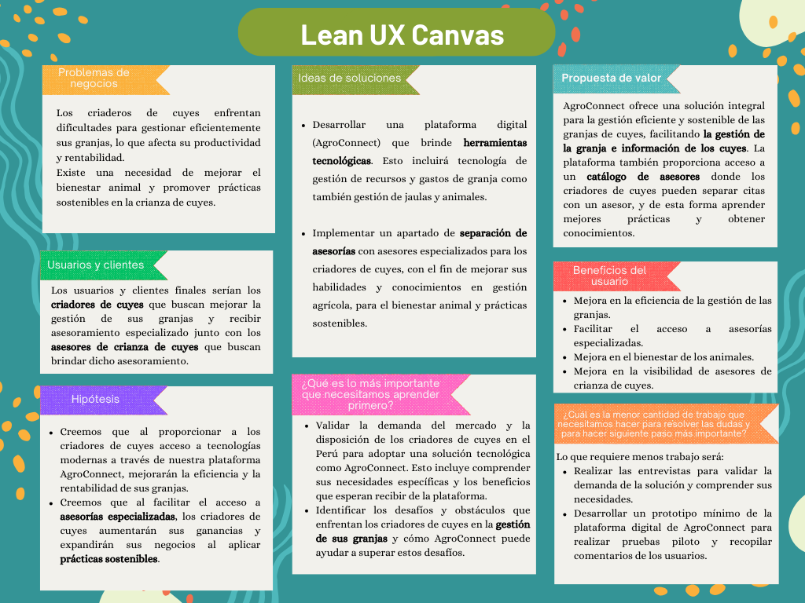

_Imagen 2. Lean UX Canvas_


## 1.3. Segmentos objetivo

Por el lado de los asesores, hemos considerado que estos tendrán experiencia en el campo y/o estudios universitarios en carreras como ingeniería agrónoma, medicina veterinaria, zootecnia, etc. De este modo, debido a que el plan de estudios de estas carreras es de mínimo 5 años a más, y necesitan cierto grado de experiencia para dar recomendaciones y planes de acción confiables, hemos decidido que el rango de edad será de 25 años hasta 65 años.


Según el Ministerio de Desarrollo Agrario y Riego (2023), la crianza de cuyes es una alternativa para la generación de ingresos monetarios para más de 800,000 familias agrarias en el Perú, las cuales se ubican en su mayoría en la sierra del país. El consumo de carne de cuy se ha mantenido en el tiempo e incluso ha trascendido al mercado externo. Esta información destaca la importancia de los asesores en la crianza de cuyes, ya que su conocimiento y orientación pueden ser fundamentales para el éxito y la sostenibilidad de los productores en este sector.


|**Segmento objetivo**|Asesores |
| :- | :- |
|**Edad**|25-65 años|
|**Ubicación**|Perú|
|**Sexo**|Masculino y Femenino|
|**Formación educativa**|Universitario o cualquier educación superior|
|**Poder adquisitivo**|Bajo, medio y alto|

Para delimitar el segmento objetivo de criadores de cuyes nos basamos en el diagnóstico situacional de la crianza de cuyes en Cajamarca realizado en julio de 2004. Dicho diagnóstico menciona que el 44.6% de los productores tenían más de 50 años, sus esposas que conducían la crianza de cuyes tenían entre 31 a 50 años. Además, los hijos que vivían con los padres tenían entre 6 a 17 años. Por lo tanto, para el rango de edad de los criadores decidimos seleccionar desde los 18 años de edad hasta los 60 años para abarcar tanto a los padres que manejan la crianza como a los hijos mayores de edad que la apoyan.

Por otro lado, el mismo diagnóstico señala que el grado de instrucción predominante en la familia es de educación primaría con un 65.6% que es el que consideraremos.


|**Segmento objetivo**|Criadores de cuyes|
| :- | :- |
|**Edad**|18-60 años|
|**Ubicación**|Perú|
|**Sexo**|Masculino y Femenino|
|**Formación educativa**|Educación primaria|
|**Poder adquisitivo**|Bajo y medio|


# Capítulo II Requirements Elicitation & Analysis

## 2.1. Competidores

### 2.1.1. Análisis competitivo
<table>
  <tr>
    <th colspan="6" valign="top">Competitive Analysis Landscape</th>
  </tr>
  <tr>
    <td colspan="2" valign="top">¿Por qué llevar a cabo este análisis?</td>
    <td colspan="4" valign="top">Objetivo 1: Adquirir conocimiento acerca de las propuestas ofrecidas por nuestros competidores y obtener enseñanzas a partir de las áreas en las que presentan limitaciones.<br>
    Objetivo 2: Identificar los puntos fuertes y las limitaciones de nuestros competidores con el fin de formular una estrategia competitiva sólida y efectiva.
    </td>
  </tr>
  <tr>
    <td colspan="2" rowspan="2" valign="top">Empresa/App</td>
    <td valign="top">AgroConnect </td>
    <td valign="top">BestFarm</td>
    <td valign="top">CattleMax</td>
    <td valign="top">BarnTools</td>
  </tr>
  <tr>
    <td valign="top"></td>
    <td valign="top"></td>
    <td valign="top"></td>
    <td valign="top"></td>
  </tr>
  <tr>
    <td rowspan="2" valign="top">Perfil</td>
    <td valign="top">Overview</td>
    <td valign="top">Una aplicación integral desarrollada por AgroTech para mejorar la gestión de granjas de cuyes en el Perú. Ofrece asesoramiento especializado y herramientas tecnológicas para optimizar la alimentación, salud y sostenibilidad en la crianza de cuyes, empoderando a los granjeros a través de la innovación tecnológica.</td>
    <td valign="top">Plataforma integral de gestión agrícola que abarca una amplia gama de actividades agrícolas, incluyendo cultivos y ganadería.</td>
    <td valign="top">Aplicación especializada en la gestión de ganado. Está diseñada específicamente para ayudar a los ganaderos a llevar un registro detallado de su ganado, gestionar la salud y el seguimiento de la reproducción.</td>
    <td valign="top">BarnTools es una aplicación que se centra en la gestión de animales de granja en general, incluyendo ganado, aves de corral y otros animales. </td>
  </tr>
  <tr>
    <td valign="top">Ventaja competitiva ¿Qué valor ofrece a los clientes?</td>
    <td valign="top">La ventaja competitiva de AgroConnect es la integración completa de tecnología y asesoramiento especializado. Esto significa que no solo proporcionamos herramientas tecnológicas avanzadas a través de AgroConnect, sino que también ofrecemos orientación y asesoramiento específico para la crianza de cuyes.</td>
    <td valign="top">La ventaja competitiva de BestFarm radica en su enfoque de la gestión agrícola, que permite a los usuarios gestionar tanto cultivos como animales en una sola plataforma.</td>
    <td valign="top">La principal ventaja competitiva de CattleMax es que ofrece características y herramientas específicas para el ganado, lo que lo convierte en una opción sólida para ganaderos que buscan una solución dedicada.</td>
    <td valign="top">La ventaja competitiva de BarnTools radica en su capacidad para gestionar una variedad de animales de granja, lo que la hace adecuada para granjeros con múltiple variedad de ganado.</td>
  </tr>
  <tr>
    <td rowspan="2" valign="top">Perfil de Marketing</td>
    <td valign="top">Mercado objetivo</td>
    <td valign="top">El mercado objetivo de AgroConnect son los criadores de cuyes en Perú, así como otros actores involucrados en la cadena de producción y comercialización de productos cárnicos de cuy.</td>
    <td valign="top">El mercado objetivo de BestFarm incluye a agricultores y ganaderos que gestionan operaciones mixtas de cultivos y ganado.</td>
    <td valign="top">El mercado objetivo de CattleMax son los ganaderos y criadores de ganado de todas las escalas.</td>
    <td valign="top">El mercado objetivo de BarnTools son los granjeros y ganaderos que gestionan una variedad de animales</td>
  </tr>
  <tr>
    <td valign="top">Estrategias de marketing</td>
    <td valign="top">Campañas educativas en línea y fuera de línea para resaltar los beneficios de AgroConnet en términos de mejora de la productividad, bienestar animal y sostenibilidad en la crianza de cuyes.</td>
    <td valign="top">Promoción en ferias agrícolas y ganaderas para mostrar la versatilidad de la plataforma.</td>
    <td valign="top">Colaboración con asociaciones ganaderas y veterinarios especializados en ganado.</td>
    <td valign="top">Publicidad en revistas agrícolas y ganaderas</td>
  </tr>
  <tr>
    <td rowspan="3" valign="top">Perfil de Producto</td>
    <td valign="top">Productos & Servicios</td>
    <td valign="top">Plataforma integral de gestión para la crianza de cuyes. Ofreciendo una solución completa para la gestión eficiente de granjas de cuyes.</td>
    <td valign="top">Plataforma integral de gestión agrícola para cultivos y animales, planificación de cultivos, programación de tareas, seguimiento de salud, análisis de datos agrícolas</td>
    <td valign="top">Plataforma de gestión de ganado bovino, registro de animales, seguimiento de salud, programación de tareas, seguimiento de reproducción, gestión de gastos.</td>
    <td valign="top">Plataforma versátil para la gestión de animales de granja en general, registro de animales, seguimiento de salud, programación de tareas.</td>
  </tr>
  <tr>
    <td valign="top">Precios & Costos</td>
    <td valign="top">Modelo de suscripción mensual o anual. Los precios varían según la escala de la operación y las funcionalidades requeridas.</td>
    <td valign="top">BestFarm utiliza  precios basados en suscripción.</td>
    <td valign="top">CattleMax utiliza  precios basados en suscripción.</td>
    <td valign="top">BarnTools utiliza  precios basados en la suscripción.</td>
  </tr>
  <tr>
    <td valign="top">Canales de distribución (Web y/o Móvil)</td>
    <td valign="top">AgroConnect se distribuye principalmente a través de una plataforma web accesible desde cualquier navegador. También ofrece una aplicación móvil.</td>
    <td valign="top">BestFarm se distribuye a través de una plataforma web</td>
    <td valign="top">CattleMax se distribuye a través de una plataforma web y ofrece una aplicación móvil</td>
    <td valign="top">BarnTools se distribuye principalmente a través de una plataforma web accesible desde navegadores de computadoras de escritorio y dispositivos móviles.</td>
  </tr>
  <tr>
    <td rowspan="4" valign="top">Análisis SWOT</td>
    <td valign="top">Fortalezas</td>
    <td valign="top">- Integración completa de tecnología y asesoramiento especializado.<br>
    - Mejora del bienestar animal y la sostenibilidad en la crianza de cuyes.<br>
    - Plataforma integral que aborda múltiples aspectos de la gestión de granjas de cuyes.<br>
    - Potencial para expandirse hacia otros tipos de animales en el futuro.
    </td>
    <td valign="top">- Ofrece una plataforma integral para la gestión de cultivos y animales.<br>
    - Enfoque en la agricultura.<br>
    - Planificación y análisis de datos agrícolas.
    </td>
    <td valign="top">- Enfoque especializado en la gestión de ganado bovino.<br>
    - Herramientas específicas para ganado bovino.<br>
    - Plataforma web y aplicación móvil para mayor accesibilidad.
    </td>
    <td valign="top">- Versatilidad para gestionar una variedad de animales de granja.<br>
    - Registro de animales, seguimiento de salud y programación de tareas.<br>
    - Plataforma web y aplicación móvil para mayor accesibilidad.
    </td>
  </tr>
  <tr>
    <td valign="top">Debilidades</td>
    <td valign="top">– Posible resistencia al cambio por parte de algunos criadores de cuyes.<br>
    - Costos de implementación y acceso a tecnología en áreas rurales o remotas.<br>
    - Necesidad de una curva de aprendizaje para algunos usuarios menos familiarizados con la tecnología.<br>
    - Dependencia de la conectividad a internet para el funcionamiento óptimo de la plataforma.
    </td>
    <td valign="top">- Competencia en nichos de mercado más específicos.<br>
    - Puede ser percibido como demasiado complejo para usuarios con necesidades simples.
    </td>
    <td valign="top">- Limitado en términos de diversificación de servicios para otros tipos de animales.</td>
    <td valign="top">- Mayor competencia en el mercado de gestión de animales de granja.</td>
  </tr>
  <tr>
    <td valign="top">Oportunidades</td>
    <td valign="top">- Creciente demanda de soluciones tecnológicas en el sector agrícola.<br>
    - Aumento de la conciencia sobre el bienestar animal y la sostenibilidad.<br>
    - Posibilidad de colaboraciones con instituciones gubernamentales y organizaciones agrícolas para promover el uso de tecnología en la crianza de cuyes.<br>
    - Expansión a nuevos mercados regionales o internacionales.
    </td>
    <td valign="top">- Expansión hacia mercados agrícolas más amplios.<br>
    - Colaboración con proveedores de tecnología agrícola.
    </td>
    <td valign="top">- Expansión hacia otros nichos de mercado ganadero.</td>
    <td valign="top">- Colaboración con proveedores de tecnología agrícola.</td>
  </tr>
  <tr>
    <td valign="top">Amenazas</td>
    <td valign="top">- Competencia de otras soluciones tecnológicas en el mercado agrícola.<br>
    - Cambios en la regulación gubernamental que podrían afectar la industria de la crianza de cuyes.
    </td>
    <td valign="top">- Competidores especializados en áreas específicas de la agricultura</td>
    <td valign="top">- Cambios en las regulaciones ganaderas.</td>
    <td valign="top">- Competidores especializados en áreas específicas de la gestión de animales de granja.</td>
  </tr>
</table>

### 2.1.2. Estrategias y tácticas frente a competidores
**Estrategias:**

**Diferenciación del producto:** Destacaremos las características únicas de AgroConnect, como la integración completa de tecnología y asesoramiento especializado, para diferenciarnos claramente de otras soluciones en el mercado.

**Enfoque en el valor agregado:** Nos centraremos en comunicar y demostrar el valor agregado que AgroConnect ofrece a los criadores de cuyes, resaltando los beneficios tangibles como la mejora del bienestar animal, la eficiencia operativa y la sostenibilidad.


**Tácticas:**

**Marketing de contenido:** Crearemos contenido educativo y relevante sobre la crianza de cuyes, tecnología agrícola y prácticas sostenibles, para posicionarnos como líderes de pensamiento en el sector y atraer a clientes potenciales.

**Programas de prueba y demostraciones:** Ofreceremos programas de prueba gratuitos y demostraciones en granjas para permitir a los clientes experimentar directamente los beneficios de AgroConnect y generar confianza en nuestra solución.

**Desarrollo de alianzas estratégicas:** Buscaremos colaboraciones con instituciones agrícolas, asociaciones de criadores de cuyes y otras empresas del sector para ampliar nuestra red de clientes y aumentar la visibilidad de AgroConnect.

**Servicio al cliente excepcional:** Nos comprometemos a brindar un excelente servicio al cliente, proporcionando soporte técnico, capacitación y asistencia personalizada para garantizar la satisfacción y fidelidad de nuestros usuarios.


## 2.2. Entrevistas

### 2.2.1. Diseño de entrevistas

**Segmento: Asesor**
1. ¿Cuál es su experiencia en la granja y cuántos años lleva trabajando en este campo?
2. ¿Qué tipo de asesoramiento o servicios específicos ofrece a los criadores en su trabajo actual?
3. ¿Cuáles considera que son los desafíos más comunes que enfrentan los criadores de cuyes principiantes en la gestión de sus granjas?
4. ¿Qué herramientas o recursos utiliza actualmente para brindar asesoramiento a los criadores?
5. ¿Cuál ha sido su experiencia con estas herramientas o recursos? ¿Fue una experiencia positiva o negativa?
6. ¿Qué características o funcionalidades le gustaría ver en una plataforma como “AgroConnect” que facilite la prestación de sus servicios de asesoramiento?
7. ¿Qué temas específicos en la industria agropecuaria considera que son de mayor interés para los criadores principiantes y que deberían abordarse en la plataforma?
8. ¿Cómo cree que una plataforma como "AgroConnect" podría beneficiar a los criadores principiantes y a los propios asesores en la industria?

**Segmento: Criador de cuyes**
1. ¿Cuál es el tamaño de su operación agropecuaria y qué tipo de animales roedores cría?
2. ¿Cuáles son los mayores desafíos que enfrenta en la gestión diaria de su granja?
3. ¿Qué herramientas o métodos utiliza actualmente para llevar un registro de la salud y el estado de sus animales?
4. ¿Cómo planifica y programa las tareas diarias relacionadas con la alimentación, cuidado de los animales y mantenimiento de las instalaciones?
5. ¿Qué información de pronóstico suele utilizar para tomar decisiones en su granja?
6. ¿Ha utilizado aplicaciones o herramientas móviles relacionadas a la gestión de granjas? ¿Cuáles han sido sus experiencias?
7. ¿Qué tipo de información o recursos adicionales le gustaría tener acceso para mejorar la gestión de su granja?
8. ¿Cuál es su opinión sobre la posibilidad de recibir asesoramiento y orientación de criadores más experimentados a través de plataformas en línea o aplicaciones?

### 2.2.2. Registro de entrevistas

**Entrevista N 1 - Asesor:**

**Entrevistador:** Andre Valverde

**Entrevistado:** Rodrigo Guerra

**Link de la entrevista:** https://youtu.be/rXbdiB0spIQ 


_Imagen 3. Entrevista a Rodrigo_

**Resumen:** 

Rodrigo Guerra, es asesor de cría de cuyes que tiene un año de experiencia y ofrece asesoramiento técnico en alimentación, reproducción y gestión de granjas. Los desafíos comunes para los criadores principiantes incluyen la falta de conocimientos técnicos. Utiliza herramientas como manuales técnicos y capacitaciones, con una experiencia generalmente positiva. En una plataforma como "AgroConnect", busca funciones para facilitar el intercambio de conocimientos y abordar temas como manejo del estrés y prácticas sostenibles, lo que beneficiaría a criadores y asesores.


**Entrevista N 2 - Asesor:** 

**Entrevistador:** Salvador Salinas

**Entrevistado:** Tamara García

**Link de la entrevista:** https://youtu.be/xs9W9uG10z0


_Imagen 4. Entrevista a Tamara_

**Resumen:**

Tamara García es una potencial asesora en la cría de cuyes y está dispuesta a aconsejar a criadores principiantes en la granja de cuyes. Su principal recurso es la experiencia que ha ganado gracias a su familia, y cuenta cómo desde pequeña está familiarizada con la cría de cuyes y la gestión de granja de cuyes. Al comentarle un poco sobre la idea de la plataforma “AgroConnect”, menciona que le gustó mucho la idea ya que no ha visto algo parecido anteriormente, especialmente dirigido a la granja de cuyes. Asimismo, comenta que debería ser una aplicación fácil de usar y accesible para todos.


**Entrevista N 3 - Asesor:**

**Entrevistador:** Sebastian Paredes

**Entrevistado:** Belen Ramos

**Link de la entrevista:** https://youtu.be/xwnwEvw3LxI


_Imagen 5. Entrevista a Belen_

**Resumen:**

Belen Ramos, la entrevistada, tiene un año de experiencia en la crianza de cuyes y ofrece asesoramiento básico sobre aspectos como la alimentación y el control de enfermedades. Utiliza recursos en línea y su experiencia personal para brindar consejos prácticos a criadores principiantes. Considera que una plataforma como "AgroConnect" sería beneficiosa para conectar con criadores y abordar temas relevantes como la selección de razas y el manejo de enfermedades.

**Entrevista N 4 - Asesor:**

**Entrevistador:** Piero Delgado

**Entrevistado:** Adrián Espinoza

**Link de la entrevista:** https://youtu.be/ANKhs9e_x5E


_Imagen 6. Entrevista a Adrián_

**Resumen:**
Adrián ha estado involucrado en la crianza de cuyes desde joven por su familia y recientemente ha empezado a ofrecer asesoramiento a otras familias en alimentación, manejo sanitario y selección de razas de cuyes. Por ello, decidió estudiar Medicina Veterinaria en Arequipa para aprender más de la crianza de animales. Durante la entrevista, destacó los desafíos comunes que enfrentan los criadores principiantes, como el manejo de la alimentación y la prevención de enfermedades. Actualmente, utiliza principalmente su conocimiento personal y recursos en línea para brindar asesoramiento, pero está interesado en explorar nuevas herramientas como aplicaciones. Sugirió que AgroConnect debería permitir la programación de citas de asesoramiento de manera sencilla y abordar temas como la organización de criaderos y la gestión de recursos.


**Entrevista N 5 - Asesor:**

**Entrevistador:** Nadia Lucas

**Entrevistado:** Romina Arana

**Link de la entrevista:** https://www.youtube.com/watch?v=-s0YObYyF8c


_Imagen 7. Entrevista a Romina_

**Resumen:**
Romina, una egresada de la UNALM con más de 3 años de experiencia en trabajos de campo desde su sexto ciclo universitario, ofrece asesoramiento en diversos aspectos de la producción de cuyes, desde selección de razas hasta planificación de instalaciones. Su experiencia positiva en el trabajo actual, obtenido a través de una convocatoria en línea, resalta la utilidad de recursos digitales para el aprendizaje. En cuanto a "AgroConnect", Romina sugiere funciones que faciliten la interacción directa entre asesores y criadores, así como la inclusión de temas como reproducción, nutrición, manejo sanitario y comercialización. También considera que ambos, criadores principiantes y asesores, podrían beneficiarse de una plataforma que brinde información confiable y servicios eficientes.


**Entrevista N 6 - Criador:**

**Entrevistador:** Sebastian Paredes

**Entrevistado:** Alessandra Chaupis

**Link de la entrevista:** https://youtu.be/3UqveRZBafU


_Imagen 8. Entrevista a Alessandra_

**Resumen:** 

Alessandra Chaupis, una joven de 20 años que vive en San Juan de Lurigancho, se encuentra en sus inicios en el negocio de la crianza de cuyes, en la entrevista destaca que su operación agropecuaria es de tamaño mediano, gracias a esta escala puede gestionar todas las actividades de cuidado y producción de manera efectiva, manteniendo un equilibrio entre la rentabilidad y la atención individualizada que requieren los cuyes. Los principales desafíos que enfrenta en su granja son el control de enfermedades, la gestión de la alimentación adecuada y el mantenimiento de las condiciones sanitarias para garantizar la salud y el bienestar de los animales y la calidad de los productos. Utiliza un registro manual y aplicaciones móviles para el seguimiento de la salud de los cuyes, así como un calendario para planificar las tareas diarias. Además, utiliza información meteorológica y datos históricos de producción para tomar decisiones informadas. Además, tiene una experiencia positiva con aplicaciones móviles de gestión de granjas, que le han permitido mejorar la eficiencia de su operación. Busca acceso a información sobre nuevas técnicas de crianza y mejores prácticas de manejo, y considera que recibir asesoramiento de criadores más experimentados sería beneficioso para mejorar la eficiencia y productividad de su granja.


**Entrevista N 7 - Criador:** 

**Entrevistador:** Nadia Lucas

**Entrevistado:** Nayeli Chavez

**Link de la entrevista:** https://youtu.be/xM3fyi4a-To 


_Imagen 9. Entrevista a Nayeli_

**Resumen:**

Nayeli Chávez, una criadora de 24 años que reside en Puente Piedra, es relativamente nueva en el negocio que maneja junto a su madre, crían alrededor de 50 cuyes debido a su alta demanda. Sus desafíos incluyen mantener la salud y condiciones ambientales adecuadas para los animales, así como gestionar su alimentación y espacio. Actualmente lleva registros manuales de la salud de cada cuy y planifica sus tareas diarias para garantizar un cuidado constante. Utiliza información sobre madurez sexual y ciclos reproductivos para tomar decisiones en su granja y está abierta a explorar aplicaciones que faciliten la gestión. Busca acceso a recursos sobre prácticas de cría avanzadas y considera valiosa la orientación de criadores más experimentados a través de plataformas en línea o aplicaciones.


**Entrevista N 8 - Criador:**

**Entrevistador:** Piero Delgado

**Entrevistado:** Daniel Ruiz

**Link de la entrevista:** https://youtu.be/Lst4qVknGrk?si=2-f34iRuoXJ4amyC


_Imagen 10. Entrevista a Daniel_

**Resumen:**

Daniel viene de una familia que ha criado cuyes durante generaciones para generar un ingreso para su familia. Su familia maneja una operación mediana con alrededor de 30 cuyes. Uno de los desafíos más grandes para su criadero es mantener la salud y el bienestar de los cuyes, así como garantizar una alimentación adecuada y prevenir enfermedades. Para registrar la información de los cuyes, utiliza métodos manuales donde detalla la salud de cada animal y realiza revisiones periódicas para detectar problemas. Daniel no ha utilizado aplicaciones especializadas pero usa herramientas simples como calculadora y calendario. Está interesado en una herramienta intuitiva para gestionar la información de los cuyes y recibir asesoramiento en línea. Estaría dispuesto a pagar por una aplicación con estas funcionalidades si el precio es asequible.


**Entrevista N 9 - Criador:**

**Entrevistador:** Salvador Salinas

**Entrevistado:** Anderson Morales

**Link de la entrevista:** https://youtu.be/y0rkvGo_8nQ

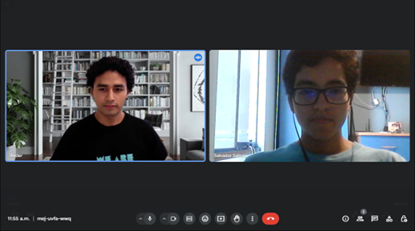

_Imagen 11. Entrevista a Anderson_

**Resumen:**

Anderson Morales ha empezado junto a su padre a criar unos treinta cuyes aproximadamente. Comenta que a veces se le dificulta el mantener registro de los recursos y datos de los animales, ya que lo hace en un excel pero no suele ser muy eficiente. Al comentarle sobre la idea de la app para poder gestionar los datos de su granja y recibir asesorías, mencionó que le pareció una gran idea, ya que así podría tener una mejor manera para organizar sus datos y además poder tener gente de la cual apoyarse en caso tenga algún problema.

### 2.2.3. Análisis de entrevistas

**Formas de difusión de información de los asesores**
|Formas de difusión|Rodrigo|Tamara|Belen|
| - | - | - | - |
|Charlas|X| | |
|Grupos de discusion en línea|X| |X|
|Visita presencial| |X|X|
|Videos en línea| | |X|


_Imagen 12. Gráfico circular - Asesores_

Gracias a las entrevistas realizadas, comprendimos que los asesores suelen brindar apoyo a través de internet o a conocidos. Así, al comentarle sobre nuestra idea de aplicación web para poder brindar asesorías a criadores de cuyes, indicaron que les pareció muy buena idea ya que brinda mejor comunicación y confiabilidad.

**Desafíos que tienen los asesores con la crianza de cuyes**
|Desafíos de crianza|Alessandra|Nayeli|Daniel|
| - | - | - | - |
|Gestión de alimentación|X|X|X|
|Mantenimiento de galpones|X| | |
|Control de enfermedades|X|X|X|
|Gestión de espacio| |X| |


_Imagen 13. Gráfico circular - Criadores_

Asimismo, obtuvimos la conclusión de que los criadores de cuyes suelen tener dificultad para gestionar correctamente la alimentación y control de enfermedades, además de gestionar recursos de la granja en sí. De esta forma, al comentarle sobre nuestra idea de aplicación web para poder recibir asesorías de personas con experiencia y gestionar los recursos de su granja, indicaron que les pareció muy buena idea ya que sería un mejor recurso para obtener información confiable.

## 2.3. Needfinding

### 2.3.1. User Personas

Para la realización de las fichas de User Personas se han considerado los 2 segmentos objetivos: asesores y criadores de cuyes. Se elaborarán las fichas con la información recopilada de las entrevistas sobre su perfil.

**Segmento Asesor**


_Imagen 14. User Persona - Asesor_

**Segmento Criador**


_Imagen 15. User Persona - Criador_

### 2.3.2. User Task Matrix

<table>
  <tr>
    <th rowspan="2" valign="top"><b>Task Matrix</b></th>
    <th colspan="2" valign="top"><b>Asesores</b></th>
    <th colspan="2" valign="top"><b>Criadores</b></th>
  </tr>
  <tr>
    <td valign="top"><b>Frecuencia</b></td>
    <td valign="top"><b>Importancia</b></td>
    <td valign="top"><b>Frecuencia</b></td>
    <td valign="top"><b>Importancia</b></td>
  </tr>
  <tr>
    <td>Alimentar a los cuyes</td>
    <td>Nunca</td>
    <td>Ninguna</td>
    <td>Diaria</td>
    <td>Alta</td>
  </tr>
  <tr>
    <td>Proporcionar agua limpia</td>
    <td>Nunca</td>
    <td>Ninguna</td>
    <td>Diaria</td>
    <td>Alta</td>
  </tr>
  <tr>
    <td>Limpiar jaulas</td>
    <td>Nunca</td>
    <td>Ninguna</td>
    <td>Semanal</td>
    <td>Media</td>
  </tr>
  <tr>
    <td>Comprar suministros y alimentos</td>
    <td>Nunca</td>
    <td>Ninguna</td>
    <td>Mensual</td>
    <td>Media</td>
  </tr>
  <tr>
    <td>Vender cuyes</td>
    <td>Nunca</td>
    <td>Ninguna</td>
    <td>Mensual</td>
    <td>Alta</td>
  </tr>
  <tr>
    <td>Gestionar gastos y ganancias</td>
    <td>Mensual</td>
    <td>Media</td>
    <td>Mensual</td>
    <td>Alta</td>
  </tr>
  <tr>
    <td>Monitorear la salud y el bienestar de los cuyes</td>
    <td>Mensual</td>
    <td>Alta</td>
    <td>Siempre</td>
    <td>Alta</td>
  </tr>
  <tr>
    <td>Investigar sobre nuevas prácticas y tecnologías para la crianza de cuyes</td>
    <td>Mensual</td>
    <td>Media</td>
    <td>Casi Nunca</td>
    <td>Baja</td>
  </tr>
  <tr>
    <td>Realizar seguimiento y evaluación de progreso de granjas</td>
    <td>Semanal</td>
    <td>Alta</td>
    <td>Semanal</td>
    <td>Alta</td>
  </tr>
  <tr>
    <td>Participar de sesiones de asesoramiento para recibir información actualizada</td>
    <td>Mensual</td>
    <td>Media</td>
    <td>Mensual</td>
    <td>Media</td>
  </tr>
  <tr>
    <td>Resolver problemas específicos en las granjas</td>
    <td>Según necesidad</td>
    <td>Muy Alta</td>
    <td>Según necesidad</td>
    <td>Muy Alta</td>
  </tr>
  <tr>
    <td>Desarrollar y/o asistir a sesiones de capacitación sobre técnicas de crianza</td>
    <td>A veces</td>
    <td>Alta</td>
    <td>A veces</td>
    <td>Media</td>
  </tr>
  <tr>
    <td>Elaborar y/o leer informes de progreso con recomendaciones</td>
    <td>Trimestral</td>
    <td>Alta</td>
    <td>Trimestral</td>
    <td>Alta</td>
  </tr>
  <tr>
    <td>Evaluar las condiciones y necesidades de las granjas de forma presencial</td>
    <td>Casi nunca</td>
    <td>Alta</td>
    <td>Diaria</td>
    <td>Media</td>
  </tr>
</table>

<br>
A partir del User Task Matrix, resaltaremos las tareas de mayor trascendencia. Entre ellas tenemos ‘monitorear la salud y bienestar de los cuyes’ ya que los criadores están pendientes constantemente de la salud de los cuyes viendo comportamientos inusuales y posibles enfermedades para comunicárselo a los asesores quienes otorgarían consejos sobre el accionar ante una posible enfermedad o comportamiento inusual. Esta tarea es fundamental para que haya una producción exitosa y sin contratiempos.

Asimismo, la tarea de ‘realizar seguimiento y evaluación de progreso de granjas’ es fundamental por el mismo motivo porque permite una mejora continua en el rendimiento de las granjas.

Por otro lado, las principales diferencias entre ambos segmentos radican en las actividades diarias dentro del criadero ya que solo participan los criadores para asegurarse de la salud y crecimiento de los cuyes. Por lo tanto, los criadores están monitoreando constantemente las condiciones de sus granjas, mientras que los asesores tienen que separar una fecha para realizar esto de forma presencial.

Finalmente, la principal coincidencia encontrada es que tanto los asesores como los criadores deben estar preparados para solucionar problemas específicos cuando estos aparezcan.


### 2.3.3. User Journey Mapping

Para el segmento de los asesores especializados, se ha considerado desde el momento en que reciben una solicitud de servicio por parte de un criador de cuyes hasta el seguimiento de los avances con respecto a los cambios planteados.
Por otro lado, para el segmento de criadores de cuyes se tomó en cuenta desde la búsqueda inicial de información y contactos de asesores hasta la implementación de nuevos conocimientos y el análisis de resultados obtenidos.

**Segmento Asesor**


_Imagen 16. User Journey Map - Asesor_

**Segmento Criador**


_Imagen 17. User Journey Map - Criador_

### 2.3.4. Empathy Mapping

En esta sección, se desarrollaron los Empathy Maps de cada segmento objetivo. Se utilizó una plantilla de EXPressia que contiene los apartados que debe tener el Empathy Map junto a preguntas que se respondieron conforme a lo identificado de nuestro segmento objetivo para desarrollar este artefacto.

**Segmento Asesor**

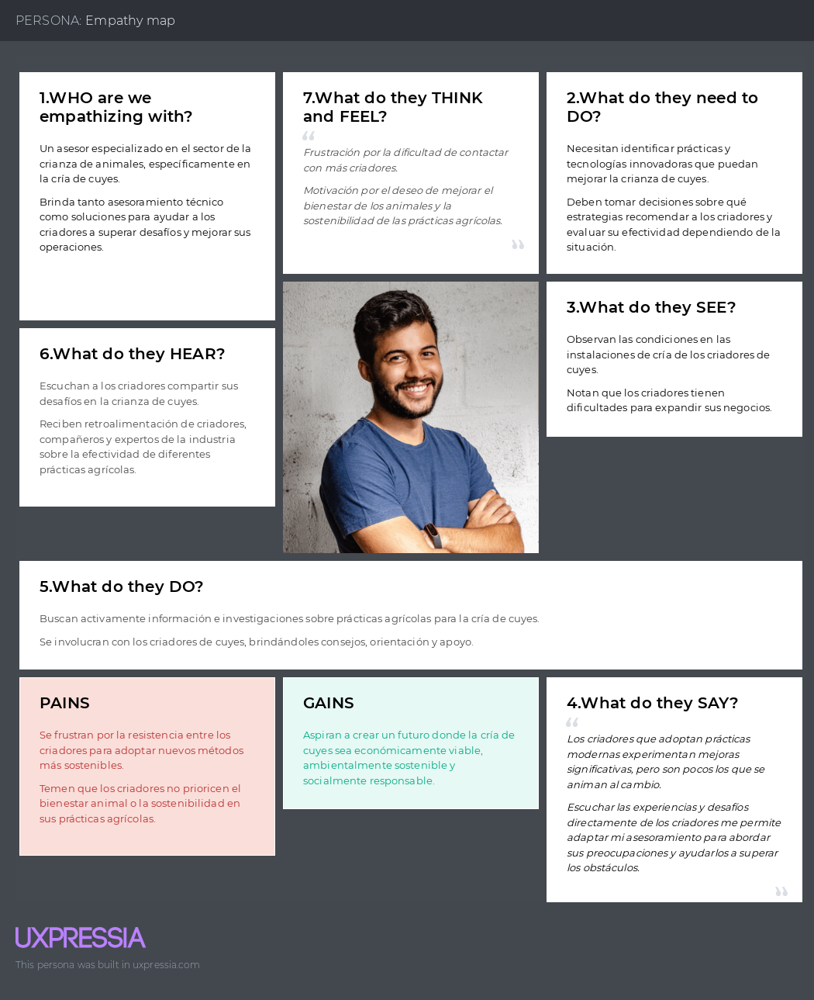

_Imagen 18. Empathy Map - Asesor_

**Segmento Criador**


_Imagen 19. Empathy Map - Criador_

### 2.3.5. As-is Scenario Mapping
**Segmento: Asesor**

|**Phases**|**Búsqueda de de trabajo**|**Publicar su experiencia en el rubro** |**Comunicación con el ganadero**|**Asesorar al ganadero**|
| :- | :- | :- | :- | :- |
|**Doing**|- Busca la manera de llegar a más público, creándose  foros de difusión, cuentas de instagram,etc.Para que así más personas adquieran sus servicios.|- Habiendo creado su perfil, empieza a publicar información acerca de él, la experiencia que tiene en el campo, el rubro con el que se especializa, entre otros datos relevantes que ayuden a captar el interés del cliente.|-Se comunica con el ganadero mediante whatsapp, instagram o en llamadas cortas explicando los beneficios de su servicio.|- Mediante whatsapp y luego de haber llegado a un acuerdo se reúne con el ganador para poder asesorar en lo que necesita|
|**Thinking**|- "Necesito que me contraten para poder generar ingresos."|- "Espero que la información que publique interese a los clientes."|- "Es importante comunicarse con la persona, sin embargo no llegó a comprender que exactamente desea."|- "El asesoramiento que brinda al ganadero ha sido no tan eficiente pero sí eficaz."|
|**Feeling**|<p>-Estresado por no saber donde debo posicionarme para poder buscar trabajo. </p><p>- Decepcionado por no conocer una página o aplicación que me brinde la facilidad de conectar con mis clientes.</p>|<p>- Preocupado sobre qué dirán las personas al ver lo que ofrezco.</p><p>- Tímido al publicar mi información en mi feed.</p>|<p>- Satisfecho por haber conseguido un cliente dispuesto a contratarme.</p><p>- Confundido porque el cliente no detalla bien qué servicio  desea  de mí.</p>|<p>- Satisfecho de haber culminado mi asesoramiento continuo al cliente.</p><p></p><p>-Frustrado por el tiempo que me demore en asesorar debido a la gran cantidad de herramientas que he usado.</p>|

**Segmento: Criador**

|**Phases**|**Búsqueda de Información y Asesoramiento**|**Comunicación con el Asesor** |**Registro de Datos y Asesoramiento**|**Uso Continuo**|
| :- | :- | :- | :- | :- |
|**Doing**|- Busca información sobre la crianza de cuyes en línea y en libros especializados.|- Contacta a un asesor a través de la aplicación para obtener asesoramiento sobre la crianza de su ganado de cuyes.|<p>- Proporciona detalles sobre su ganado de cuyes, como la cantidad, la salud, la alimentación y otros aspectos relevantes, al asesor. </p><p>- Recibe asesoramiento y recomendaciones del asesor.</p>|- Mantiene una comunicación regular con el asesor para recibir orientación continua sobre la crianza de su ganado de cuyes.|
|**Thinking**|- "Necesito encontrar información precisa y útil para mejorar la crianza de mi ganado de cuyes."|- "Espero que el asesor tenga el conocimiento necesario para ayudarme."|- "Es importante proporcionar datos precisos para recibir un asesoramiento efectivo."|- "La relación continua con el asesor es clave para el éxito de mi ganado de cuyes."|
|**Feeling**|<p>- Motivado por mejorar la salud y la productividad de su ganado de cuyes.</p><p>`- Interesado en aprender más sobre la crianza de cuyes</p>|<p>- Optimista sobre la posibilidad de recibir asesoramiento valioso del asesor.</p><p>- Satisfecho al establecer una comunicación efectiva.</p>|<p>- Satisfecho por recibir recomendaciones que benefician a su ganado de cuyes. </p><p>- Responsable de seguir las recomendaciones del asesor.</p>|<p>- Satisfecho con la relación continua con el asesor. </p><p>- Comprometido con mejorar su ganadería de cuyes a largo plazo.</p>|


## 2.4. Ubiquitous Language

En esta sección, se definirán términos utilizados a lo largo del proyecto para que se pueda comprender para todos los miembros del equipo y agentes interesados. 

- **Guinea pig breeder** (Criador de cuyes): Persona dedicada a la crianza y producción de cuyes con el fin de obtener carne y otros productos derivados de estos animales.
- **Ganadero** (Rancher): Individuo dedicado a la crianza de animales. En este contexto, es otra forma de llamar a los criadores de cuyes, pero de forma más general. Los ganaderos son responsables del cuidado diario de los cuyes, incluida la alimentación, el manejo del hábitat y la reproducción.
- **Advisor** (Asesor): En el contexto del proyecto, es una persona con experiencia y conocimientos especializados en la crianza de cuyes y prácticas agrícolas relacionadas. Su papel es brindar apoyo personalizado para resolver desafíos específicos que enfrentan los criadores en el cuidado de los cuyes.
- **Guinea pig farm** (Granja de cuyes): Instalación destinada a la cría y manejo de cuyes, equipada con las infraestructuras necesarias para su cuidado y reproducción.
- **Animal welfare** (Bienestar animal): Estado de salud física y psicológica de los cuyes que garantiza su crecimiento óptimo, garantizado mediante prácticas de crianza adecuadas que respetan sus necesidades naturales.
- **Sustainable agricultural practices** (Prácticas agrícolas sostenibles): Técnicas y métodos de producción que preservan los recursos naturales y minimizan el impacto ambiental negativo, contribuyendo a la conservación a largo plazo del medio ambiente y los ecosistemas.

- **Self-sustainable** (Auto-sustentable): En el contexto de la crianza de cuyes, se refiere a la práctica de consumir los cuyes criados en la granja principalmente para satisfacer las necesidades alimenticias de los criadores y sus familias. En lugar de venderlos para generar ingresos adicionales.

- **Shed** (Galpón): Es el ambiente donde se construyen o colocan las pozas o jaulas para criar a los cuyes, lo que permite un mejor control de los animales.

- **Cage** (Jaula): Espacio donde vive un grupo de cuyes normalmente construidos de madera o mallas metálicas.

- **Resources** (Recursos): Elementos físicos necesarios para la crianza de cuyes como el alimento que consumen los cuyes, la medicina para los cuyes enfermos, o recursos de producción como pueden ser las pieles de los cuyes.

- **Expenses** (Gastos): Inversiones de dinero del criador para cubrir las necesidades de la crianza como puede ser la compra de los alimentos de los cuyes.

- **Review** (Reseña): Evaluación del desempeño de un asesor durante una cita. Consta de calificación (con rango de 0 a 5 estrellas) y de un comentario opcional.

- **Appointment** (Cita): Encuentro programado entre el criador y el asesor con el objetivo de recibir asistencia técnica en desafíos en la crianza, y con el objetivo de recibir recomendaciones.


# Capítulo III Requirements Specification
## 3.1. To-Be Scenario Mapping
**Segmento: Asesor**<br>

|**Phases**|**Búsqueda de de trabajo**|**Publicar su experiencia en el rubro** |**Comunicación con el ganadero**|**Asesorar al ganadero**|
| :- | :- | :- | :- | :- |
|**Doing**|- Ingreso a la aplicación “AgroConnect” y me registro como asesor.|- Habiendo creado mi cuenta, ingreso a mi perfil y lo diseñó a mi gusto sin límites para que el cliente sepa lo que ofrezco, además resalto mi calificación y las reseñas positivas que he tenido con el asesoramiento a otros clientes.|-Acepto la solicitud que me envió un cliente el cual resalta lo que necesita de manera detallada, luego me comunico con él mediante la misma aplicación y coordino algunos aspectos de la solicitud.|- Me reúno con el ganadero luego de coordinar mediante la aplicación,para luego asesorar usando todas las herramientas que me brinda la aplicación siendo rápido y eficiente.|
|**Thinking**|- "Que bueno que haya un sitio exclusivo para asesores en la ganadería "|- “Me encanta detallar toda mi información de manera concisa."|- "Me encanta lo rápido que es  entender al cliente, gracias a la solicitud detallada que me manda y que de igual manera podamos comunicarnos en la misma aplicación."|- "El asesoramiento que brinda al ganadero ha sido eficiente y rápido debido a las herramientas que me proporciona la aplicación."|
|**Feeling**|<p>-Tranquilo por lo fácil que fue para el registrase en la aplicación. </p><p>- Contento porque existe una aplicación que lo ayude a hacerse más reconocido.</p>|<p>- Entusiasmado en los nuevos clientes que llegare a tener por la información que les he brindado </p><p>` `- Feliz por poder resaltar mi empeño como asesor mediante reseñas y puntajes.</p>|<p>- Satisfecho por haber comprendido al cliente de manera rapido.</p><p>` `- Cómodo por la manera en la cual me he comunicado con el cliente.</p>|<p>- Satisfecho de haber culminado mi asesoramiento continuo al cliente.</p><p></p><p>-Encantado  por las herramientas que me brinda la aplicación para poder asesorar bien al ganadero.</p>|

**Segmento: Criadores**<br>

|**Phases**|**Búsqueda de Información y Asesoramiento**|**Comunicación con el Asesor** |**Registro de Datos y Asesoramiento**|**Uso Continuo**|
| :- | :- | :- | :- | :- |
|**Doing**|<p>- Navega por la aplicación en busca de información relevante sobre la crianza de ganado de cuyes</p><p></p><p></p>|- Inicia una conversación en la aplicación con el asesor para obtener detalles específicos sobre su ganado de cuyes.|<p>- Registra los datos de su ganado de cuyes, incluyendo su salud, alimentación y otros detalles relevantes en la aplicación. </p><p>- Recibe asesoramiento y recomendaciones del asesor.</p>|- Continúa interactuando con el asesor a lo largo del tiempo, el cual le va brindando asesoramiento y seguimiento regular.|
|**Thinking**|- "Necesito encontrar información precisa y útil que me ayude con mi ganado de cuyes"|- "Espero obtener información detallada del asesor para gestionar mi granja de cuyes de manera  adecuada."|- "Es importante proporcionar datos precisos para recibir un asesoramiento efectivo."|- "Mantener una comunicación continua con el asesor es esencial para el éxito de mi granja."|
|**Feeling**|- Interesado mucho más en aprender más sobre la ganadería de cuyes. |- Satisfecho al establecer una comunicación efectiva.|<p>- Satisfecho por contribuir al bienestar de su ganado de cuyes.</p><p> </p>|<p>- Satisfecho con la relación continua con el asesor. </p><p>- Comprometido con el cuidado de su granja.</p>|

## 3.2. User Stories

Se identificaron las siguientes épicas que se componen de las historias de usuario.

<table><tr><th valign="top"><b>Epic ID</b></th><th valign="top"><b>Epic</b></th><th valign="top"><b>User story ID</b></th><th valign="top"><b>User stories</b></th></tr>
<tr><td rowspan="10" valign="top"><b>E01</b></td><td rowspan="10" valign="top">Sistema de búsqueda y programación de citas con asesores y calificaciones</td><td valign="top">US01</td><td valign="top">Visualización del catálogo de asesores</td></tr>
<tr><td valign="top">US02</td><td valign="top">Visualización de información de un asesor</td></tr>
<tr><td valign="top">US03</td><td valign="top">Visualización de horarios de asesores</td></tr>
<tr><td valign="top">US04</td><td valign="top">Programación de citas con asesores</td></tr>
<tr><td valign="top">US05</td><td valign="top">Visualización de información del criador de cuyes</td></tr>
<tr><td valign="top">US06</td><td valign="top">Notificación de citas al asesor</td></tr>
<tr><td valign="top">US07</td><td valign="top">Notificación de citas al criador</td></tr>
<tr><td valign="top">US08</td><td valign="top">Calificación al asesor luego de una cita</td></tr>
<tr><td valign="top">US14</td><td valign="top">Separación de fechas disponibles para asesoría</td></tr>
<tr><td valign="top">US31</td><td valign="top">Visualización de calendario</td></tr>
<tr><td rowspan="2" valign="top"><b>E02</b></td><td rowspan="2" valign="top">Publicaciones en la aplicación</td><td valign="top">US09</td><td valign="top">Gestión de publicaciones de asesores</td></tr>
<tr><td valign="top">US10</td><td valign="top">Visualización de publicaciones de asesores</td></tr>
<tr><td rowspan="3" valign="top"><b>E03</b></td><td rowspan="3" valign="top">Sistema integral de registro y seguimiento animal</td><td valign="top">US11</td><td valign="top">Gestión de jaulas de cuyes</td></tr>
<tr><td valign="top">US12</td><td valign="top">Registro de información de animales</td></tr>
<tr><td valign="top">US13</td><td valign="top">Visualización y edición de información de animales</td></tr>
<tr><td rowspan="2" valign="top"><b>E04</b></td><td rowspan="2" valign="top">Gestión de granja</td><td valign="top">US15</td><td valign="top">Gestión de recursos de la granja</td></tr>
<tr><td valign="top">US16</td><td valign="top">Gestión de gastos realizados</td></tr>
<tr><td rowspan="2" valign="top"><b>E05</b></td><td rowspan="2" valign="top">Eficiencia y seguridad de aplicación</td><td valign="top">US17</td><td valign="top">Seguridad de información</td></tr>
<tr><td valign="top">US18</td><td valign="top">Disponibilidad y confiabilidad</td></tr>
<tr><td rowspan="3" valign="top"><b>E06</b></td><td rowspan="3" valign="top">Registro, acceso a la aplicación y datos personales</td><td valign="top">US19</td><td valign="top">Registro de un usuario nuevo</td></tr>
<tr><td valign="top">US20</td><td valign="top">Inicio de sesión</td></tr>
<tr><td valign="top">US21</td><td valign="top">Recuperación de contraseña</td></tr>
<tr><td rowspan="6" valign="top"><b>E07</b></td><td rowspan="6" valign="top">Visualización de una Landing Page estática</td><td valign="top">US22</td><td valign="top">Visualización de Navbar y Footer</td></tr>
<tr><td valign="top">US23</td><td valign="top">Visualización de sección de inicio</td></tr>
<tr><td valign="top">US24</td><td valign="top">Visualización de sección “Acerca De”</td></tr>
<tr><td valign="top">US25</td><td valign="top">Visualización de sección “Sobre Nosotros”</td></tr>
<tr><td valign="top">US26</td><td valign="top">Visualización de sección “Características”</td></tr>
<tr><td valign="top">US27</td><td valign="top">Visualización de sección “Contacto”</td></tr>
<tr><td rowspan="7" valign="top"><b>E08</b></td><td rowspan="7" valign="top">Funcionalidades con APIs</td><td valign="top">US28</td><td valign="top">Uso de un API para videollamadas</td></tr>
<tr><td valign="top">US29</td><td valign="top">Uso de un API para alojar imágenes</td></tr>
<tr><td valign="top">US32</td><td valign="top">Uso de nuestra API para gestionar usuarios</td></tr>
<tr><td valign="top">US33</td><td valign="top">Uso de nuestra API para gestionar publicaciones</td></tr>
<tr><td valign="top">US34</td><td valign="top">Uso de nuestra API para manejar recursos y gastos</td></tr>
<tr><td valign="top">US35</td><td valign="top">Uso de nuestra API para manejar la reserva de citas entre asesores y criadores</td></tr>
<tr><td valign="top">US36</td><td valign="top">Uso de la API para manejar las jaulas y animales</td></tr>
</table>


|**Epic / Story ID**|**Título**|**Descripción**|**Criterios de Aceptación**|**Relacionado con (Epic ID)**|
| :- | :- | :- | :- | :- |
|US01|Visualización del catálogo de asesores|**Como** criador de cuyes **quiero** explorar un catálogo de asesores **para** conocer quiénes me pueden apoyar con asesorías|<p>**Escenario 1: Explorar catálogo de asesores**</p><p>**Given** el criador quiere explorar el catálogo de asesores.</p><p>**And** se encuentra en el apartado de “Asesores”.</p><p>**When** seleccione el botón “Catálogo de asesores”.</p><p>**Then** el sistema le mostrará una lista de todos los asesores disponibles en la aplicación.</p><p></p><p>**Escenario 2: Filtrar búsqueda de asesores**</p><p>**Given** el criador quiere personalizar su búsqueda.</p><p>**And** se encuentra en el apartado de “Asesores”.</p><p>**When** seleccione el botón de filtros.</p><p>**Then** el sistema** le permitirá filtrar el catálogo de asesores por ubicación, experiencia o reputación.</p><p></p><p>**Escenario 3: Ver mis asesores**</p><p>**Given** el criador desea ver los asesores a los que les solicitó un servicio para recibir una mentoría.</p><p>**And** se encuentra en el apartado de “Asesores”.</p><p>**When** haga clic en el botón “Mis Asesores”</p><p>**Then** el sistema le mostrará una lista de todos los asesores a los que ha solicitado una cita.</p>|E01|
|US02|Visualización de información de un asesor|**Como** criador de cuyes **quiero** ver la información de un asesor **para** tomar una decisión informada antes de separar una cita|<p>**Escenario 1: Ver información de un asesor** </p><p>**Given** el criador quiere ver información de un asesor.</p><p>**And se** encuentra en el apartado de “Asesores”.</p><p>**When** seleccione al cuadro de un asesor.</p><p>**Then** el sistema le mostrará la información del asesor como nombre, experiencia, calificación y reseñas.</p><p></p><p>**Escenario 2: Fallar al visualizar la información del asesor**</p><p>**Given** el criador quiere ver información relevante del asesor.</p><p>**And se** encuentra en el apartado de “Asesores”</p><p>**When** seleccione al cuadro de un asesor.</p><p>**And** se encuentre con un error al cargar la información.</p><p>**Then** el sistema le mostrará un mensaje de error de carga.</p>|E01|
|US03|Visualización de horarios de asesores|**Como** criador de cuyes **quiero** ver los horarios disponibles de los asesores **para** seleccionar un horario que se ajuste a mi agenda.|<p>**Escenario 1: Visualizar horarios disponibles**</p><p>**Given** el criador desea visualizar los horarios disponibles de un asesor elegido.</p><p>**And** se encuentra viendo la información del perfil de un asesor.</p><p>**When** haga clic en el botón “Reservar Cita”</p><p>**Then** el sistema le mostrará una interfaz con los horarios disponibles del asesor</p><p></p><p>**Escenario 2: Fallar al intentar visualizar horarios.**</p><p>**Given** el criador desea visualizar los horarios disponibles del asesor elegido.</p><p>**And** se encuentra viendo la información del perfil de un asesor.</p><p>**When** haga clic en el botón “Reservar Cita”</p><p>**And** el asesor no tenga horarios disponibles</p><p>**Then** el sistema le mostrará un mensaje de error “El asesor no tiene horarios disponibles”.</p>|E01|
|US04|Programación de citas con asesores|**Como** criador de cuyes **quiero** programar una cita con un asesor **para** recibir orientación personalizada sobre la crianza de cuyes|<p>**Escenario 1: Programar cita**</p><p>**Given** el criador desea programar una cita.</p><p>**And** se encuentra en el apartado de “Horarios Disponibles” del perfil de un asesor.</p><p>**When** seleccione un horario disponible</p><p>**And** complete los campos solicitados.</p><p>**And** haga clic en el botón “Reservar Cita”</p><p>**Then** el sistema le mostrará un mensaje de confirmación.</p><p></p><p>**Escenario 2: Fallar al programar cita**</p><p>**Given** el criador desea programar una cita.</p><p>**And** se encuentra en el apartado de “Horarios Disponibles” del perfil de un asesor.</p><p>**When** seleccione un horario disponible</p><p>**And** se encuentra un error técnico o de conexión que impide completar la programación.</p><p>**Then** el sistema le mostrará un mensaje de error sugiriendo contactar con soporte.</p>|E01|
|US05|Visualización de información del criador de cuyes|**Como** asesor **quiero** tener información de la granja del criador de cuyes **para** planificar los temas de la asesoría|<p>**Escenario 1: Ver información del criador**</p><p>**Given** el asesor desea ver información del criador de cuyes con el que tendrá una asesoría</p><p>**And** se encuentra en la sección de “Mis Citas” .</p><p>**And** observa que tiene una cita programada con un criador.</p><p>**When** haga clic en la card de la cita.</p><p>**Then** el sistema le permitirá ver información de la granja del criador como número de jaulas y número de cuyes, como también información del criador como nombre, edad y localización.</p><p></p><p>**Escenario 2: Fallar al acceder a la información del criador**</p><p>**Given** el asesor desea ver información del criador de cuyes con el que tendrá una asesoría</p><p>**And** se encuentra en la sección de “Mis Citas” .</p><p>**And** observa que tiene una cita programada con un criador.</p><p>**When** haga clic en la card de la cita.</p><p>**And** se encuentre con un error al cargar la información.</p><p>**Then** el sistema le mostrará un mensaje de error indicando que hubo un error de carga.</p>|E01|
|US06|Notificación de citas al asesor|**Como** asesor**, quiero** recibir notificaciones de citas programadas por los criadores **para** mantenerme al tanto de mis ofertas laborales.|<p>**Escenario 1: Ver notificaciones de cita programadas por criadores**</p><p>**Given** el asesor desea ver sus notificaciones de citas programadas.</p><p>**When** se encuentre en el apartado de “Notificaciones”</p><p>**Then** el sistema le mostrará un mensaje que describe brevemente la solicitud.</p><p></p><p>**Scenario 2: Aceptar notificación de cita programada con el criador**</p><p>**Given** que el asesor decide cerrar la notificación para liberar espacio y permitir la visualización de otras notificaciones.</p><p>**And** se encuentra en la sección de "Notificaciones" del sistema.</p><p>**When** haga clic en el botón "Aceptar" dentro de la notificación correspondiente a la cita programada con el criador.</p><p>**Then** el sistema eliminará la notificación de la lista.</p>|E03|
|US07|Notificación de citas al criador|**Como** criador de cuyes **quiero** recibir notificaciones referentes al estado de mis citas **para** mantenerme al tanto de las asesorías que he solicitado.|<p>**Escenario 1: Ver notificaciones de cita programadas con los asesores**</p><p>**Given** el criador desea ver sus notificaciones de citas programadas.</p><p>**When** se encuentre en el apartado de “Notificaciones”</p><p>**Then** el sistema le mostrará un mensaje que describe brevemente la solicitud.</p><p></p><p>**Scenario 2: Aceptar notificación de cita programada con el asesor**</p><p>**Given** que el criador decide cerrar la notificación para liberar espacio y permitir la visualización de otras notificaciones.</p><p>**And** se encuentra en la sección de "Notificaciones" del sistema.</p><p>**When** haga clic en el botón "Aceptar" dentro de la notificación correspondiente a la cita programada con el asesor.</p><p>**Then** el sistema eliminará la notificación de la lista de notificaciones.</p><p></p>|E01|
|US08|Calificación del asesor luego de una cita|**Como** criador de cuyes **quiero** calificar al asesor luego de la consulta **para** ayudar a otros criadores a tomar una decisión informada antes de separar una cita.|<p>**Escenario 1: Calificar al asesor**</p><p>**Given** el criador desea hacer un feedback referente al servicio del asesor.</p><p>**And** se encuentra en la vista de calificación del servicio.</p><p>**When** haga clic en el botón “Calificar Servicio”</p><p>**Then** el sistema le permitirá asignarle un número de estrellas y reseñar el servicio del asesor.</p><p></p><p>**Escenario 2: Omitir Calificación**</p><p>**Given** el criador no desea dar feedback al asesor referente al servicio.</p><p>**And** se encuentra en la vista de calificación del servicio.</p><p>**When** haga clic en el botón “Omitir calificación”</p><p>**Then** el sistema le permitirá omitir la reseña.</p>|E01|
|US09|Gestión de publicaciones de asesores|**Como** asesor **quiero** hacer publicaciones referentes a mis trabajos **para** que los criadores tengan más confianza en mí.|<p>**Escenario 1: Crear una nueva publicación**</p><p>**Given** el asesor desea crear una publicación.</p><p>**And** está en el apartado de "Mis Publicaciones".</p><p>**When** hace clic en el botón "Crear Publicación" de la Sidebar.</p><p>**Then** se le redirige a un formulario donde puede ingresar el contenido de su nueva publicación.</p><p>**And** después de completar el contenido, hace clic en el botón "Publicar".</p><p>**Then** el sistema le mostrará un mensaje de confirmación.</p><p></p><p>**Escenario 2: Editar una publicación existente**</p><p>**Given** el asesor desea editar una publicación existente.</p><p>**And** está en el apartado de "Mis Publicaciones" de la Sidebar.</p><p>**And** tiene una publicación previamente creada.</p><p>**When** selecciona la opción de editar en la publicación que desea modificar.</p><p>**Then** se le redirige al formulario de edición donde puede modificar el contenido de la publicación.</p><p>**And** después de realizar los cambios deseados, hace clic en el botón "Guardar Cambios".</p><p>**Then** el sistema le mostrará un mensaje de confirmación y los cambios se reflejan en la publicación actualizada.</p><p></p><p>**Escenario 3: Eliminar una publicación existente**</p><p>**Given** el asesor desea eliminar una publicación existente.</p><p>**And** está en el apartado de "Mis Publicaciones" de la Sidebar.</p><p>**And** tiene una publicación previamente creada.</p><p>**When** selecciona la opción de eliminar en la publicación que desea borrar.</p><p>**Then** el sistema le mostrará un mensaje de confirmación solicitando la confirmación de la eliminación.</p><p>**And** después de confirmar, la publicación se elimina de su perfil y ya no está disponible para los criadores.</p>|E02|
|US10|Visualización de publicaciones de los asesores|**Como** criador de cuyes **quiero** poder ver las publicaciones de la comunidad de asesores **para** obtener información útil y, si es necesario, solicitar asesoramiento en base a esas publicaciones.|<p>**Escenario 1: Visualizar publicaciones de asesores**</p><p>**Given** el criador desea ver las publicaciones de la comunidad</p><p>**When** haga clic en el botón “Publicaciones” de la Sidebar.</p><p>**Then** el sistema le mostrará una lista de las últimas publicaciones de la comunidad de asesores.</p>|E02|
|US11|Gestión de jaulas de cuyes|**Como** criador de cuyes **quiero** poder registrar una jaula en la plataforma **para** poder almacenar y gestionar mis cuyes de manera efectiva, garantizando su seguridad y bienestar.|<p>**Escenario 1: Registro exitoso de la jaula**</p><p>**Given** que el criador desea registrar su galón.</p><p>**And** se encuentra en el apartado "Mis Animales".</p><p>**When** haga clic en el botón "Registrar Jaula".</p><p>**And** completa el formulario con la información requerida de la jaula.</p><p>**And** hace clic en el botón "Registrar".</p><p>**Then** el sistema le mostrará un mensaje del registro exitoso de la jaula.</p><p></p><p>**Escenario 2: Eliminar jaula**</p><p>**Given** que el criador desea eliminar su galón.</p><p>**And** se encuentra en el apartado "Mis Animales".</p><p>**When** haga clic en el botón "Borrar" de la jaula deseada.</p><p>**Then** el sistema le mostrará un mensaje de confirmación solicitando la confirmación de la eliminación.</p><p>**And** después de confirmar, la jaula se elimina.</p>|E03|
|US12|Registro de información de animales|**Como** criador de cuyes **quiero** contar con un sistema de registro de animales **para** almacenar información básica sobre cada animal, incluyendo su número de identificación, nombre, raza, género, peso y fecha de nacimiento.|<p>**Escenario 1: Registrar un nuevo animal**</p><p>**Given** el criador desea registrar un cuy en su galpón.</p><p>**And** se encuentra en la jaula deseada</p><p>**When** haga clic en el botón ”Nuevo cuy”</p><p>**And** ingresa la información básica del animal, incluyendo su número de identificación, número de galpón, raza, género y fecha de nacimiento.</p><p>**And** haga clic “Registrar”</p><p>**Then** el sistema le mostrará una confirmación del registro.</p><p></p><p>**Escenario 2: Fallar en el registro de animal**</p><p>**Given** el criador desea registrar un cuy en su galpón.</p><p>**And** se encuentra en la jaula deseada</p><p>**When** haga clic en el botón ”Nuevo cuy”</p><p>**And i**ntenta ingresar la información del animal pero deja en blanco algunos campos obligatorios para el registro**.**</p><p>**And** haga clic “Registrar”.</p><p>**Then** el sistema le mostrará un mensaje de error.</p>|E03|
|US13|Visualización y edición de información de animales|**Como** criador de cuyes **quiero** acceder a la información de un animal **para** visualizar o actualizar su información registrada.|<p>**Escenario 1: Visualizar la información de un animal registrado**</p><p>**Given** el criador tiene varios cuyes registrados en la aplicación y desea visualizar la información de uno en específico.</p><p>**And** se encuentra en el apartado de “Mis Animales”</p><p>**When** haga clic en “Ver” de una jaula</p><p>**And** seleccione el card de un cuy  específico.</p><p>**Then** el sistema le mostrará la información detallada del cuy.</p><p></p><p>**Escenario 2: Actualizar información de un animal registrado**</p><p></p><p>**Given** el criador tiene varios cuyes registrados en la aplicación y desea editar la información de uno en específico.</p><p>**And** se encuentra viendo la información detallada de un cuy </p><p>**When** haga clic en “Editar”</p><p>**And** realiza cambios en la información del cuy.</p><p>**Then** el sistema actualizará la información detallada del cuy.</p><p></p>|E03|
|US14|Separación de fechas disponibles para asesoría|**Como** asesor, **quiero** poder seleccionar y separar las fechas y horas en las que estoy disponible para ofrecer asesorías **para** que los usuarios interesados puedan ver mis horarios disponibles y agendar una cita en un momento conveniente.|<p>**Escenario 1: Registrar disponibilidad para asesorías**</p><p>**Given** el asesor desea registrar sus fechas y horas disponibles para asesorías.</p><p>**And**  está visualizando la página de "Horario disponible"</p><p>**When** haga clic en el botón “Registrar nueva fecha”</p><p>**And**  complete los datos del nuevo horario disponible que tiene el asesor</p><p>**Then** el sistema actualizará y guardará las fechas y horas seleccionadas como disponibles.</p><p></p><p>**Escenario 2: Eliminar horario de disponibilidad para asesorías**</p><p>**Given** el asesor desea eliminar un horario de disponibilidad para asesorías</p><p>**And** está visualizando la página de "Horario disponible"</p><p>**When** haga clic en el botón “Eliminar” junto al horario que desea eliminar</p><p>**And** confirme la eliminación del horario</p><p>**Then** el sistema actualizará y eliminará el horario de disponibilidad seleccionado</p><p></p>|E01|
|US15|Gestión de recursos de la granja|**Como** criador de cuyes **quiero** registrar el inventario de mi granja **para** tener un control sobre los recursos esenciales como alimentos y medicamentos.|<p>**Escenario 1: Registrar de nuevo ingreso de recursos en el inventario**</p><p>**Given** el criador ha recibido el pedido de recursos por parte del proveedor y desea registrar esto en su inventario.</p><p>**And** se encuentra en el apartado de “Mi Granja” de la Sidebar.</p><p>**And** ingresa a la sección de “Gestión de Recursos” del apartado de “Mi Granja”.</p><p>**When** haga clic en el botón “Nuevo Recurso”</p><p>**And** ingresa los detalles de nombre y tipo de recurso, fecha, cantidad y observación.</p><p>**Then** el sistema mostrará una confirmación.</p><p></p><p>**Escenario 2: Ver recursos**</p><p>**Given** el criador desea ver los recursos que posee.</p><p>**And** se encuentra en el apartado de “Mi Granja” de la Sidebar.</p><p>**When** haga clic en el botón “Gestión de Recursos”.</p><p>**Then** el sistema le permitirá visualizar sus recursos que incluyen datos como el nombre del recurso, el tipo de recurso (alimento, medicina, cultivo u otro) y la fecha en el que fue registrado este recurso.</p><p></p><p>**Escenario 2: Filtrar recursos**</p><p>**Given** el creador desea ver un recurso de un tipo en específico.</p><p>**And** se encuentra en la sección de “Gestión de Recursos”del apartado de “Mi Granja”.</p><p>**When** seleccione el tipo de recurso que sea filtrar (todos, alimento, medicina, cultivo)</p><p>**And** haga clic en el botón “Filtrar”</p><p>**Then** el sistema le mostrará una lista de todos los recursos que pertenezcan a ese tipo.</p><p></p><p>**Escenario 3: Editar recurso**</p><p></p><p>**Escenario 4: Eliminar recurso**</p>|E04|
|US16|Gestión de gastos realizados|**Como** criador de cuyes **quiero** registrar gastos relacionados con mi negocio **para** tener un control y poder tomar decisiones financieras que serán útiles para tener una mejor rentabilidad.|<p>**Escenario 1: Registrar gasto**</p><p>**Given** el criador desea registrar los gastos que ha realizado.</p><p>**And** se encuentra en el apartado de “Mi Granja” de la Sidebar.</p><p>**And** ingresa a la sección de “Gestión de Gastos”del apartado de “Mi Granja”.</p><p>**When** haga clic en el botón “Nuevo Gasto”</p><p>**And** ingrese datos como el precio, tipo de gasto, fecha y demás campos.</p><p>**Then** el sistema registrará correctamente los detalles del gasto.</p><p></p><p>**Escenario 2: Ver gasto registrado**</p><p>**Given** el criador desea ver un gasto ya registrado.</p><p>**And** se encuentra en el apartado de “Mi Granja” de la Sidebar.</p><p>**When** haga clic en el botón “Gestión de gastos”</p><p>**Then** el sistema le permitirá visualizar sus gastos.</p><p></p><p>**Escenario 3: Filtrar gasto**</p><p>**Given** el criador desea ver un recurso de un tipo en específico.</p><p>**And** se encuentra en la sección de “Gestión de Gastos”del apartado de “Mi Granja”.</p><p>**When** seleccione el tipo de gasto que desea filtrar (todos, salud, alimento, Mantenimiento de criadero)</p><p>**And** haga clic en el botón “Filtrar”</p><p>**Then** el sistema le mostrará una lista de todos los recursos que pertenezcan a ese tipo.</p><p></p><p>**Escenario 3: Editar gasto**</p><p></p><p>**Escenario 4: Eliminar gasto**</p>|E04|
|US17|Seguridad de información|**Como** usuario **quiero** que la aplicación cumpla con los estándares de seguridad **para** proteger mi información registrada.|<p>**Escenario 1: Registro de un nuevo usuario con verificación de seguridad (sign-up)**</p><p>**Dado que** el usuario desea registrarse</p><p>**Cuando** el sistema recibe una solicitud POST con los datos del nuevo usuario a la API</p><p>**Entonces** se registrará el nuevo usuario</p><p>**Y** brindará respuesta a la petición realizada</p><p>**Escenario 2: Inicio de sesión del usuario con verificación de seguridad exitoso (sign-in)**</p><p>**Dado** que el usuario desea iniciar sesión de forma segura</p><p>**Cuando** el sistema recibe una solicitud POST con las credenciales de inicio de sesión del usuario (correo electrónico y contraseña) a la API</p><p>**Entonces** se verificarán las credenciales</p><p>**Y** la API responde con un código de estado 200 y el token de autenticación válido</p><p>**Escenario 3: Inicio de sesión del usuario con verificación de seguridad fallido (sign-in)**</p><p>**Dado** que el usuario desea iniciar sesión de forma segura</p><p>**Cuando** el sistema recibe una solicitud POST con las credenciales de inicio de sesión del usuario (correo electrónico y contraseña) a la API</p><p>**Entonces** se verificarán las credenciales</p><p>**Y** la API responde con un código de estado 400 indicando que no se encontró un usuario con las credenciales ingresadas</p>|E05|
|US18|Disponibilidad y confiabilidad|**Como** usuario **quiero** que la aplicación esté disponible siempre **para** acceder a ella en cualquier momento y sin interrupciones.|<p>**Escenario 1: Acceso a la aplicación en todo momento**</p><p>**Given** el usuario desea usar la aplicación en cualquier instante.</p><p>**When** ingrese a la aplicación.</p><p>**Then** la aplicación se encuentra disponible y funcional.</p><p></p><p>**Escenario 2: Acceso a la aplicación sin interrupciones**</p><p>**Given** el usuario desea usar la aplicación en cualquier instante.</p><p>**When** ingresa a la aplicación.</p><p>**Then** la aplicación carga rápidamente y controla el tráfico para que la experiencia sea fluida.</p>|E05|
|US19|Registro de un usuario nuevo|**Como** usuario **quiero** registrarme **para** acceder a las funciones de usuario.|<p>**Escenario 1: Registro de cuenta por formulario**</p><p>**Given** el usuario desea registrarse en la aplicación.</p><p>**And** se encuentra en el apartado de “Registrarse”.</p><p>**When** complete el formulario de registro con su información personal.</p><p>**And** seleccione su rol en la aplicación entre “Criador” o “Asesor”</p><p>**And** los datos** sean correctos según las validaciones establecidas.</p><p>**Then** la cuenta se creará.</p><p></p><p>**Escenario 2: Registro incorrecto de cuenta**</p><p>**Given** el usuario se encuentra en el apartado de “Registrarse”.</p><p>**When** ingrese los datos solicitados de manera errónea.</p><p>**Then** la cuenta no se creará.</p><p>**And** recibirá un mensaje indicando el error.</p>|E06|
|US20|Inicio de sesión|**Como** usuario **quiero** acceder a mi cuenta registrada **para** acceder a las funciones de usuario.|<p>**Escenario 1: Inicio de sesión exitoso**</p><p>**Given** el usuario desea acceder a su cuenta registrada. </p><p>**And** se encuentra en el apartado de “Iniciar Sesión”.</p><p>**When** introduzca sus credenciales correctamente.</p><p>**Then** será redireccionado a su vista de usuario.</p><p></p><p>**Escenario 2: Inicio de sesión fallido**</p><p>**Given** el usuario desea acceder a su cuenta registrada. </p><p>**And** se encuentra en el apartado de “Iniciar Sesión”.</p><p>**When** introduzca sus credenciales incorrectamente.</p><p>**Then** no se le permitirá acceso a su cuenta.</p><p>**And** recibirá un mensaje indicando el error.</p><p></p><p>**Escenario 3: Bloqueo de sesión por exceso de intentos**</p><p>**Given** el usuario desea acceder a su cuenta registrada. </p><p>**And** se encuentra en el apartado de “Iniciar sesión”.</p><p>**When** introduzca sus credenciales incorrectamente.</p><p>**And** siga errando hasta alcanzar el número máximo de intentos permitidos (tres intentos).</p><p>**Then** recibirá un mensaje que le informe que ha excedido el número de intentos permitidos.</p><p>**And** su cuenta será bloqueada temporalmente.</p>|E06|
|US21|Recuperación de contraseña|**Como** usuario **quiero** poder recuperar mi contraseña **para** acceder a mi cuenta.|<p>**Escenario 1: Recuperación de contraseña**</p><p>**Given** el usuario olvidó su contraseña</p><p>**When** se dirija a la sección de “Inicio de sesión”</p><p>**And** seleccione “olvidé mi contraseña”</p><p>**And** coloque su correo vinculado a la cuenta.</p><p></p><p>**Then** se le enviará un correo para que cambie su contraseña.</p>|E06|
|US22|Visualización de Navbar y Footer|**Como** potencial usuario **quiero** navegar con facilidad **para** movilizarme a través de la página y conocer sobre la aplicación.|<p>**Escenario 1: Visualización de Navbar y Footer**</p><p>**Given** el usuario desea conocer sobre la aplicación.</p><p>**When** ingresa al Landing Page,</p><p>**Then** se mostrará el Navbar y Footer que permitirá al usuario navegar con facilidad.</p>|E07|
|US23|Visualización de sección de inicio|**Como** potencial usuario **quiero** acceder a una página de inicio **para** conocer la idea principal de la aplicación y ver un diseño agradable.|<p>**Escenario 1: Visualización de página de inicio**</p><p>**Given** el usuario desea conocer sobre la aplicación.</p><p>**When** ingresa al Landing Page.</p><p>**Then** se mostrará la página inicial sencilla que da a entender la idea principal.</p>|E07|
|US24|Visualización de sección “Acerca De”|**Como** potencial usuario **quiero** acceder a una página sobre el problema que resuelve **para** conocer el propósito de la aplicación.|<p>**Escenario 1: Visualización de página Acerca De**</p><p>**Given** el usuario desea conocer sobre el problema que resuelve la aplicación</p><p>**When** ingresa al Landing Page</p><p>**And** ingresa a la sección Acerca De</p><p>**Then** se mostrará la página Acerca De, en la que se detalla la problemática que resolverá la aplicación.</p>|E07|
|US25|Visualización de sección “Sobre Nosotros”|**Como** potencial usuario **quiero** acceder a una página sobre la startup **para** conocer el propósito de la empresa detrás de la aplicación.|<p>**Escenario 1: Visualización de página Sobre Nosotros**</p><p>**Given** el usuario desea conocer sobre la empresa detrás de la aplicación.</p><p>**When** ingresa al Landing Page</p><p>**And** ingresa a la sección Sobre Nosotros</p><p>**Then** se mostrará la página Sobre Nosotros, en la que detalla información sobre la startup, su misión y visión.</p>|E07|
|US26|Visualización de sección “Características”|**Como** potencial usuario **quiero** acceder a una página sobre las características **para** conocer las principales funcionalidades de la aplicación.|<p>**Escenario 1: Visualización de página Características**</p><p>**Given** el usuario desea conocer sobre las características de la aplicación</p><p>**When** ingresa al Landing Page</p><p>**And** ingresa a la sección Características</p><p>**Then** se mostrará la página Características en la que detalla información sobre las funcionalidades principales que ofrece la aplicación.</p>|E07|
|US27|Visualización de sección “Contacto”|**Como** potencial usuario **quiero** acceder a una página de contacto **para** poder contactar con la empresa en caso tenga algún problema, duda o sugerencia.|<p>**Escenario 1: Visualización de página Contacto**</p><p>**Given** el usuario desea contactar con el área de soporte de la empresa</p><p>**When** ingresa al Landing Page</p><p>**And** ingresa a la sección Contacto</p><p>**Then** se mostrará la página Contacto, en la que se muestra los medios de contacto que puede usar el usuario para hacer consultas.</p>|E07|
|US28|Uso de un API para videollamadas|**Como** desarrollador **quiero** integrar la creación de videollamadas utilizando la API de Jitsi Meet **para** facilitar las asesorías en la aplicación**	|<p>**Escenario 1: Creación de videollamada**</p><p>**Given** el usuario tiene una asesoría pendiente</p><p>**When** seleccione la opción de ingresar a la asesoría</p><p>**Then** el sistema lo redireccionará a un enlace con la videollamada de Google Meet para que el usuario acceda a su asesoría</p><p></p>|E08|
|US29|Uso de un API para alojar imágenes|**Como** desarrollador **quiero** integrar la API de almacenamiento de Firebase **para** que los usuarios puedan subir y visualizar sus imágenes de foto de perfil y publicaciones.|<p>**Escenario 1: Subir imágenes**</p><p>**Given** el usuario desea subir una imagen en nuestra plataforma</p><p>**When** se reciba la imagen en el formato compatible</p><p>**Then** el sistema sube la imagen usando la API del almacenamiento de Firebase para generar el enlace de visualización</p><p></p>|E08|
|US31|Visualización de calendario|**Como** usuario **quiero** visualizar un calendario **para** ver de forma agradable y ordenada las asesorías programadas que tengo.|<p>**Escenario 1: Visualizar calendario como criador**</p><p>**Given** el criador ha separado una o más asesorías</p><p>**When** ingrese a la sección Calendario del Sidebar</p><p>**Then** se mostrará un calendario que muestra las citas programadas con los asesores en las fechas correspondientes</p><p></p><p>**Escenario 2: Visualizar calendario como asesor**</p><p>**Given** el asesor tiene programada una o más asesorías</p><p>**When** ingrese a la sección Calendario del Sidebar</p><p>**Then** se mostrará un calendario que muestra las citas programadas con los criadores en las fechas correspondientes</p>|E01|
|US32|Uso de nuestra API para gestionar usuarios|**Como** desarrollador **quiero** integrar un API **para** gestionar la información de los usuarios en la base de datos, de manera que pueda realizar operaciones CRUD (Crear, Leer, Actualizar, Borrar) a través de solicitudes HTTP.|<p>**Escenario 1: Integrar un API para manejar las solicitudes HTTP de los usuarios y notificaciones**</p><p>**Given** el desarrollador tiene acceso a la documentación de la API y las credenciales necesarias para realizar la integración.</p><p>**When** el desarrollador envía una solicitud de tipo GET, POST o PUT con los datos solicitados del usuario o notificación a la API.</p><p>**Then** La API responde con un código de estado correspondiente (200 OK o 201 Created)</p><p>**And** se realiza la operación solicitada.</p><p>**Escenario 2: Manejar errores en la Integración de API para Solicitudes HTTP de usuarios y notificaciones**</p><p>**Given** el desarrollador tiene acceso a la documentación de la API y las credenciales necesarias para realizar la integración</p><p>**When** el desarrollador envía una solicitud de tipo GET, POST, PUT o DELETE con los datos solicitados del usuario o notificación a la API</p><p>**And** ocurre un error.</p><p>**Then** la API responde con un código de estado correspondiente al error (400 Bad Request, 401 Unauthorized, 403 Forbidden, 404 Not Found, 500 Internal Server Error).</p><p>**And** el sistema proporciona un mensaje de error descriptivo que ayuda al desarrollador a identificar y corregir el problema.</p>|E08|
|US33|Uso de nuestra API para gestionar publicaciones|**Como** desarrollador **quiero** integrar un API **para** gestionar la información de las publicaciones de asesores en la base de datos, de manera que pueda realizar operaciones CRUD (Crear, Leer, Actualizar, Borrar) a través de solicitudes HTTP.|<p>**Escenario 1: Integrar un API para manejar las solicitudes HTTP de las publicaciones**</p><p>**Given** el desarrollador tiene acceso a la documentación de la API y las credenciales necesarias para realizar la integración.</p><p>**When** el desarrollador envía una solicitud de tipo GET, POST o DELETE con los datos solicitados de la publicación a la API.</p><p>**Then** La API responde con un código de estado correspondiente (200 OK o 201 Created) y se realiza la operación solicitada.</p><p>**Escenario 2: Manejar errores en la Integración de API para Solicitudes HTTP de publicaciones**</p><p>**Given** el desarrollador tiene acceso a la documentación de la API y las credenciales necesarias para realizar la integración</p><p>**When** el desarrollador envía una solicitud de tipo GET, POST o DELETE con los datos solicitados de la publicación a la API y ocurre un error.</p><p>**Then** la API responde con un código de estado correspondiente al error (400 Bad Request, 401 Unauthorized, 403 Forbidden, 404 Not Found, 500 Internal Server Error).</p><p>**And** el sistema captura el error y proporciona un mensaje de error descriptivo que ayuda al desarrollador a identificar y corregir el problema.</p>|E08|
|US34|Uso de nuestra API para manejar recursos y gastos|**Como** desarrollador **quiero** integrar un API **para** gestionar la información de los recursos y gastos de los criadores en la base de datos, de manera que pueda realizar operaciones CRUD (Crear, Leer, Actualizar, Borrar) a través de solicitudes HTTP.|<p>**Escenario 1: Integrar un API para manejar las solicitudes HTTP de los recursos o gastos**</p><p>**Given** el desarrollador tiene acceso a la documentación de la API y las credenciales necesarias para realizar la integración.</p><p>**When** el desarrollador envía una solicitud de tipo GET, POST, PUT o DELETE con los datos solicitados del recurso o gasto a la API.</p><p>**Then** La API responde con un código de estado correspondiente (200 OK o 201 Created)  y se realiza la operación solicitada.</p><p>**Escenario 2: Manejar errores en la Integración de API para Solicitudes HTTP de recursos o gastos**</p><p>**Given** el desarrollador tiene acceso a la documentación de la API y las credenciales necesarias para realizar la integración</p><p>**When** el desarrollador envía una solicitud de tipo GET, POST, PUT o DELETE con los datos solicitados del recurso o gasto a la API y ocurre un error.</p><p>**Then** la API responde con un código de estado correspondiente al error (400 Bad Request, 401 Unauthorized, 403 Forbidden, 404 Not Found, 500 Internal Server Error).</p><p>**And** el sistema captura el error y proporciona un mensaje de error descriptivo que ayuda al desarrollador a identificar y corregir el problema.</p>|E08|
|US35|Uso de nuestra API para manejar la reserva de citas entre asesores y criadores|**Como** desarrollador **quiero** integrar un API **para** gestionar la información de las citas entre asesores y criadores en la base de datos, de manera que pueda realizar operaciones CRUD (Crear, Leer, Actualizar, Borrar) a través de solicitudes HTTP.|<p>**Escenario 1: Integrar un API para manejar las solicitudes HTTP de las citas y horarios disponibles de asesores**</p><p>**Given** el desarrollador tiene acceso a la documentación de la API y las credenciales necesarias para realizar la integración.</p><p>**When** el desarrollador envía una solicitud de tipo GET, POST, PUT o DELETE con los datos solicitados de una cita entre un asesor y un criador a la API.</p><p>**Then** La API responde con un código de estado correspondiente (200 OK o 201 Created)  y se realiza la operación solicitada.</p><p>**Escenario 2: Manejar errores en la Integración de API para Solicitudes HTTP de citas y horarios disponibles de asesores**</p><p>**Given** el desarrollador tiene acceso a la documentación de la API y las credenciales necesarias para realizar la integración</p><p>**When** el desarrollador envía una solicitud de tipo GET, POST, PUT o DELETE con los datos solicitados de de una cita entre un asesor y un criador a la API y ocurre un error.</p><p>**Then** la API responde con un código de estado correspondiente al error (400 Bad Request, 401 Unauthorized, 403 Forbidden, 404 Not Found, 500 Internal Server Error).</p><p>**And** el sistema captura el error y proporciona un mensaje de error descriptivo que ayuda al desarrollador a identificar y corregir el problema.</p>|E08|
|US36|Uso de nuestra API para manejar las jaulas y animales|**Como** desarrollador **quiero** integrar un API **para** gestionar la información de las jaulas y los animales de los criadores en la base de datos, de manera que pueda realizar operaciones CRUD (Crear, Leer, Actualizar, Borrar) a través de solicitudes HTTP.|<p>**Escenario 1: Integrar un API para manejar las solicitudes HTTP de las jaulas o animales**</p><p>**Given** el desarrollador tiene acceso a la documentación de la API y las credenciales necesarias para realizar la integración</p><p>**When** el desarrollador envía una solicitud de tipo GET, POST, PUT o DELETE con los datos solicitados de la jaula o animal a la API.</p><p>**Then** La API responde con un código de estado correspondiente (200 OK o 201 Created)  y se realiza la operación solicitada.</p><p>**Escenario 2: Manejar errores en la Integración de API para Solicitudes HTTP de jaulas o animales**</p><p>**Given** el desarrollador tiene acceso a la documentación de la API y las credenciales necesarias para realizar la integración</p><p>**When** el desarrollador envía una solicitud de tipo GET, POST, PUT o DELETE con los datos solicitados de la jaula o animal a la API y ocurre un error.</p><p>**Then** la API responde con un código de estado correspondiente al error (400 Bad Request, 401 Unauthorized, 403 Forbidden, 404 Not Found, 500 Internal Server Error).</p><p>**And** el sistema captura el error y proporciona un mensaje de error descriptivo que ayuda al desarrollador a identificar y corregir el problema.</p>|E08|


## 3.3. Impact Mapping
**Segmento: Asesor**


 
 _Imagen 20. impact map - asesor_

**Segmento: Criadores**


 
 _Imagen 21. impact map - criador_
 
 ## 3.4. Product Backlog

 Para trabajar el Product Backlog, se utilizó la herramienta Pivotal Tracker, la cual se encuentra en el siguiente enlace: <https://www.pivotaltracker.com/n/projects/2699734>

 

  _Imagen 22. Product backlog_

|**# Orden**|**User Story Id**|**Título**|**Descripción**|**Story Points (1/2/3/5/8)**|
| :- | :- | :- | :- | :- |
|1|US22|Visualización de Navbar y Footer|**Como** potencial usuario **quiero** navegar con facilidad **para** movilizarme a través de la página y conocer sobre la aplicación.|2|
|2|US23|Visualización de sección de inicio|**Como** potencial usuario **quiero** acceder a una página de inicio **para** conocer la idea principal de la aplicación y ver un diseño agradable.|1|
|3|US24|Visualización de sección “Acerca De”|**Como** potencial usuario **quiero** acceder a una página sobre el problema que resuelve **para** conocer el propósito de la aplicación.|2|
|4|US25|Visualización de sección “Sobre Nosotros”|**Como** potencial usuario **quiere** acceder a una página sobre la startup **para** conocer el propósito de la empresa detrás de la aplicación.|2|
|5|US26|Visualización de sección “Características”|**Como** potencial usuario **quiero** acceder a una página sobre las características **para** conocer las principales funcionalidades de la aplicación.|2|
|6|US27|Visualización de sección “Contacto”|**Como** potencial usuario **quiero** acceder a una página de contacto **para** poder contactar con la empresa en caso tenga algún problema, duda o sugerencia.|2|
|7|US01|Visualización del catálogo de asesores|**Como** criador de cuyes **quiero** explorar el catálogo de asesores **para** conocer quiénes me pueden apoyar con asesorías.|5|
|8|US02|Visualización de información de un asesor|**Como** criador de cuyes **quiero** tener acceso a la información de un asesor **para** tomar una decisión informada antes de separar una cita.|3|
|9|US03|Visualización de horarios de asesores|**Como** criador de cuyes **quiero** ver los horarios disponibles de los asesores **para** seleccionar un horario que se ajuste a mi agenda.|3|
|10|US04|Programación de citas con asesores|**Como** criador de cuyes **quiero** poder programar una cita con un asesor **para** recibir orientación personalizada|8|
|11|US05|Visualización de información del criador de cuyes|**Como** asesor **quiero** tener tener información de la granja del criador de cuyes **para** planificar los temas de la asesoría.|5|
|12|US06|Notificación de citas al asesor|**Como** asesor, **quiero** recibir notificaciones de citas programadas por los criadores **para** mantenerme al tanto de mis ofertas laborales.|3|
|13|US07|Notificación de citas al criador|**Como** criador de cuyes **quiero** recibir notificaciones referentes al estado de mis citas **para** mantenerme al tanto de mi solicitud.|3|
|14|US08|Calificación al asesor luego de una cita|**Como** criador de cuyes **quiero** calificar al asesor luego de consulta **para** ayudar a otros criadores a tomar una decisión informada antes de separar una cita.|5|
|15|US09|Gestión de publicaciones de asesores|**Como** asesor **quiero** hacer publicaciones **para** tener una mayor visibilidad.|5|
|16|US10|Visualización de publicaciones de los asesores|**Como** criador de cuyes **quiero** poder ver las publicaciones de la comunidad de asesores **para** obtener información útil y, si es necesario, solicitar asesoramiento en base a esas publicaciones.|3|
|17|US11|Gestión de jaulas de cuyes|**Como** criador de cuyes **quiero** poder registrar una jaula en la plataforma **para** poder gestionar la información de mis cuyes de manera organizada.|3|
|18|US12|Registro de información de un animal|**Como** criador de cuyes **quiero** contar con un sistema de registro de animales **para** almacenar información básica sobre cada animal, incluyendo su número de identificación, nombre, raza, género, peso y fecha de nacimiento.|3|
|19|US13|Visualización y edición de información de animales|**Como** criador de cuyes **quiero** acceder a la información de un animal **para** visualizar o actualizar su información registrada.|5|
|20|US14|Separación de fechas disponibles para asesoría|**Como** asesor **quiero** poder seleccionar y separar las fechas y horas en las que estoy disponible para ofrecer asesorías **para** que los usuarios interesados puedan ver mis horarios disponibles y agendar una cita en un momento conveniente.|3|
|21|US15|Gestión de recursos de la granja|**Como** criador de cuyes **quiero** gestionar los recursos de mi granja **para** tener un control sobre los recursos esenciales como alimentos y medicamentos.|5|
|22|US16|Gestión de gastos realizados|**Como** criador de cuyes **quiero** gestionar los gastos relacionados con mi negocio **para** tener un control y poder tomar decisiones financieras que serán útiles para tener una mejor rentabilidad.|5|
|23|US19|Registro de un usuario nuevo|**Como** usuario **quiero** registrarme **para** acceder a las funciones de usuario.|3|
|24|US20|Inicio de sesión|**Como** usuario **quiero** acceder a mi cuenta registrada **para** acceder a las funciones de usuario.|3|
|25|US21|Recuperación de contraseña|**Como** usuario **quiero** poder recuperar mi contraseña **para** acceder a mi cuenta.|5|
|26|US31|Visualización de calendario|**Como** usuario **quiero** visualizar un calendario **para** ver de forma agradable y ordenada las asesorías programadas que tengo.|3|
|27|US32|Uso de nuestra API para gestionar usuarios|**Como** desarrollador **quiero** integrar un API **para** gestionar la información de los usuarios en la base de datos, de manera que pueda realizar operaciones CRUD (Crear, Leer, Actualizar, Borrar) a través de solicitudes HTTP. |5|
|28|US33|Uso de nuestra API para gestionar publicaciones|**Como** desarrollador **quiero** integrar un API **para** gestionar la información de las publicaciones de asesores en la base de datos, de manera que pueda realizar operaciones CRUD (Crear, Leer, Actualizar, Borrar) a través de solicitudes HTTP. |5|
|29|US34|Uso de nuestra API para manejar recursos y gastos|**Como** desarrollador **quiero** integrar un API **para** gestionar la información de los recursos y gastos de criadores en la base de datos, de manera que pueda realizar operaciones CRUD (Crear, Leer, Actualizar, Borrar) a través de solicitudes HTTP. |5|
|30|US35|Uso de nuestra API para manejar la reserva de citas entre asesores y criadores|**Como** desarrollador **quiero** integrar un API **para** gestionar la información de las citas entre asesores y criadores en la base de datos, de manera que pueda realizar operaciones CRUD (Crear, Leer, Actualizar, Borrar) a través de solicitudes HTTP. |5|
|31|US36|Uso de la API para manejar las jaulas y animales|**Como** desarrollador **quiero** integrar un API **para** gestionar la información de las jaulas y los animales de los criadores en la base de datos, de manera que pueda realizar operaciones CRUD (Crear, Leer, Actualizar, Borrar) a través de solicitudes HTTP. |5|
|32|US28|Uso de un API para videollamadas|**Como** desarrollador **quiero** integrar la creación de videollamadas utilizando la API de Jitsi Meet **para** facilitar las asesorías en la aplicación.|5|
|33|US29|Uso de un API para alojar imágenes|**Como** desarrollador **quiero** integrar la API de almacenamiento de Firebase **para** que los usuarios puedan subir y visualizar sus imágenes de foto de perfil y publicaciones.|5|
|34|US17|Seguridad de información|**Como** usuario **quiero** que la aplicación cumpla con los estándares de seguridad **para** proteger mi información registrada.|5|
|35|US18|Disponibilidad y confiabilidad|**Como** usuario **quiero** que la aplicación esté disponible siempre **para** acceder a ella en cualquier momento y sin interrupciones.|3|


# Capítulo IV: Product Design

## 4.1. Style Guidelines

La importancia del estilo de un producto radica en la creación de una experiencia visual armoniosa y atractiva para los usuarios. A continuación, se presentará una descripción detallada de las pautas de estilo de nuestro proyecto.

### 4.1.1. General Style Guidelines

**Consistencia Visual**

Garantizar una apariencia uniforme en todos los aspectos del producto, desde la disposición de la interfaz de usuario hasta los elementos visuales. Esto implica seleccionar colores coherentes, tipografía adecuada, estilos consistentes y una navegación web intuitiva.

<p align="center">
  
</p>

_Imagen 23. Ejemplo de consistencia visual_

**Simplicidad**

Enfatizar la simplicidad en el diseño para una experiencia de usuario intuitiva y evitar el uso excesivo de elementos que puedan hacer perder el foco de atención al usuario.

<p align="center">
  
</p>

_Imagen 24. Ejemplo de simplicidad_

**Branding**

El logotipo de AgroConnect se presenta en forma de un círculo, que simboliza la unidad y la conexión dentro de las comunidades agrícolas peruanas. En el centro del círculo se encuentra un cuy, animal característico de las granjas peruanas y un símbolo de la agricultura local. El cuy está representado de manera amigable y sonriente, transmitiendo la naturaleza acogedora y cercana de la plataforma. El cuy lleva un pequeño gorro de granjero como un guiño a la laboriosa comunidad agrícola.

<p align="center">
  
</p>

_Imagen 25. Logo de AgroConnect_

**Typography**

La tipografía elegida para AgroConnect es "Inter", una fuente sans-serif moderna y altamente legible. Este tipo de letra se destaca por su estilo limpio y contemporáneo, lo que comunica profesionalismo y actualización. La elección de Inter asegura que el texto en las interfaces de usuario sea fácilmente legible y tenga una apariencia moderna y uniforme. Además, Inter es una fuente versátil que ofrece una amplia variedad de pesos y estilos, lo que permite una adaptación flexible a diferentes contextos y tamaños de texto en la aplicación.

<p align="center">
  
</p>

_Imagen 26. Fuentes_

**Colors**

AgroConnect ha seleccionado una paleta de colores que comunica confiabilidad y eficiencia en la contratación de asesores especializados y en el uso de herramientas avanzadas. Los tonos predominantes, como los marrones, amarillos y anaranjados, transmiten una sensación cálida que evoca la calidez y la energía de la naturaleza presente en las granjas peruanas. Esta elección de colores no solo refleja la conexión con la tierra y las raíces agrícolas, sino que también sugiere un ambiente acogedor y estimulante para los usuarios de la plataforma.

**Spacing**

El spacing garantiza una distribución uniforme y un equilibrio visual en la interfaz. Se han establecido las siguientes medidas.

````
 - Botones: padding de 16px vertical y 32px horizontal 
 - Margin entre texto 16px 
 - Margin entre elementos 24px 
 - Margin entre secciones 72px
````

**Diseño Visual con Patrón Z**

 Vamos a incorporar el conocido Patrón Z en nuestro diseño visual, el cual dirige de manera intuitiva la atención del usuario a través de la interfaz. Este enfoque implica estratégicamente ubicar los elementos clave en las esquinas superior e inferior izquierdas, mientras que los elementos secundarios se colocan en las esquinas superior e inferior derechas. Este diseño genera un flujo visual eficaz y atractivo que mejora la experiencia del usuario.

<p align="center">
  
</p>

_Imagen 27. Ejemplo de Patron Z_

### 4.1.2. Web Style Guidelines

**Colors**

AgroConnect ha seleccionado cuidadosamente una paleta de colores que refleja los valores y la identidad de la plataforma. Los tonos elegidos comunican confiabilidad y eficiencia en la contratación de asesores especializados y en el uso de herramientas avanzadas.

<p align="center">
  
</p>

_Imagen 28. Colores de AgroConnect_

**Typography**

La tipografía desempeña un papel fundamental en la apariencia y la legibilidad de AgroConnect. Hemos seleccionado cuidadosamente la fuente "Inter", una fuente sans-serif moderna y altamente legible.

<p align="center">
  
</p>

_Imagen 29. Tipografia de AgroConnect_

**Icons**

Los íconos desempeñan un papel importante en la experiencia del usuario al proporcionar una representación visual rápida y reconocible de diversas funciones y características dentro de AgroConnect. Hemos seleccionado una colección de íconos que son consistentes con la identidad visual de la plataforma y que refuerzan su propósito y temática agrícola.

<p align="center">
  
</p>

_Imagen 30. Iconos de AgroConnect_

**Spacing**

El espaciado adecuado entre elementos es esencial para lograr una apariencia equilibrada y una experiencia de usuario cómoda en AgroConnect. Hemos establecido pautas claras de espaciado que garantizan coherencia y claridad en toda la plataforma.

<p align="center">
  
</p>

_Imagen 31. Spacing de AgroConnect_

**Grid System**

El grid system es una herramienta esencial en el diseño y la organización de la interfaz de usuario de AgroConnect. Proporciona una estructura visual que ayuda a distribuir y alinear los elementos de la página de manera consistente y armoniosa en diferentes tamaños de pantalla.

<p align="center">
  
</p>

_Imagen 32. Grid System de AgroConnect_

**Button**

Los botones son elementos importantes en la interfaz de usuario de AgroConnect, ya que proporcionan una forma clara y visualmente destacada para que los usuarios realicen acciones importantes. Hemos definido un estilo de botón consistente que refleja la identidad visual de la plataforma y promueve una experiencia de usuario intuitiva y coherente.

<p align="center">
  
</p>

_Imagen 33. Button de AgroConnect_

**Input System**

El input system es fundamental en la experiencia del usuario en AgroConnect, ya que proporciona formas para que los usuarios ingresen datos y realicen acciones dentro de la plataforma. Hemos definido un sistema de entrada consistente que garantiza una experiencia de usuario intuitiva y coherente en toda la interfaz.

<p align="center">
  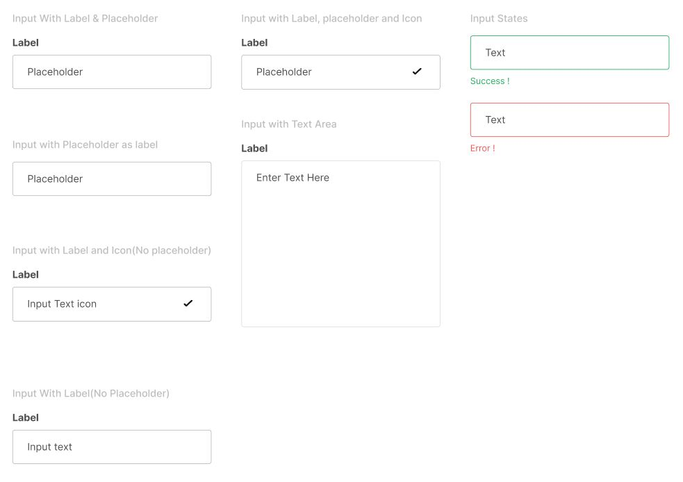
</p>

_Imagen 34. Input System de AgroConnect_

## 4.2. Information Architecture

La arquitectura de información desempeña un papel fundamental en la organización y estructuración del contenido para garantizar su accesibilidad y comprensión por parte de los usuarios. En este apartado, se detallarán los sistemas de organización, etiquetado, etiquetas SEO y metaetiquetas, sistema de búsqueda y sistemas de navegación que componen la arquitectura de la información de nuestro producto.

### 4.2.1. Organization Systems

En AgroConnect, aplicamos un sistema de jerarquía visual para resaltar la información esencial y relevante, garantizando que los usuarios encuentren fácilmente lo que necesitan. Utilizamos una organización secuencial para guiar intuitivamente a los usuarios a través del proceso de registro y búsqueda de asesores o asesoría. En lo que respecta a la categorización de contenido, está organizado según audiencia (Criadores y Asesores)

### 4.2.2. Labeling Systems

En el proyecto AgroConnect se eligió implementar un sistema de etiquetado breve y fácil de comprender para los usuarios. Las etiquetas que se utilizarán son las siguientes:


**Vista de Criador:**

<table>
  <tbody>
  <tr>
      <th>My Farm - Mi Granja</th>
      <td>Se implementará un botón que permitirá a los usuarios gestionar su inventario, que incluirá medicamentos, producción de carne, fertilizante y otros elementos relacionados.</td>
  </tr>
  <tr>
      <th>Advisors - Mis asesores</th>
      <td>Se implementará un botón que permitirá a los usuarios contactar con asesores.</td>
  </tr>
  <tr>
      <th>My animals - Mis animales</th>
      <td>Se implementará un botón que permitirá al usuario llevar un registro y seguimiento de los animales en la granja.</td>
  </tr>
  <tr>
      <th>Calendar - Calendario</th>
      <td>Se implementará un botón que permitirá visualizar un calendario con las citas registradas.</td>
  </tr>
  <tr>
      <th>Registry - Registro</th>
      <td>Se implementará un botón que permitirá al usuario registrar información de nuevos animales, datos de la gastos y recursos.</td>
  </tr>
  <tr>
      <th>Notifications - Notificaciones</th>
      <td>Se implementará un botón que permitirá visualizar notificaciones respecto a las solicitudes de las ofertas de empleo.</td>
  </tr>
  <tr>
      <th>Logout</th>
      <td>Se implementará un botón que permitirá al usuario desvincularse de su cuenta.</td>
  </tr>
  </tbody>
</table>

<br></br>
**Vista de Asesor:**

<table>
  <tbody>
  <tr>
      <th>Home - Inicio</th>
      <td>Se implementará un botón que permitirá al usuario ver publicaciones de clientes y poder ofertar.</td>
  </tr>
  <tr>
      <th>My clients - Mis clientes</th>
      <td>Se implementará un botón que permitirá a los usuarios ver su clientes.</td>
  </tr>
  <tr>
      <th>My publications - Mis publicaciones</th>
      <td>Se implementará un botón que permitirá al usuario ver el historial de sus publicaciones de ofertas de trabajo.</td>
  </tr>
  <tr>
      <th>Notifications - Notificaciones</th>
      <td>Se implementará un botón que permitirá visualizar notificaciones respecto a las solicitudes de las ofertas de empleo y recordatorios de citas pendientes.</td>
  </tr>
    <tr>
      <th>Calendar - Calendario</th>
      <td>Se implementará un botón que permitirá visualizar un calendario con las citas registradas.</td>
  </tr>
  <tr>
      <th>Logout</th>
      <td>Se implementará un botón que permitirá al usuario desvincularse de su cuenta.</td>
  </tr>
</table>

### 4.2.3. SEO Tags and Meta Tags

Las Search Engine Optimization (Etiquetas SEO) y las Meta Tags (Meta Etiquetas) juegan un papel vital en la visibilidad y el posicionamiento del contenido en los motores de búsqueda. Existen varios tipos de etiquetas SEO y metaetiquetas, y a continuación se destacan algunas de las más relevantes para la empresa:

- **Metaetiqueta de Descripción (Meta Description Tag):** Esta etiqueta ofrece una breve   descripción del contenido de la página. Aunque no influye directamente en el ranking de búsqueda, una meta descripción bien redactada puede aumentar la tasa de clics (CTR) al proporcionar a los usuarios una visión clara del contenido de la página.

````
<meta name="description" content="AgroTech ofrece soluciones tecnológicas innovadoras para mejorar la gestión de granjas de cuyes. Nuestra misión es empoderar a los granjeros con herramientas inteligentes y eficientes.">
````

**Metaetiqueta de Autor (Meta Autor Tag):** Esta etiqueta especifica el autor del contenido de la página. Esto puede ser útil para atribuir la propiedad intelectual o identificar la fuente del contenido.

````
<meta name="author" content="AgroTech">
````

**Etiqueta de Título (Title Tag):** Esta etiqueta es esencial para el SEO, ya que define el título de una página web y aparece como el título principal en los resultados de búsqueda. 

````
<title>AgroConnect</title>
````

**Etiqueta de Idioma (Language Tag):** Esta etiqueta especifica el idioma principal del contenido de la página. Es útil para la clasificación en búsquedas locales y ayuda a los motores de búsqueda a comprender el idioma del contenido.

````
<html lang="en">
````

**Metaetiqueta de Robots (Meta Robots Tag):** Esta etiqueta indica a los motores de búsqueda cómo indexar y rastrear la página. Puede especificar si la página debe ser indexada, si deben seguirse los enlaces o si se deben seguir ciertas instrucciones específicas.

````
<meta name="robots" content="index, follow"> 
````

<p align="center">
  
</p>

_Imagen 35. SEO tags de AgroConnect_

### 4.2.4. Searching Systems

La aplicación AgroConnect desarrollará un sistema de búsqueda intuitivo, diseñado para que los usuarios encuentren rápidamente la información que necesitan. Este sistema se basará en filtros inteligentes que simplificarán la búsqueda de asesores, evitando así que los usuarios se vean abrumados por la cantidad de información disponible. Con esta mejora, nuestra aplicación garantizará una experiencia de usuario más fluida y satisfactoria al buscar información relevante.

<table>
  <tbody>
  <tr>
      <th>Ubicación</th>
      <td>Permite al usuario buscar asesores o recibir solicitudes de asesoramiento basadas en su ubicación actual o en una ubicación específica.</td>
  </tr>
  <tr>
      <th>Tipo de Asesoría</th>
      <td>Permite al usuario buscar según el tipo de asesoría ofrecida.</td>
  </tr>
  <tr>
      <th>Presupuesto</th>
      <td>Permite al usuario buscar asesores que se ajusten a su presupuesto.</td>
  </tr>
  <tr>
      <th>Experiencia</th>
      <td>Permite al usuario buscar asesores con un nivel de experiencia específico.</td>
  </tr>
  <tr>
      <th>Reputación</th>
      <td>Permite al usuario buscar asesores según las calificaciones obtenidas.</td>
  </tr>
  <tr>
      <th>Idioma</th>
      <td>Permite al usuario buscar según el idioma.</td>
  </tr>
  <tr>
      <th>Palabras Clave</th>
      <td>Proporciona un cuadro de búsqueda donde los usuarios pueden ingresar palabras clave específicas relacionadas con el tipo de asesoría que necesitan.</td>
  </tr>
  </tbody>
</table>

### 4.2.5. Navigation Systems

La página de inicio de AgroConnect ha sido diseñada para una experiencia fácil y completa, ofreciendo las siguientes características:

 - ***Menús de Navegación:*** Los menús de navegación son una estructura estándar que se utiliza para organizar y presentar las diversas secciones y páginas de un producto. Estos menús pueden adoptar diferentes formas, como menús desplegables, ubicados en la parte superior o lateral de una página, e incluso enlaces de navegación en el pie de página.

 - ***Navegación por Pestañas:*** Es un sistema que emplea pestañas para organizar el contenido en secciones o categorías. Esto permite a los usuarios cambiar entre las distintas secciones de contenido simplemente haciendo clic en las pestañas correspondientes, sin necesidad de cargar nuevas páginas.

## 4.3. Landing Page UI Design

En este apartado, nos enfocaremos en el diseño de la interfaz de usuario (UI) de nuestra landing page. Es crucial que los usuarios que visiten nuestra página comprendan rápidamente de qué se trata nuestro producto y qué beneficios principales ofrecemos.

### 4.3.1. Landing Page Wireframe

**Wireframe - sección de ‘Inicio’ de AgroConnect:** la sección tendrá una imagen de fondo llamativa con un mensaje que refleja el objetivo de la startup para llamar la atención de posibles usuarios.

<p align="center">
  
</p>

_Imagen 36. Pagina Acerca de_

**Wireframe - sección de ‘Sobre Nosotros’:** la sección tendrá una imagen de fondo y tendrá información sobre la startup Agrotech junto con nuestra misión y visión.

<p align="center">
  
</p>

_Imagen 37. Pagina Sobre Nosotros_

**Wireframe - sección de ‘Características’:** la sección tendrá una imagen de fondo y tendrá información sobre los servicios que ofrecemos con nuestra aplicación AgroConnect.

<p align="center">
  
</p>

_Imagen 38. Pagina Características_

**Wireframe - sección de ‘Contacto’:** la sección tendrá una imagen de fondo y tendrá un formulario donde los usuarios potenciales puedan escribir consultas para que sean respondidas en un correo por un miembro de AgroTech.

<p align="center">
  
</p>

_Imagen 39. Pagina Contacto_

### 4.3.2. Landing Page Mock-up
**Mockup - sección de ‘Inicio’ de AgroConnect:** la sección tiene una imagen de fondo llamativa con un mensaje que refleja el objetivo de la startup para llamar la atención de posibles usuarios.

<p align="center">
  
</p>

_Imagen 40. Mockup Pagina Inicio_

**Mockup - sección de ‘Acerca de’:** la sección tiene una imagen de fondo y tiene información sobre la problemática que queremos resolver.

<p align="center">
  
</p>

_Imagen 41. Mockup Pagina Acerca de_

**Mockup - sección de ‘Sobre Nosotros’:** la sección tiene una imagen de fondo y tiene información sobre la startup Agrotech junto con nuestra misión y visión.

<p align="center">
  
</p>

_Imagen 42. Mockup Pagina Sobre Nosotros_

**Mockup - sección de ‘Características’:** la sección tiene una imagen de fondo y tiene información sobre los servicios que ofrecemos con nuestra aplicación AgroConnect.

<p align="center">
  
</p>

_Imagen 43. Mockup Pagina de Características_

**Mockup - sección de ‘Contacto’:** la sección tiene una imagen de fondo y tiene un formulario donde los usuarios potenciales pueden escribir consultas para que sean respondidas en un correo por un miembro de AgroTech.

<p align="center">
  
</p>

_Imagen 44. Mockup Pagina de Contacto_

## 4.4 Web Applications UX/UI Design

### 4.4.1 Web Applications Wireframes
En este apartado, se muestran todos los wireframes necesarios para cumplir las funcionalidades indicadas en las User Stories con sus escenarios relacionados con el Web Application.

**Wireframes de Inicio de sesión y Registro:** En estos wireframes se han colocado las vistas de registro las cuales tienen primero los mismos inputs para criador y asesor, siendo el correo y contraseña, para luego diferir en información específica como es el caso de asesor donde coloca su profesión, años de experiencia, foto de perfil, etc.


_Imagen 45. Wireframes de Inicio de sesión y Registro_

**Wireframes de Mi Granja:** En estos wireframes se maneja las vistas del criador donde podrá gestionar tanto sus recursos como sus gastos, pudiendo ver toda la información con respecto a estos que ha ido registrando.


_Imagen 46. Wireframes de sección Mi Granja_

**Wireframes de Mis Animales - Jaulas:** En estos wireframes se maneja las vistas de la sección Mis Animales en específico los que tratan del manejo de las jaulas donde están los cuyes pudiendo modificar su información y/o eliminarlas.


_Imagen 47. Wireframes de Mis animales - Jaulas_

**Wireframes de Mis Animales - Jaulas:** En estos wireframes se maneja las vistas de la sección Mis Animales en específico los que tratan de la visualización y edición de información de los cuyes.


_Imagen 48. Wireframes de Mis animales - Cuyes_

**Wireframes de Asesores - Citas:** En estos wireframes se maneja la visualización de los asesores que participan de la aplicación, incluyendo la funcionalidad de filtrar los asesores por palabras clave como su nombre. Además de poder comprobar los horarios disponibles de los asesores y reservar citas.


_Imagen 49. Wireframes de Asesores - Citas_

**Wireframes de Asesores - Reseñas:** En estos wireframes se maneja la funcionalidad de reseñas de los asesores.


_Imagen 50. Wireframes de Asesores - Reseñas_

**Wireframes de Registro - Jaulas:** En estos wireframes se maneja el registro de nuevas jaulas.


_Imagen 51. Wireframes de Registro - Jaulas_

**Wireframes de Registro - Cuyes:** En estos wireframes se maneja el registro de nuevos cuyes.


_Imagen 52. Wireframes de Registro - Cuyes_

**Wireframes de Registro - Recursos:** En estos wireframes se maneja el registro de nuevos recursos.


_Imagen 53. Wireframes de Registro - Cuyes_

**Wireframes de Notificaciones:** En estos wireframes se maneja la vista de las notificaciones del criador que serían los recordatorios de citas programadas.


_Imagen 54. Wireframes de Notificaciones_

**Wireframes de Clientes:** En estos wireframes se maneja la vista de los clientes del asesor.


_Imagen 55. Wireframes de Clientes_

**Wireframes de Publicaciones:** En estos wireframes se maneja la vista de las publicaciones actuales del asesor y la creación de nuevas publicaciones.


_Imagen 56. Wireframes de Publicaciones_

**Wireframes de Notificaciones:** En estos wireframes se maneja la vista de las notificaciones del asesor que serían los recordatorios de citas programadas y interés en sus publicaciones.


_Imagen 57. Wireframes de Notificaciones_

### 4.4.2 Web Applications Wireflow Diagrams
Para usuario:


_Imagen 58. Wireflow - usuario - 1_


_Imagen 59. Wireflow - usuario - 2_

Para asesor:


_Imagen 60. Wireflow - asesor - 1_

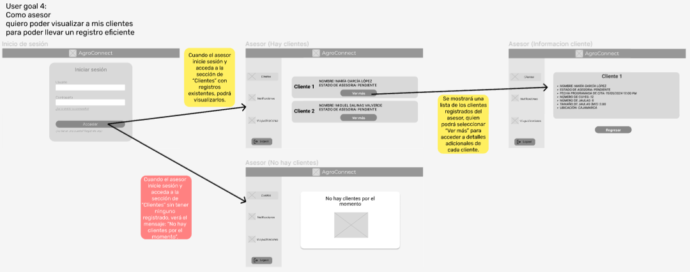

_Imagen 61. Wireflow - asesor - 2_


_Imagen 62. Wireflow - asesor - 3_


_Imagen 63. Wireflow - asesor - 4_

Para criador:


_Imagen 64. Wireflow - criador - 1_


_Imagen 65. Wireflow - criador - 2_


_Imagen 66. Wireflow - criador - 3_


_Imagen 67. Wireflow - criador - 4_


_Imagen 68. Wireflow - criador - 5_


_Imagen 69. Wireflow - criador - 6_


_Imagen 70. Wireflow - criador - 7_


_Imagen 71. Wireflow - criador - 8_


_Imagen 72. Wireflow - criador - 9_


_Imagen 73. Wireflow - criador - 10_


_Imagen 74. Wireflow - criador - 11_

### 4.4.3 Web Applications Mock-ups

En este apartado, se muestran todos los mock-ups basados de los wireframes previamento mencionados. Añadiendo los colores del general style guidelines e imágenes para mejorar la visibilidad de la aplicación.

**Mock-ups de Inicio de sesión y Registro:** 


_Imagen 75. Mock-ups de Inicio de sesión y Registro_

**Mock-ups de Mi Granja:**


_Imagen 76. Mock-ups de sección Mi Granja_

**Mock-ups de Mis Animales - Jaulas:**

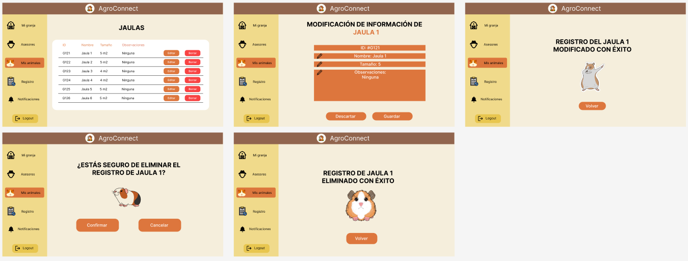

_Imagen 77. Mock-ups de Mis animales - Jaulas_

**Mock-ups de Mis Animales - Jaulas:**


_Imagen 78. Mock-ups de Mis animales - Cuyes_

**Mock-ups de Asesores - Citas:**


_Imagen 79. Mock-ups de Asesores - Citas_

**Mock-ups de Asesores - Reseñas:**


_Imagen 80. Mock-ups de Asesores - Reseñas_

**Mock-ups de Registro - Jaulas:**


_Imagen 81. Mock-ups de Registro - Jaulas_

**Mock-ups de Registro - Cuyes:**


_Imagen 82. Mock-ups de Registro - Cuyes_

**Mock-ups de Registro - Recursos:**


_Imagen 83. Mock-ups de Registro - Cuyes_

**Mock-ups de Notificaciones:**


_Imagen 84. Mock-ups de Notificaciones_

**Mock-ups de Clientes:**


_Imagen 85. Mock-ups de Clientes_

**Mock-ups de Publicaciones:**


_Imagen 86. Mock-ups de Publicaciones_

**Mock-ups de Notificaciones:**


_Imagen 87. Mock-ups de Notificaciones_

### 4.4.4 Web Applications User Flow Diagrams

Cabe mencionar que los happy paths son representados por cuadros amarillos, mientras que los unhappy paths se identifican por los cuadros con tonalidad rojiza.

**Para usuario:**


_Imagen 88. usuario - inicio sesion_


_Imagen 89. usuario - recuperar contraseña_

**Para asesor:**


_Imagen 90. asesor - registro_


_Imagen 91. asesor - visualizar clientes_


_Imagen 92. asesor - crear publicaciones_


_Imagen 93. asesor - recibir notificaciones_

**Para criador:**


_Imagen 94. criador - registrar jaulas_


_Imagen 95. criador - registrar cuyes_


_Imagen 96. criador - registrar gastos_


_Imagen 97. criador - registrar recursos_


_Imagen 98. criador - modificar informacion jaulas_


_Imagen 99. criador - eliminar jaulas_


_Imagen 100. criador - ver en que jaulas pertencen cuyes_


_Imagen 101. criador - eliminar registro cuy_


_Imagen 102. criador - editar registro cuy_


_Imagen 103. criador - buscar asesores_


_Imagen 104. criador - calificar asesoria_
 

## 4.5 Web Applications Prototyping
A partir de los User Flows definidos en el punto anterior, se trabajó el prototipo funcional en Figma, el cual se explica en el siguiente video.

URL del video: [Video de explicación](https://www.youtube.com/watch?v=lTo_Pz0j2vc)

URL del prototipo: [Prototipo en figma](https://www.figma.com/proto/y65W2Fnk2IreDIFC3yPTAl/Open--Web-Style-Guidelines?type=design&node-id=296-1548&t=75RhDMIrAZo5uqGx-1&scaling=contain&page-id=112%3A67&starting-point-node-id=296%3A1548)


_Imagen 105. Explicación del prototipo_

## 4.6 Domain-Driven Software Architecture
### 4.6.1 Software Architecture Context Diagram
El diagrama de contexto representa la estructura y las principales interacciones de un sistema de software. Este sistema permite a los usuarios, ya sean los criadores novatos o asesores, explorar la plataforma y llevar a cabo las sesiones para apoyo, y para gestionar inventario de la granja. 


_Imagen 106. Diagrama de contexto_

### 4.6.2 Software Architecture Container Diagrams
El diagrama de contenedores representa la arquitectura del sistema de AgroConnect. Los criadores y asesores utilizan el contenedor de la aplicación web para interactuar con las funcionalidades del sistema mediante una conexión con la API REST.


_Imagen 107. Diagrama de contenedores_

### 4.6.3 Software Architecture Components Diagrams
Los diagramas de componentes fueron creados en base a la API Rest y los bounded contexts que la componen: Gestión, Publicación, Usuario y Cita.

**API Rest Bounded Context Component Diagram**


_Imagen 108. Diagrama de componentes - API REST_


**Management Bounded Context Component Diagram**


_Imagen 109. Diagrama de componentes - Gestión_


**Publication Bounded Context Component Diagram**


_Imagen 110. Diagrama de componentes - Publicación_


**User Bounded Context Component Diagram**


_Imagen 111. Diagrama de componentes - Usuario_

**Appointment Bounded Context Component Diagram**


_Imagen 112. Diagrama de componentes - Cita_

## 4.7 Software Object-Oriented Design
### 4.7.1 Class Diagrams

**User BC Class Diagram**


_Imagen 113. Diagrama de Clases User Bounded Context_

**Management BC Class Diagram**


_Imagen 114. Diagrama de Clases Management Bounded Context_

**Appointment BC Class Diagram**


_Imagen 115. Diagrama de Clases Apointment Bounded Context_

**Publication BC Class Diagram**


_Imagen 116. Diagrama de Clases Publication Bounded Context_


### 4.7.2. Class Dictionary.

#### User Bounded Context

**User (Aggregate)**
La clase User contiene la información de autenticación de un usuario registrado dentro de la aplicación.

**Atributos:**
- id: int - Identificador único del usuario
- username: string - Correo electrónico del usuario
- password: string - Contraseña del usuario

**Métodos:**
- getUser(): Devuelve los detalles del usuario.

-----

**Breeder (Aggregate)**
La clase Breeder representa a un criador dentro de la aplicación y tiene una relación de dependencia con User.

**Atributos:**
- id: int - Identificador único del criador
- fullname: string - Nombre completo del criador
- location: string - Ubicación del criador
- birthDate: LocalDate - Fecha de nacimiento del criador
- description: string - Descripción del criador
- userId: int - Identificador del usuario

**Métodos:**
- getBreeder(): Devuelve los detalles del criador.

-----

**Advisor (Aggregate)**
La clase Advisor representa a un asesor dentro de la aplicación y tiene una relación de dependencia con User.

**Atributos:**
- id: int - Identificador único del asesor
- fullname: string - Nombre completo del asesor
- location: string - Ubicación del asesor
- birthDate: LocalDate - Fecha de nacimiento del asesor
- description: string - Descripción del asesor
- occupation: string - Ocupación del asesor
- experience: int - Años de experiencia del asesor
- photo: string - Foto del asesor
- rating: int - Calificación del asesor
- userId: int - Identificador del usuario

-----

**AvailableDate (Entity)**
La clase AvailableDate representa las fechas disponibles de un asesor para programar citas.

**Atributos:**
- id: int - Identificador único de la fecha disponible
- date: LocalDate - Fecha disponible
- startTime: LocalTime - Hora de inicio
- endTime: LocalTime - Hora de fin
- status: boolean - Estado de la fecha disponible
- advisorId: int - Identificador del asesor

**Métodos:**
- getAvailableDate(): Devuelve los detalles de la fecha disponible.
- getStatus(): Devuelve el estado de la fecha disponible.

-----

**Notification (Entity)**
La clase Notification representa una notificación dentro de la aplicación.

**Atributos:**
- id: int - Identificador único de la fecha disponible
- type: string - Tipo de notificación
- text: string - Texto de la notificación
- date: Date - Fecha de la notificación
- meetingUrl: string - Enlace de reunión para cita
- userId: int - Identificador del usuario

**Métodos:**
- getNotification(): Devuelve los detalles de la notificación.

-----

#### Management Bounded Context

**Cage (Aggregate)**
La clase Cage contiene toda la información de una jaula de cuyes.

**Atributos:**
- id: int - Identificador único de la jaula
- name: Name - Nombre de la jaula
- size: Size - Tamaño de la jaula
- observations: Observations - Observaciones de la jaula
- breederId: int - Identificador del criador

**Métodos:**
- getCage(): Devuelve los detalles de la jaula.
- updateCage(): Actualiza los detalles de la jaula.

-----

**Animal (Entity)**
La clase Animal representa a un cuy dentro de una jaula.

**Atributos:**
- id: int - Identificador único del cuy
- name: Name - Nombre del cuy
- breed: Breed - Raza del cuy
- gender: Gender - Género del cuy
- birthDate: BirthDate - Fecha de nacimiento del cuy
- weight: Weight - Peso del cuy
- isSick: isSick - Estado de salud del cuy
- observations: Observations - Observaciones del cuy
- cageId: int - Identificador de la jaula

**Métodos:**
- getAnimal(): Devuelve los detalles del cuy.
- updateAnimal(): Actualiza los detalles del cuy.

-----

**Resource (Aggregate)**
La clase Resource contiene toda la información de un recurso utilizado en la granja.

**Atributos:**
- id: int - Identificador único del recurso
- name: Name - Nombre del recurso
- resourceType: ResourceType - Tipo de recurso
- quantity: Quantity - Cantidad del recurso
- date: DateOfCreation - Fecha de creación del recurso
- observations: Observations - Observaciones del recurso
- breederId: int - Identificador del criador

**Métodos:**
- getResource(): Devuelve los detalles del recurso.
- updateResource(): Actualiza los detalles del recurso.

-----

**Expense (Aggregate)**
La clase Expense contiene toda la información de un gasto realizado por un criador.

**Atributos:**
- id: int - Identificador único del gasto
- name: Name - Nombre del gasto
- expenseType: ExpenseType - Tipo de gasto
- amount: Amount - Monto del gasto
- date: DateOfCreation - Fecha de creación del gasto
- observations: Observations - Observaciones del gasto
- breederId: int - Identificador del criador

**Métodos:**
- getExpense(): Devuelve los detalles del gasto.
- updateExpense(): Actualiza los detalles del gasto.

-----

#### Appointment Bounded Context

**Appointment (Aggregate)**
La clase Appointment contiene toda la información de una cita programada entre un criador y un asesor.

**Atributos:**
- id: int - Identificador único de la cita
- date: DateAppointment - Fecha de la cita
- status: Status - Estado de la cita
- breederId: int - Identificador del criador
- advisorId: int - Identificador del asesor

**Métodos:**
- getAppointment(): Devuelve los detalles de la cita.
- updateAppointment(): Actualiza los detalles de la cita.

-----

**DateAppointment (ValueObject)**
La clase DateAppointment representa la fecha de una cita programada.

**Atributos:**
- date: Date - Fecha de la cita

**Métodos:**
- getDateAppointment(): Devuelve la fecha de la cita.
- setDateAppointment(): Establece la fecha de la cita.

-----

**Status (ValueObject)**
La Enum Status representa el estado de una cita programada.

**Atributos:**
- PENDIENTE: Estado de la cita pendiente
- TERMINADO: Estado de la cita terminada

-----

**Review (Entity)**
La clase Review representa la reseña de un asesor realizada por un criador.

**Atributos:**
- id: int - Identificador único de la reseña
- comment: string - Comentario de la reseña
- rating: int - Calificación de la reseña
- appointmentId: int - Identificador de la cita

**Métodos:**
- getReview(): Devuelve los detalles de la reseña.

-----

#### Publication Bounded Context

**Publication (Aggregate)**
La clase Publication contiene toda la información de una publicación realizada por un asesor.

**Atributos:**
- id: int - Identificador único de la publicación
- publicationContent: PublicationContent - Contenido de la publicación
- date: Date - Fecha de la publicación
- advisorId: int - Identificador del asesor

**Métodos:**
- getPublication(): Devuelve los detalles de la publicación.

-----

**PublicationContent (ValueObject)**
La clase PublicationContent representa el contenido de una publicación.

**Atributos:**
- title: string - Título de la publicación
- description: string - Descripción de la publicación
- image: string - Imagen de la publicación

**Métodos:**
- getTitle(): Devuelve el título de la publicación.
- setTitle(): Establece el título de la publicación.
- getDescription(): Devuelve la descripción de la publicación.
- setDescription(): Establece la descripción de la publicación.
- getImage(): Devuelve la imagen de la publicación.
- setImage(): Establece la imagen de la publicación.


## 4.8 Database Design
### 4.8.1 Database Diagram
Se hizo el diseño de la base de datos no relacional, considerando cumplir con las funcionalidades mencionadas en las User Stories.


_Imagen 117. Diagrama de base de datos_


# Capítulo V Product Implementation, Validation & Deployment

## 5.1. Software Configuration Management.

### 5.1.1. Software Development Environment Configuration.

**Project Management:**

Para la gestión del proyecto, utilizamos como principal medio de comunicación WhatsApp, a través de un grupo en el cual compartimos nuestras ideas y opiniones sobre cada parte del trabajo. A esto se le suma el uso de la herramienta Google Meet, para realizar reuniones en videoconferencia y conversar de forma síncrona. Por otro lado, el proyecto también tiene que ser documentado con todos los puntos requeridos, por lo que utilizamos Google Drive para la creación de documentos compartidos y trabajar de forma colaborativa, permitiendo un mejor flujo de trabajo y tener un historial sobre lo que realizó cada uno. Asimismo, utilizamos GitHub para el manejo de repositorios a través de una comunidad conformada por todos los integrantes del equipo. En esta, también documentamos los reportes y la aplicación en sí.


**Requirements Management:**

Para el registro de los requisitos, o también llamadas historias de usuario, utilizamos la herramienta Pivotal Tracker, en la cual registramos cada una de ellas y ordenadas por prioridad según el Product Backlog. La realización de este fue grupal, todos los integrantes aportamos en las historias de usuario y discutimos sobre las principales funcionalidades que consideramos que debe tener la aplicación web.


**Product UX/UI Design:**

Se realizaron los productos de UX con la herramienta UXPressia, así como el User Persona, Empathy Mapping, Impact Mapping, entre otras. Gracias a esto pudimos modelar bien los diseños de la experiencia de usuario, lo cual nos sirve para poder ponernos en una mejor perspectiva para nuestros segmentos objetivo. Por otro lado, hicimos los prototipos de la aplicación web utilizando la herramienta Figma, la cual nos permitió crear los Wireframes y Mock-ups para tener un diseño previo al desarrollo de la aplicación.


**Software Development:**

Como principal IDE, utilizamos Visual Studio Code, el cual es el entorno de desarrollo con el que estamos más familiarizados, además que ofrece flexibilidad, facilidad de uso y una gran variedad de soporte de lenguajes de programación. Además, permite la conexión con repositorios en línea creados en GitHub, lo cual nos permite tener una mejor gestión del proyecto, así como el historial de todos los cambios realizados. En la otra mano, para el desarrollo usamos los lenguajes aprendidos previamente, como HTML, CSS y JavaScript, y nuevos conocimientos adquiridos este ciclo como el framework de AngularJS.


**Software Testing:**

Las pruebas de aceptación son importantes a realizar para comprobar que los criterios de aceptación planteados están favoreciendo a las necesidades del negocio y cumplir con los requerimientos, para lo cual utilizamos el lenguaje Gherkin. Este consiste en trabajar el escenario con Given When Then, y lograr identificar las variables de input y output, lo cual es sencillo de entender para todos ya que utiliza lenguaje natural. Gracias a este, es que se logra garantizar la calidad del software, por ello cumple un papel esencial en los proyectos de desarrollo.


### 5.1.2. Source Code Management.

Usuarios de GitHub
<table>
  <thead>
    <tr>
        <th>Integrante</th>
        <th>Usuario de GitHub</th>
    </tr>
  </thead>
  <tbody>
  <tr>
      <td>Delgado Corrales, Piero Gonzalo</td>
      <td>PieroD04</td>
  </tr>
  <tr>
      <td>Lucas Coronel, Nadia Alessandra</td>
      <td>nad21lc</td>
  </tr>
  <tr>
      <td>Paredes Puente, Sebastián Roberto</td>
      <td>sebastian123gonzalo</td>
  </tr>
  <tr>
      <td>Salinas Torres, Salvador Antonio</td>
      <td>salvadoorssalinas</td>
  </tr>
  <tr>
      <td>Valverde Mozo, Andre Gabriel</td>
      <td>AndreVMG</td>
  </tr>
  </tbody>
</table>


*URL de repositorio de Landing Page:* https://github.com/AgroTech-UPC/Landing-Page

*URL de repositorio de Web Services:* https://github.com/AgroTech-UPC/Web-Services

*URL de repositorio de Frontend Web Applications:* https://github.com/AgroTech-UPC/Frontend-Web-Applications

*URL de repositorio de Acceptance Tests*: https://github.com/AgroTech-UPC/Acceptance-Tests

Para el desarrollo del trabajo se hará uso de GitFlow, el cual es un modelo de flujo de trabajo para la gestión de control de versiones Git. Está compuesta por ramas y cada una cumple un propósito distinto. Las ramas que utilizamos son: Feature, Develop, Release y Main. 

**Rama Feature**: En esta rama se desarrolla un feature específico, por ejemplo la implementación del registro de un usuario o del inicio de sesión. Las ramas Feature se trabajan y controlan por separado para tener un orden sobre el cual trabajar a partir del Product Backlog. Esto asegura que cualquier problema que surja durante el desarrollo de una característica no afecte al programa en su totalidad.

**Rama Develop**: En esta rama se fusionan las ramas feature desarrolladas. Esto permite verificar que todo funcione correctamente antes de integrarlo en la rama Release para su despliegue.

**Rama Release**: En esta rama se prepara la versión final del sprint. Se realiza una revisión final de la versión para poder hacer el despliegue. Se asegura que todo esté correcto y funcional antes de hacer el despliegue. Al hacer el merge a la rama main, se especifica la versión que se está desplegando, para tener un control sobre las versiones desplegadas.

**Rama Main**: En esta rama se encuentra la versión desplegada más reciente del proyecto. Es la rama principal que cuenta con cada versión desplegada oficialmente.


### 5.1.3. Source Code Style Guide & Conventions.
En el desarrollo de este trabajo, se utilizará una gran variedad de lenguajes para trabajar en el Landing Page, Web Services y Frontend Web Application. Para ello, se utilizará la siguiente guía de estilos y convenciones.


**HTML**

Es el lenguaje utilizado para estructurar el contenido de una página web, brindando una variedad de elementos posibles como texto, imágenes, formularios, etc.
https://www.w3schools.com/html/html5_syntax.asp

- Declarar el tipo de documento en la primera línea con \<!DOCTYPE html>.
- Respetar la estructura básica del HTML: \<html>, \<head>, \<body>.
- Declarar el título de la página para dar a conocer al usuario en qué página se encuentra. (Usar el elemento \<title> en \<head>)
- Se usará la indentación coherente para lograr una lectura sencilla del código, por lo que es importante tener la tabulación correcta para cada nivel de anidamiento.
- Siempre cerrar los elementos que lo requieran, ya sea una división, párrafo, título. (Si se declara una \<div>, siempre cerrarlo con \</div>)
- Declarar el atributo “alt” para las imágenes.


**CSS**

Es el lenguaje utilizado para definir el diseño de la página web, así como los estilos, fuentes, colores, contenedores, etc.
https://google.github.io/styleguide/htmlcssguide.html
- Usar indentación de forma correcta.
- Los nombres para elementos deben ser cortos y en minúsculas.
- Declarar los colores en código hexadecimal. (Ejemplo: #024A86)
- Dejar comentarios para conocer el propósito del estilo y su uso.
- El diseño debe ser responsive para que los usuarios lo puedan visualizar cómodamente desde el dispositivo en qué se encuentren.


**JavaScript**

Es el lenguaje de programación más utilizado para la programación web, ya que permite desarrollar páginas interactivas con animaciones agradables para los usuarios.
https://www.w3schools.com/js/js_conventions.asp
- Declarar nombres coherentes y cortos para las variables y funciones.
- Dejar comentarios para dar a conocer que hace cada parte del código sobre la página web.
- Siempre colocar un punto y coma al final de cada línea de código.
- Declarar las constantes cuando sea necesario en lugar de variables que nunca cambiarán su valor.
- Usar los operadores de comparación estricta en lugar de comparación regular cuando sea posible. (Ejemplo: Utilizar === en lugar de ==)


**TypeScript**

Es el superjunto de JavaScript que añade características como el tipado estático y funciones avanzadas.
https://www.typescriptlang.org/docs/handbook/intro.html
- Declarar nombres significativos y consistentes para las variables, al igual que en JavaScript.
- Declarar interfaces y tipos en PascalCase.
- Declarar variables y funciones en CamelCase.
- Dejar comentarios para explicar sobre lo que hace cada parte del código.
- Usar interfaces para la reutilización de código.


**Java**

Es un lenguaje de programación utilizado para la programación web, programación móvil, entre otros. Es capaz de adaptarse para funcionar en distintas plataformas.
https://google.github.io/styleguide/javaguide.html
- Nombrar las variables, funciones y clases con CamelCase, además de ser significativos y cortos.
- Utilizar HTTPS para establecer una conexión segura.
- Usar indentación correctamente para un código coherente y ordenado.
- Usar comillas dobles (“) para las cadenas de texto.
- Dejar comentarios en cada bloque de código para explicar su funcionalidad.
- Declarar constantes cuando sean variables que no cambiarán su valor a lo largo de todo el código.


**Gherkin**

Es el lenguaje para el diseño de casos de prueba en base a los requisitos establecidos por el negocio. Este se utiliza durante el proceso de testing.
https://specflow.org/gherkin/gherkin-conventions-for-readable-specifications/
- Separar en bloques cada parte de Given When Then, para una mejor lectura y subdividirse adecuadamente.
- Al mostrar las variables de input y output con sus ejemplos, se utilizan tablas para la representación de estos. Sin embargo, no es necesario utilizar tantas tablas para cada parte del código, sino una general al final del escenario.
- Si hay más de un escenario en un archivo, hacer la separación adecuada entre estas para diferenciarlas y dar a conocer que son más de uno. Para ello, se puede dejar dos líneas en blanco para saber dónde es que un escenario termina y el otro comienza.
- Agregar líneas en blanco dentro de cada Step para una mejor lectura y organización de la información.


### 5.1.4. Software Deployment Configuration.

Para la configuración del despliegue de la aplicación, utilizaremos Git, un sistema de control de versiones distribuido que es bastante utilizado en proyectos de desarrollo de software. Es una herramienta esencial para trabajar colaborativamente y poder hacer el seguimiento de los cambios realizados por los miembros del grupo. Una de sus mejores ventajas es su capacidad para rastrear los cambios en los archivos de un proyecto a lo largo del tiempo. Con Git, es posible crear ramas, realizar cambios en ellas y fusionarlos eficientemente, permitiendo que varios desarrolladores trabajen en diferentes aspectos del proyecto simultáneamente sin interferencias.


Por otro lado, tenemos a GitHub, el cual es la plataforma para poder alojar repositorios de Git. Es uno de los servicios más utilizados por desarrolladores de forma mundial, ya que permite manejar repositorios públicos y privados para almacenar el código en la nube. A parte de ello, maneja el historial de los repositorios, permitiendo a los usuarios acceder a todas las versiones trabajadas, permitiendo que puedan retornar a una versión anterior en caso lo deseen. Ofrece otras herramientas que son muy útiles como los pull requests, los cuales son solicitudes de revisiones de una rama y luego poder fusionarla con otra rama.


Así es como con este, que cada miembro podrá trabajar de forma remota desde su IDE, teniendo una copia del repositorio Git a través del repositorio en línea almacenado en GitHub, así poder hacer commits para empujar los cambios que hayan realizado.

## 5.2. Landing Page, Services & Applications Implementation.

### 5.2.1. Sprint 1

#### 5.2.1.1. Sprint Planning 1.

Se planeó el primer sprint a través de una reunión en Meet. Para ello, se hizo la siguiente tabla para registrar la información que se discutió.

|**Sprint #**|Sprint 1|
| :- | :- |
|**Sprint Planning Background**||
|Date|2024-04-01|
|Time|10: 00 PM|
|Location|Virtual (Google Meet)|
|Prepared by|Delgado Corrales, Piero Gonzalo|
|Attendees (to planning meeting)|<p>Delgado Corrales, Piero Gonzalo</p><p>Lucas Coronel, Nadia Alessandra</p><p>Paredes Puente, Sebastián Roberto</p><p>Salinas Torres, Salvador Antonio</p><p>Valverde Mozo, Andre Gabriel</p>|
|Sprint n - 1 Review Summary|No hubo sprint anterior|
|Sprint n - 1 Retrospective Summary|No hubo sprint anterior|
|**Sprint Goal & User Stories**||
|Sprint 1 Goal|Realizar el Landing Page|
|Sprint 1 Velocity|20|
|Sum of Story Points|20|


#### 5.2.1.2. Sprint Backlog 1.

El objetivo de este primer sprint es la implementación del Landing Page estático. Además, se trabajó con una tabla en Trello para manejar los Work-Items de forma adecuada.

<https://trello.com/b/AtaOZblV/sprint-backlog-1> 

 

_Imagen 118. Sprint Backlog 1 en Trello_

<table>
  <tr>
  <th valign="top">Sprint #</th>
  <th colspan="7" valign="top">Sprint 1</th>
</tr>
<tr>
  <td colspan="2" valign="top">User Story</td>
  <td colspan="6" valign="top">Work-Item / Task</td>
</tr>
<tr>
  <td valign="top">Id</td>
  <td valign="top">Title</td>
  <td valign="top">Id</td><td valign="top">Title</td>
  <td valign="top">Description</td>
  <td valign="top">Estimation</td><td valign="top">Assigned To</td>
  <td valign="top">Status (To-Do / In-Process / Review / Done)</td>
</tr>
<tr>
  <td rowspan="2" valign="top">US22</td>
  <td rowspan="2" valign="top">Visualización de Navbar y Footer</td>
  <td valign="top">TS01</td>
  <td valign="top">Implementación de Navbar</td>
  <td valign="top">Se implementa el navbar de forma responsive.</td>
  <td rowspan="2" valign="top">2</td>
  <td valign="top">Nadia Lucas</td><td valign="top">Done</td>
</tr>
<tr>
  <td valign="top">TS02</td>
  <td valign="top">Implementación de Footer</td>
  <td valign="top">Se implementa el footer de forma responsive.</td>
  <td valign="top">Nadia Lucas</td>
  <td valign="top">Done</td>
</tr>
<tr><td valign="top">US23</td><td valign="top">Visualización de sección de inicio</td><td valign="top">TS03</td><td valign="top">Implementación de página de inicio</td><td valign="top">Se implementa la página de inicio de forma responsive y con su archivo css correspondiente.</td><td valign="top">1</td><td valign="top">Nadia Lucas</td><td valign="top">Done</td></tr>
<tr><td valign="top">US24</td><td valign="top">Visualización de sección “Acerca De”</td><td valign="top">TS04</td><td valign="top">Implementación de sección Acerca De</td><td valign="top">Se implementa la página Acerca De, de forma responsive y con su archivo css correspondiente.</td><td valign="top">2</td><td valign="top">Sebastián Paredes</td><td valign="top">Done</td></tr>
<tr><td valign="top">US25</td><td valign="top">Visualización de sección “Sobre Nosotros”</td><td valign="top">TS05</td><td valign="top">Implementación de sección Sobre Nosotros</td><td valign="top">Se implementa la página Sobre Nosotros, de forma responsive y con su archivo css correspondiente.</td><td valign="top">2</td><td valign="top">Salvador Salinas</td><td valign="top">Done</td></tr>
<tr><td valign="top">US26</td><td valign="top">Visualización de sección “Características”</td><td valign="top">TS06</td><td valign="top">Implementación de sección Características</td><td valign="top">Se implementa la página Características, de forma responsive y con su archivo css correspondiente.</td><td valign="top">2</td><td valign="top">Andre Valverde</td><td valign="top">Done</td></tr>
<tr><td valign="top">US27</td><td valign="top">Visualización de sección “Contacto”</td><td valign="top">TS07</td><td valign="top">Implementación de sección Contacto</td><td valign="top">Se implementa la página Contacto, de forma responsive y con su archivo css correspondiente.</td><td valign="top">2</td><td valign="top">Piero Delgado</td><td valign="top">Done</td></tr>
</table>

#### 5.2.1.3. Development Evidence for Sprint Review.

Se realizaron los avances con los commits correspondiente en el repositorio de la siguiente forma.

Repositorio Landing Page: <https://github.com/AgroTech-UPC/Landing-Page>

|**Repository**|**Branch**|**Commit Id**|**Commit Message**|**Commited on (Date)**|
| :- | :- | :- | :- | :- |
|AgroTech-UPC/Landing-Page|feature/header-footer|ff5467f|feat: Preparing the workspace|02/04/2024|
|AgroTech-UPC/Landing-Page|feature/header-footer|965448b|feat: Complete header and footer|02/04/2024|
|AgroTech-UPC/Landing-Page|develop|f450025|Merge pull request #1 from AgroTech-UPC/header-footer|02/04/2024|
|AgroTech-UPC/Landing-Page|develop|bab8888|refactor: login button deleted & padding to main|02/04/2024|
|AgroTech-UPC/Landing-Page|feature/contact|1fdfcb2|feat: contact page completed|03/04/2024|
|AgroTech-UPC/Landing-Page|feature/contact|2a79c52|fix: fixed position of footer|03/04/2024|
|AgroTech-UPC/Landing-Page|develop|1c1cab7|Merge pull request #4 from AgroTech-UPC/feature/contact|03/04/2024|
|AgroTech-UPC/Landing-Page|feature/home|12c2b0b|feat: home page completed|03/04/2024|
|AgroTech-UPC/Landing-Page|develop|b348cf3|Merge pull request #5 from AgroTech-UPC/feature/home|03/04/2024|
|AgroTech-UPC/Landing-Page|feature/about-us|bcee2f1|feat: about us section added|03/04/2024|
|AgroTech-UPC/Landing-Page|develop|f0b57ab|Merge pull request #7 from AgroTech-UPC/feature/about-us|03/04/2024|
|AgroTech-UPC/Landing-Page|feature/about-app|a0f235c|Feat: Section about-app created|04/04/2024|
|AgroTech-UPC/Landing-Page|feature/characteristics|2c15c6d|feat: features section added|04/04/2024|
|AgroTech-UPC/Landing-Page|develop|961b6fe|Merge pull request #8 from AgroTech-UPC/feature/about-app|04/04/2024|
|AgroTech-UPC/Landing-Page|develop|bc8aa23|Merge pull request #10 from AgroTech-UPC/feature/characteristics|04/04/2024|
|AgroTech-UPC/Landing-Page|main|341ad78|Merge pull request #11 from AgroTech-UPC/develop|04/04/2024|

#### 5.2.1.4. Testing Suite Evidence for Sprint Review.

Se realizaron las pruebas de aceptación para las historias de usuario trabajadas utilizando el lenguaje Gherkin en archivos feature. De esta manera, se registraron en el repositorio.

Repositorio Acceptance Tests: <https://github.com/AgroTech-UPC/Acceptance-Tests>

|**Repository**|**Branch**|**Commit Id**|**Commit Message**|**Commited on (Date)**|
| :- | :- | :- | :- | :- |
|AgroTech-UPC/Acceptance-Tests|main|57f2c58|feat: added feature file for US29|05/04/2024|
|AgroTech-UPC/Acceptance-Tests|main|1b94680|feat: added feature file for US28|05/04/2024|
|AgroTech-UPC/Acceptance-Tests|main|9027b2b|Fix: fix typing error|05/04/2024|
|AgroTech-UPC/Acceptance-Tests|main|329c774|feat: added acceptance test for US31|05/04/2024|
|AgroTech-UPC/Acceptance-Tests|main|24c738a|feat: added acceptance test for US30|06/04/2024|
|AgroTech-UPC/Acceptance-Tests|main|802f736|feat: added acceptance test for US26|07/04/2024|
|AgroTech-UPC/Acceptance-Tests|main|29d85ed|feat: added acceptance test for US27|07/04/2024|


#### 5.2.1.5. Execution Evidence for Sprint Review.

En esta sección, se mostrará lo avanzado en el primer sprint, el cual se basa en la implementación del Landing Page estático. Para ello, se realizó el siguiente video con la explicación y las capturas que evidencia la página web.

**URL de video:**
[Execution Evidence](https://youtu.be/Yi3p53UjKF0)

 

_Imagen 119. evidencia landing page 1_


Navbar: fue implementada para que sea responsive y las secciones pasen a un menú lateral en caso de ser necesario.

 

_Imagen 120. navbar 1_

 

_Imagen 121. navbar 2_

Footer: al igual que el navbar, se implementó para acomodarse acorde al tamaño de la ventana.

 

_Imagen 122. footer 1_

 

_Imagen 123. footer 2_

Página de inicio:

 

_Imagen 124. pagina de inicio 1_

 

_Imagen 125. pagina de inicio 2_

Sección “Acerca De”:

 

_Imagen 126. seccion "Acerca de" 1_

 

_Imagen 127. seccion "Acerca de" 2_

Sección “Sobre Nosotros”:

 

_Imagen 128. seccion "Sobre Nosotros" 1_


_Imagen 129. seccion "Sobre Nosotros" 2_

Sección “Características”: 

 

_Imagen 130. seccion "Caracteristicas" 1_

 

_Imagen 131. seccion "Caracteristicas" 2_

Sección “Contacto”:

 

_Imagen 132. seccion "Contacto" 1_

 

_Imagen 133. seccion "Contacto" 2_

#### 5.2.1.6. Services Documentation Evidence for Sprint Review.

En este primer sprint, no hemos trabajado con servicios web, ya que nos hemos concentrado exclusivamente en la creación del Landing Page estático. Es por ello que en esta ocasión, no se trabajó la documentación relacionada con el uso de servicios web.

#### 5.2.1.7. Software Deployment Evidence for Sprint Review.

Una vez acabamos de trabajar con todas las historias de usuario, realizamos el deployment del Landing Page utilizando GitHub Pages.

URL de deployment de Landing Page: <https://agrotech-upc.github.io/Landing-Page/home.html>

Para lograr hacer el deployment, entramos a la configuración del repositorio y a la sección de Pages. Luego, debemos seleccionar la rama sobre la cual se hará el deployment.

 

_Imagen 134. github - pages - 1_

Escogimos la rama main, ya que es la rama principal sobre la cual se guarda la versión final para hacer el deployment. Una vez se escoge, se guardan los cambios.

 

_Imagen 135. github - pages - 2_

Finalmente, solo se espera a que GitHub cree la página y nos brinde el enlace.

 

_Imagen 136. github - pages - 3_

 

_Imagen 137. github - pages - 4_

#### 5.2.1.8. Team Collaboration Insights during Sprint.

En la elaboración de la landing page, todos los integrantes realizaron commits referentes al branch feature que les tocó trabajar. 

 

_Imagen 138. commits - landing-page_

La división de trabajo para lograr la implementación fue por secciones en las cuales cada miembro realizó una sección de la landing page:

-Piero Delgado: sección ‘contacto’

-Sebastían Paredes: sección ‘acerca de’

-Nadia Lucas: sección ‘inicio’

-André Valverde: sección ‘características’

-Salvador Salinas: sección ‘sobre nosotros’

Cada sección tuvo su rama con el formato ‘feature/sección’


_Imagen 139. feature-seccion_

### 5.2.2. Sprint 2

#### 5.2.2.1. Sprint Planning 2.

Se planeó el segundo sprint a través de una reunión en Meet. Para ello, se hizo la siguiente tabla para registrar la información que se discutió.

|**Sprint #**|Sprint 2|
| :- | :- |
|**Sprint Planning Background**||
|Date|2024-04-24|
|Time|11: 00 PM|
|Location|Virtual (Google Meet)|
|Prepared by|Delgado Corrales, Piero Gonzalo|
|Attendees (to planning meeting)|<p>Delgado Corrales, Piero Gonzalo</p><p>Lucas Coronel, Nadia Alessandra</p><p>Paredes Puente, Sebastián Roberto</p><p>Salinas Torres, Salvador Antonio</p><p>Valverde Mozo, Andre Gabriel</p>|
|Sprint 1 Review Summary|En el primer sprint, logramos realizar el deployment del landing page, pero igualmente no se llegó a una versión buena. Además, se necesita mejorar la base de datos y las historias de usuario.|
|Sprint 1 Retrospective Summary|En retrospectiva, se debe mejorar el landing page, la base de datos, mejorar algunas historias de usuario y añadir más.|
|**Sprint Goal & User Stories**||
|Sprint 2 Goal|Implementar el Frontend de nuestra aplicación web|
|Sprint 2 Velocity|72|
|Sum of Story Points|72|

#### 5.2.2.2. Sprint Backlog 2.

El objetivo de este segundo sprint es la implementación del Frontend de nuestra aplicación web. Además, se trabajó con una tabla en Trello para manejar los Work-Items de forma adecuada.

https://trello.com/b/lyM1zKbK/agrotech-sprint-backlog-2


_Imagen 140. Sprint Backlog 2_

<table>
    <tr><th valign="top">Sprint #</th><th colspan="7" valign="top">Sprint 2</th></tr>
    <tr><td colspan="2" valign="top">User Story</td><td colspan="6" valign="top">Work-Item / Task</td></tr>
    <tr><td valign="top">Id</td><td valign="top">Title</td><td valign="top">Id</td><td valign="top">Title</td><td valign="top">Description</td><td valign="top">Estimation</td><td valign="top">Assigned To</td><td valign="top">Status (To-Do / In-Process / Review / Done)</td></tr>
    <tr>
      <td valign="top">US01</td><td valign="top">Visualización de catálogo de asesores</td><td valign="top">TS01</td><td valign="top">Implementación de búsqueda de asesores</td><td valign="top">Se implementa el componente para la búsqueda de asesores para los criadores.</td><td valign="top">5</td>
      <td valign="top">Andre Valverde</td><td valign="top">Done</td>
    </tr>
    <tr>
      <td valign="top">US02</td><td valign="top">Visualización de información de un asesor</td><td valign="top">TS02</td><td valign="top">Implementación de vista de información de un asesor</td><td valign="top">Se implementa el componente con la vista de información de un asesor.</td><td valign="top">3</td><td valign="top">Andre Valverde</td>
      <td valign="top">Done</td>
    </tr>
    <tr>
      <td valign="top">US03</td><td valign="top">Visualización de horarios de asesores</td><td valign="top">TS03</td><td valign="top">Implementación de vista de horarios</td><td valign="top">Se implementa el componente con la vista de los horarios disponibles del asesor.</td><td valign="top">3</td>
      <td valign="top">Andre Valverde</td><td valign="top">Done</td>
    </tr>
    <tr>
      <td valign="top">US04</td><td valign="top">Programación de citas con asesores</td><td valign="top">TS04</td><td valign="top">Implementación de vista para programar cita</td><td valign="top">Se implementa la vista para programar una cita con un asesor.</td><td valign="top">8</td>
      <td valign="top">Andre Valverde</td><td valign="top">Done</td>
    </tr>
    <tr>
      <td valign="top">US05</td><td valign="top">Visualización de información del criador de cuyes</td><td valign="top">TS05</td><td valign="top">Implementación de detalles de cita</td><td valign="top">Se implementa la página para visualizar los datos del criador previa a la cita.</td><td valign="top">5</td>
      <td valign="top">Salvador Salinas</td><td valign="top">Done</td>
    </tr>
    <tr>
      <td valign="top" rowspan="2">US06</td><td valign="top" rowspan="2">Notificación de citas al asesor</td><td valign="top">TS06</td><td valign="top">Implementación de visualización de notificaciones al asesor</td><td valign="top">Se implementa el componente que muestra la vista de notificaciones para los asesores.</td><td valign="top" rowspan="2">3</td>
      <td valign="top">Salvador Salinas</td><td valign="top">Done</td>
    </tr>
    <tr>
      <td valign="top">TS07</td><td valign="top">Implementación de eliminación de notificaciones al asesor</td><td valign="top">Se implementa la función que permite eliminar una notificación.</td><td valign="top">Salvador Salinas</td><td valign="top">Done</td>
    </tr>
    <tr>
      <td valign="top" rowspan="3">US07</td><td valign="top" rowspan="3">Notificación de citas al criador</td><td valign="top">TS08</td><td valign="top">Implementación de visualización de notificaciones al criador</td><td valign="top">Se implementa el componente que muestra la vista de notificaciones para los criadores.</td><td valign="top" rowspan="3">3</td>
      <td valign="top">Nadia Lucas</td><td valign="top">Done</td>
    </tr>
    <tr>
      <td valign="top">TS09</td><td valign="top">Implementación de eliminación de notificaciones al criador</td><td valign="top">Se implementa la función que permite eliminar una notificación.</td><td valign="top">Nadia Lucas</td><td valign="top">Done</td>
    </tr>
    <tr>
      <td valign="top">TS10</td><td valign="top">Implementación de Pantalla de Resultados Vacíos</td><td valign="top">Se implementa un componente que recibe un mensaje como parámetro y permite mostrar una vista cuando no se encuentren datos disponibles.</td><td valign="top">Nadia Lucas</td><td valign="top">Done</td>
    </tr>
    <tr>
      <td valign="top">US08</td><td valign="top">Calificación al asesor luego de una cita</td><td valign="top">TS11</td><td valign="top">Implementación de registro de calificación del asesor</td><td valign="top">Se implementa la funcionalidad en el componente para registrar la calificación del asesor brindada por el criador.</td><td valign="top">5</td>
      <td valign="top">Andre Valverde</td><td valign="top">Done</td>
    </tr>
    <tr>
      <td valign="top" rowspan="2">US09</td>
      <td valign="top" rowspan="2">Gestión de una publicación</td>
      <td valign="top">TS12</td>
      <td valign="top">Implementación de creación de publicaciones</td>
      <td valign="top">Se implementa el componente para crear nuevas publicaciones</td>
      <td valign="top" rowspan="2">2</td>
      <td valign="top">Salvador Salinas</td>
      <td valign="top">Done</td>
    </tr>
    <tr>
      <td valign="top">TS13</td>
      <td valign="top">Implementación de eliminación de publicaciones</td>
      <td valign="top">Se implementa la función dentro del componente de publicaciones para eliminar una publicación</td>
      <td valign="top">Salvador Salinas</td>
      <td valign="top">Done</td>
    </tr>
    <tr>
      <td valign="top">US10</td><td valign="top">Visualización de publicaciones de asesores</td><td valign="top">TS14</td><td valign="top">Implementación de visualización de publicaciones</td><td valign="top">Se implementa el componente para visualizar publicaciones de asesores para el criador.</td><td valign="top">3</td>
      <td valign="top">Salvador Salinas</td><td valign="top">Done</td>
    </tr>
    <tr>
      <td valign="top" rowspan="3">US11</td><td valign="top" rowspan="3">Gestión de jaulas de cuyes</td><td valign="top">TS15</td><td valign="top">Implementación de registro de una jaula</td><td valign="top">Se implementa el componente para registrar una nueva jaula de cuyes.</td><td valign="top" rowspan="3">3</td><td valign="top">Sebastián Paredes</td><td valign="top">Done</td>
    </tr>
    <tr>
        <td valign="top">TS16</td><td valign="top">Implementación de edición de una jaula</td><td valign="top">Se implementa la función que permite editar la información de una jaula.</td><td valign="top">Piero Delgado</td><td valign="top">Done</td>
    </tr>
    <tr>
        <td valign="top">TS17</td><td valign="top">Implementación de eliminación de una jaula</td><td valign="top">Se implementa la función que permite eliminar una jaula junto a la información de los cuyes que habitan en ella.</td><td valign="top">Piero Delgado</td><td valign="top">Done</td>
    </tr>
    <tr>
      <td valign="top">US12</td><td valign="top">Registro de información de animales</td><td valign="top">TS18</td><td valign="top">Implementación de registro de un cuy</td><td valign="top">Se implementa el componente para registrar un cuy en una jaula existente.</td><td valign="top">3</td><td valign="top">Sebastián Paredes</td><td valign="top">Done</td>
    </tr>
    <tr>
      <td rowspan="2" valign="top">US13</td>
      <td rowspan="2" valign="top">Visualización y edición de información de animales</td>
      <td valign="top">TS19</td>
      <td valign="top">Implementación de vista de información de animales</td>
      <td valign="top">Se implementa el componente para visualizar las jaulas y el componente para visualizar la información de los cuyes.</td>
      <td valign="top" rowspan="2">5</td><td valign="top">Piero Delgado</td><td valign="top">Done</td>
    </tr>
    <tr>
      <td valign="top">TS20</td><td valign="top">Implementación de edición de información de animales</td><td valign="top">Se implementa la edición dentro de la componente de jaula, así como la edición para la componente de información de un cuy.</td><td valign="top">Piero Delgado</td><td valign="top">Done</td>
    </tr>
    <tr>
      <td rowspan="2" valign="top">US15</td>
      <td rowspan="2" valign="top">Gestión de recursos de la granja</td>
      <td valign="top">TS22</td>
      <td valign="top">Implementación de registro de recurso</td>
      <td valign="top">Se implementa el componente para registrar un recurso para el criador.</td>
      <td valign="top" rowspan="2">5</td><td valign="top">Sebastián Paredes</td><td valign="top">Done</td>
    </tr>
    <tr>
      <td valign="top">TS23</td>
      <td valign="top">Implementación de vista de recursos</td>
      <td valign="top">Se implementa el componente para la vista de los recursos del criador</td>
      <td valign="top">Nadia Lucas</td>
      <td valign="top">Done</td>
    </tr>
    <tr>
      <td rowspan="2" valign="top">US16</td>
      <td rowspan="2" valign="top">Gestión de gastos realizados</td>
      <td valign="top">TS24</td>
      <td valign="top">Implementación de registro de gasto</td>
      <td valign="top">Se implementa el componente para registrar un gasto para el criador.</td>
      <td valign="top" rowspan="2">5</td>
      <td valign="top">Sebastián Paredes</td>
      <td valign="top">Done</td>
    </tr>
    <tr>
      <td valign="top">TS25</td>
      <td valign="top">Implementación de vista de gastos</td>
      <td valign="top">Se implementa el componente para la vista de los recursos del criador.</td>
      <td valign="top">Nadia Lucas</td>
      <td valign="top">Done</td>
    </tr>
    <tr>
      <td valign="top">US24</td>
      <td valign="top">Visualización de la sección "Acerca De"</td>
      <td valign="top">TS26</td><td valign="top">Mejorar diseño y contenido de la sección "Acerca De"</td>
      <td valign="top">Se mejora el contenido de la página sobre la problemática, sobre nosotros, características y contacto.</td>
      <td valign="top">2</td><td valign="top">Nadia Lucas, Piero Delgado, Salvador Salinas, Sebastián Paredes</td>
      <td valign="top">Done</td>
    </tr>
    <tr>
      <td valign="top">US25</td>
      <td valign="top">Visualización de la sección "Sobre Nosotros"</td>
      <td valign="top">TS27</td>
      <td valign="top">Mejorar diseño y contenido de la sección "Sobre Nosotros"</td>
      <td valign="top">Se mejora el diseño y contenido de la sección "Sobre Nosotros" para proporcionar información clara y concisa sobre el equipo y la misión.</td>
      <td valign="top">2</td>
      <td valign="top">Nadia Lucas, Piero Delgado, Salvador Salinas, Sebastián Paredes</td>
      <td valign="top">Done</td>
    </tr>
    <tr>
      <td valign="top">US26</td>
      <td valign="top">Visualización de la sección "Características"</td>
      <td valign="top">TS28</td>
      <td valign="top">Mejorar diseño y contenido de la sección "Características"</td>
      <td valign="top">Se mejora el diseño y contenido de la sección "Características" para resaltar las funcionalidades clave de la plataforma.</td>
      <td valign="top">2</td>
      <td valign="top">Nadia Lucas, Piero Delgado, Salvador Salinas, Sebastián Paredes</td><td valign="top">Done</td>
    </tr>
    <tr>
      <td valign="top">US27</td>
      <td valign="top">Visualización de la sección "Contacto"</td>
      <td valign="top">TS29</td>
      <td valign="top">Mejorar diseño y contenido de la sección "Contacto"</td>
      <td valign="top">Se mejora el diseño y contenido de la sección "Contacto" para facilitar la comunicación entre usuarios y el equipo de soporte.</td>
      <td valign="top">1</td>
      <td valign="top">Nadia Lucas, Piero Delgado, Salvador Salinas, Sebastián Paredes</td><td valign="top">Done</td>
    </tr>
</table>

#### 5.2.2.3. Development Evidence for Sprint Review.

Se realizaron los avances con los commits correspondientes en los repositorios del Landing Page y Frontend Web Applications de la siguiente forma.

Repositorio Landing Page: <https://github.com/AgroTech-UPC/Landing-Page>

Repositorio Frontend: <https://github.com/AgroTech-UPC/Frontend-Web-Applications>


|**Repository**|**Branch**|**Commit Id**|**Commit Message**|**Commited on (Date)**|
| :- | :- | :- | :- | :- |
|AgroTech-UPC/Landing-Page|feature/about-us|b658932|feat: added develop team and fixed font size|25/04/2024|
|AgroTech-UPC/Landing-Page|feature/about-app|393d06a|fix: fixed font size|25/04/2024|
|AgroTech-UPC/Landing-Page|feature/about-us|5d05343|feat: Added improvements in about-us section|26/04/2024|
|AgroTech-UPC/Landing-Page|feature/about-app|ac57c51|feat: added more images and redesign problem section|01/05/2024|
|AgroTech-UPC/Landing-Page|feature/characteristics|74704dc|feat: added improvements in features section|02/05/2024|
|AgroTech-UPC/Landing-Page|feature/about-app|3bbb28b|feat: Added improvements in about-app section|02/05/2024|
|AgroTech-UPC/Landing-Page|main|35548e5|Merge pull request #24 from AgroTech-UPC/develop|02/05/2024|
|AgroTech-UPC/Frontend-Web-Applications|main|303c08c|chore: Setting up the work environment|23/04/2024|
|AgroTech-UPC/Frontend-Web-Applications|feature/header-sidenav|3217293|feat: Added header and sidenav|30/04/2024|
|AgroTech-UPC/Frontend-Web-Applications|feature/json-data|74089d5|chore: added json-server configuration files|30/04/2024|
|AgroTech-UPC/Frontend-Web-Applications|feature/json-data|5a83167|feat: Updated db.json includes users, advisors, resources and resource\_breed|30/04/2024|
|AgroTech-UPC/Frontend-Web-Applications|feature/json-data|c61773a|feat: added breeders, appointments, publications, notifications|30/04/2024|
|AgroTech-UPC/Frontend-Web-Applications|feature/my-farm-view|15298b8|feat: added my farm view component for breeder|30/04/2024|
|AgroTech-UPC/Frontend-Web-Applications|feature/header-sidenav|c29f9bb|fix: fixed sidenav visibility and added button|30/04/2024|
|AgroTech-UPC/Frontend-Web-Applications|feature/my-farm-resource-management|a856a03|feat: Create a my-farm-resource-management.component|30/04/2024|
|AgroTech-UPC/Frontend-Web-Applications|feature/header-sidenav|a853c26|fix: fixed padding on sidebar|30/04/2024|
|AgroTech-UPC/Frontend-Web-Applications|feature/my-farm-resource-management|711e7cb|feat: Resource management completed|01/05/2024|
|AgroTech-UPC/Frontend-Web-Applications|feature/my-farm-resource-management|a2546de|feat: added responsive version|01/05/2024|
|AgroTech-UPC/Frontend-Web-Applications|feature/register|0718256|feat: register-cage component added|01/05/2024|
|AgroTech-UPC/Frontend-Web-Applications|feature/register|38767f5|feat: register cage component and functionality added|01/05/2024|
|AgroTech-UPC/Frontend-Web-Applications|feature/my-farm-expenses-management|3a05500|feat: my-farm-expenses-management view completed|01/05/2024|
|AgroTech-UPC/Frontend-Web-Applications|feature/my-farm-expenses-management|a58148b|feat: added aria labels|01/05/2024|
|AgroTech-UPC/Frontend-Web-Applications|feature/register|0f32e71|fix: issue with confirmation of register solved with snackbar|01/05/2024|
|AgroTech-UPC/Frontend-Web-Applications|feature/register|f038f92|fix: method handleClick() fixed|01/05/2024|
|AgroTech-UPC/Frontend-Web-Applications|feature/register|ef8b3d6|feat: register-cuy section added|01/05/2024|
|AgroTech-UPC/Frontend-Web-Applications|feature/register|6684f5c|feat: section register-expense added|01/05/2024|
|AgroTech-UPC/Frontend-Web-Applications|feature/my-animals|c359b67|feat: added routes for my animals|01/05/2024|
|AgroTech-UPC/Frontend-Web-Applications|feature/my-animals|d0e2622|feat: added confirmation dialog component|01/05/2024|
|AgroTech-UPC/Frontend-Web-Applications|feature/my-animals|7a4191d|feat: added animal and cage models|01/05/2024|
|AgroTech-UPC/Frontend-Web-Applications|feature/my-animals|01007d4|feat: added http service|01/05/2024|
|AgroTech-UPC/Frontend-Web-Applications|feature/notifications-view|f7c7ee9|feat: added notification view|01/05/2024|
|AgroTech-UPC/Frontend-Web-Applications|feature/my-animals|603b0b4|feat: added table with cages|01/05/2024|
|AgroTech-UPC/Frontend-Web-Applications|feature/my-animals|10bbcc6|feat: added edit cage form|01/05/2024|
|AgroTech-UPC/Frontend-Web-Applications|feature/my-animals|a80172b|feat: added view for animals in a specific cage|01/05/2024|
|AgroTech-UPC/Frontend-Web-Applications|feature/my-animals|7841c9c|feat: added form for visualizing and editing animal information|01/05/2024|
|AgroTech-UPC/Frontend-Web-Applications|feature/clients|a9302f7|feat: clients appointments view for advisor|01/05/2024|
|AgroTech-UPC/Frontend-Web-Applications|feature/notifications-advisor|899e8d0|feat: added notifications view for advisor|01/05/2024|
|AgroTech-UPC/Frontend-Web-Applications|feature/publication|40b03dc|feat: added my publications view|01/05/2024|
|AgroTech-UPC/Frontend-Web-Applications|feature/notifications-view|e6511c1|feat: sorted folders with the ddd|01/05/2024|
|AgroTech-UPC/Frontend-Web-Applications|feature/publication|3d4b64a|feat: added publication detail view|01/05/2024|
|AgroTech-UPC/Frontend-Web-Applications|feature/publication|7dd310a|feat: added new publication feature for advisor|01/05/2024|
|AgroTech-UPC/Frontend-Web-Applications|feature/register|b442663|feat: register-resources section added|01/05/2024|
|AgroTech-UPC/Frontend-Web-Applications|feature/register|c62a0f8|fix: organization of components and services were fixed|01/05/2024|
|AgroTech-UPC/Frontend-Web-Applications|feature/notifications-advisor|12dcb5d|fix: fixed model for notification|01/05/2024|
|AgroTech-UPC/Frontend-Web-Applications|feature/notifications-view|7f0beb7|fix: conflict with header solved|01/05/2024|
|AgroTech-UPC/Frontend-Web-Applications|develop|60598bd|fix: fixed go back buttons and notifications for advisor|02/05/2024|
|AgroTech-UPC/Frontend-Web-Applications|feature/publication|6504622|feat: added feature to delete publications|02/05/2024|
|AgroTech-UPC/Frontend-Web-Applications|feature/appointment|f3de032|feat: Added Sections: Search advisors, more information about an advisor, view advisor reviews, view advisor schedules, and book an appointment|02/05/2024|
|AgroTech-UPC/Frontend-Web-Applications|feature/appointment|1429648|fix: fixed link that redirects the “back” button|02/05/2024|
|AgroTech-UPC/Frontend-Web-Applications|feature/appointment|b566228|feat: Added interface my advisors|02/05/2024|
|AgroTech-UPC/Frontend-Web-Applications|feature/appointment|9d1a9dd|feat: Functionality was added to the “My advisors” section|02/05/2024|
|AgroTech-UPC/Frontend-Web-Applications|feature/appointment|f2be04b|feat: The search bar was implemented|02/05/2024|
|AgroTech-UPC/Frontend-Web-Applications|feature/appointment|eb9e789|fix: Solution to redirect button|03/05/2024|
|AgroTech-UPC/Frontend-Web-Applications|feature/appointment|33f23e9|feat: Added Review section|03/05/2024|

#### 5.2.2.4. Testing Suite Evidence for Sprint Review.
Se realizaron las pruebas de aceptación para las historias de usuario trabajadas utilizando el lenguaje Gherkin en archivos feature. De esta manera, se registraron en el repositorio.

Repositorio Acceptance Tests: <https://github.com/AgroTech-UPC/Acceptance-Tests>

|**Repository**|**Branch**|**Commit Id**|**Commit Message**|**Commited on (Date)**|
| :- | :- | :- | :- | :- |
|AgroTech-UPC/Acceptance-Tests|main|b046326|feat: added acceptance test for US13|01/05/2024|
|AgroTech-UPC/Acceptance-Tests|main|964877f|feat: added acceptance test for US14|01/05/2024|
|AgroTech-UPC/Acceptance-Tests|main|c8e984d|feat: added acceptance test for US06|02/05/2024|
|AgroTech-UPC/Acceptance-Tests|main|950fb0b|feat: added acceptance test for US08, US09|02/05/2024|
|AgroTech-UPC/Acceptance-Tests|main|718cd68|feat: added acceptance test for US11, US12, US15|02/05/2024|
|AgroTech-UPC/Acceptance-Tests|main|209c8d5|feat: Updated features 06 and 15, and added features 07 and 16|03/05/2024|
|AgroTech-UPC/Acceptance-Tests|main|a16a719|feat: Added User Stories: 01, 02, 03, 04, 05|03/05/2024|

#### 5.2.2.5. Execution Evidence for Sprint Review.

En esta sección, se mostrará lo avanzado en el segundo sprint, el cual se basa en la nueva versión de la landing page y el despliegue del Frontend-Web-Application de AgroConnect.

**Evidencia de la landing page:**

- Se implementaron flip cards en la sección “Problemática” que contienen información relevante para nuestro segmento objetivo.


  En este apartado, también se añadió información sobre los dos segmentos objetivos.


- Se realizaron mejoras en el diseño de la sección “características”.


- Se realizaron mejoras en el diseño de la sección “Sobre Nosotros”.


En este apartado también se añadieron las fotos del equipo de desarrollo.


- Se realizaron mejoras en el diseño de la sección “Contacto”.


**Evidencia del Frontend-Web-Application:**

Se implementó todas las historias de usuario en el sprint backlog, a excepción de la primera que tiene que ver con el Landing Page, para el primer release del Frontend de nuestra aplicación web. Para ello, se grabó el siguiente video de explicación en el cual se muestran todos los procesos alcanzados.

URL de video:
[Execution Evidence](https://upcedupe-my.sharepoint.com/:v:/g/personal/u20221b127_upc_edu_pe/EYY0ErnjEsFBiUZXlO60wHQBnqjOJRxM13gjVWm8Gpbbzg?nav=eyJyZWZlcnJhbEluZm8iOnsicmVmZXJyYWxBcHAiOiJPbmVEcml2ZUZvckJ1c2luZXNzIiwicmVmZXJyYWxBcHBQbGF0Zm9ybSI6IldlYiIsInJlZmVycmFsTW9kZSI6InZpZXciLCJyZWZlcnJhbFZpZXciOiJNeUZpbGVzTGlua0NvcHkifX0&e=Hd2T2Y)


#### 5.2.2.6. Services Documentation Evidence for Sprint Review.

En el alcance de este sprint 2, se ha priorizado el desarrollo de la parte de Front-end de la aplicación web, por lo que en este caso no se evidencia el empleo de web services.

#### 5.2.2.7. Software Deployment Evidence for Sprint Review.

Para el caso del Landing Page, se hizo el deployment igualmente a través de GitHub Pages, y se accede a esta a través del siguiente enlace: https://agrotech-upc.github.io/Landing-Page/home.html


Para el Frontend Web Application, utilizamos la página https://my-json-server.typicode.com/ para alojar nuestros API creados a partir del db.json, solo creamos los repositorios en GitHub que alojan cada parte de nuestro API, el cual tuvimos que dividirlo en tres ya que hay un límite de 5 endpoints. Estos se pueden encontrar en los siguientes enlaces:
https://my-json-server.typicode.com/salvadoorssalinas/api-1
https://my-json-server.typicode.com/salvadoorssalinas/api-2
https://my-json-server.typicode.com/salvadoorssalinas/api-3


Por otro lado, para el deployment del Frontend Web Application Para ello, seguimos los siguientes pasos:

Primero, se utilizó el comando ng build para crear la carpeta dist, la cual sirve para realizar el deployment en Firebase.


Luego, se utilizó el comando de lite-server para comprobar el funcionamiento de la aplicación


Se instaló firebase-tools dentro del proyecto, y luego se inició sesión.


Se crea el proyecto Firebase en el cual se guardará todos los archivos, el cual le pusimos como nombre agroconnect-demo.


Se ejecuta el comando para instalar @angular/fire.


Se selecciona la opción ng deploy -- hosting.


Se selecciona el proyecto y se crea el enlace donde se aloja el proyecto


Se modifica el archivo firebase.json de la siguiente forma:


Se usa el comando ng deploy para deployear la aplicación


Finalmente, logramos acceder a nuestra aplicación deployada.


URL de Frontend Web Application deployado: https://agroconnect-demo.web.app/home

#### 5.2.2.8. Team Collaboration Insights during Sprint.

Para la elaboración del Frontend, nos repartimos las tareas entre cada miembro, y cada uno trabajó en las ramas feature correspondientes, para luego ir realizando los merge con la rama develop. Asimismo, nos reunimos de forma virtual a través de Google Meet para revisar juntos los avances y los merges realizados para verificar que todo funciona acorde a lo esperado.


### 5.2.3. Sprint 3.

#### 5.2.3.1. Sprint Planning 3.

El tercer sprint se planeó a través de una reunión virtual en Google Meet. Para ello, se hizo la siguiente tabla para registrar la información que se discutió.


|**Sprint #**|Sprint 3|
| :- | :- |
|**Sprint Planning Background**||
|Date|2024-05-14|
|Time|09: 00 PM|
|Location|Virtual (Google Meet)|
|Prepared by|Delgado Corrales, Piero Gonzalo|
|Attendees (to planning meeting)|<p>Delgado Corrales, Piero Gonzalo</p><p>Lucas Coronel, Nadia Alessandra</p><p>Paredes Puente, Sebastián Roberto</p><p>Salinas Torres, Salvador Antonio</p><p>Valverde Mozo, Andre Gabriel</p>|
|Sprint 2 Review Summary|En el sprint 2, se realizó la implementación y deployment del Frontend de la aplicación web.|
|Sprint 2 Retrospective Summary|Este segundo sprint consistió principalmente en Frontend, aunque faltaron algunas partes a desarrollar y realizar algunas mejoras en las historias de usuario.|
|**Sprint Goal & User Stories**||
|Sprint 3 Goal|Desarrollar la parte faltante en Frontend y empezar con el desarrollo de Backend de la aplicación web.|
|Sprint 3 Velocity|69|
|Sum of Story Points|69|

#### 5.2.3.2. Sprint Backlog 3.

El objetivo de este tercer sprint es la implementación de la parte faltante de Frontend y empezar con el Backend de nuestra aplicación web. Igualmente, se trabajó con una tabla en Trello para manejar los Work-Items de forma adecuada.
<https://trello.com/b/T5DNqXUL/agrotech-sprint-backlog-3>


<table><tr><th colspan="1" valign="top">Sprint #</th><th colspan="7" valign="top">Sprint 3</th></tr>
<tr><td colspan="2" valign="top">User Story</td><td colspan="6" valign="top">Work-Item / Task</td></tr>
<tr><td colspan="1" valign="top">Id</td><td colspan="1" valign="top">Title</td><td colspan="1" valign="top">Id</td><td colspan="1" valign="top">Title</td><td colspan="1" valign="top">Description</td><td colspan="1" valign="top">Estimation </td><td colspan="1" valign="top">Assigned To</td><td colspan="1" valign="top">Status (To-Do / In-Process / Review / Done)</td></tr>
<tr><td colspan="1" valign="top">US02</td><td colspan="1" valign="top">Visualización de información de un asesor</td><td colspan="1" valign="top">TS01</td><td colspan="1" valign="top">Mejorar estilos en la página de información del asesor</td><td colspan="1" valign="top">Mejorar los estilos CSS en la página de información del asesor.</td><td colspan="1" valign="top">3</td><td colspan="1" valign="top">Andre Valverde</td><td colspan="1" valign="top">Done</td></tr>
<tr><td colspan="1" valign="top">US04</td><td colspan="1" valign="top">Programación de citas con asesores</td><td colspan="1" valign="top">TS02</td><td colspan="1" valign="top">Mejorar estilos en mensaje de confirmación de cita</td><td colspan="1" valign="top">Mejorar los estilos CSS en el mensaje de confirmación de cita reservada para el criador.</td><td colspan="1" valign="top">3</td><td colspan="1" valign="top">Andre Valverde</td><td colspan="1" valign="top">Done</td></tr>
<tr><td colspan="1" valign="top">US05</td><td colspan="1" valign="top">Visualización de información del criador de cuyes</td><td colspan="1" valign="top">TS03</td><td colspan="1" valign="top">Mejorar estilo para la visualización de los clientes del asesor</td><td colspan="1" valign="top">Mejorar los estilos CSS para la vista de clientes (criadores) para la vista del asesor.</td><td colspan="1" valign="top">5</td><td colspan="1" valign="top">Salvador Salinas</td><td colspan="1" valign="top">Done</td></tr>
<tr><td colspan="1" rowspan="2" valign="top">US10</td><td colspan="1" rowspan="2" valign="top">Visualización de publicaciones de asesores</td><td colspan="1" valign="top">TS04</td><td colspan="1" valign="top">Implementación de página para visualizar publicaciones</td><td colspan="1" valign="top">Implementar la página para que los criadores puedan visualizar las publicaciones de asesores.</td><td colspan="1" rowspan="2" valign="top">3</td><td colspan="1" valign="top">Salvador Salinas</td><td colspan="1" valign="top">Done</td></tr>
<tr><td colspan="1" valign="top">TS05</td><td colspan="1" valign="top">Agregar botón para ir al perfil del asesor</td><td colspan="1" valign="top">Agregar un botón debajo de la publicación que redireccione al perfil del asesor.</td><td colspan="1" valign="top">Salvador Salinas</td><td colspan="1" valign="top">Done</td></tr>
<tr><td colspan="1" valign="top">US11</td><td colspan="1" valign="top">Gestión de jaula de cuyes</td><td colspan="1" valign="top">TS06</td><td colspan="1" valign="top">Reubicación de opción de registro de jaulas</td><td colspan="1" valign="top">Se mueve la opción de registro de jaulas dentro del componente de la vista Mi Granja</td><td colspan="1" valign="top">3</td><td colspan="1" valign="top">Sebastián Paredes</td><td colspan="1" valign="top">Done</td></tr>
<tr><td colspan="1" valign="top">US13</td><td colspan="1" valign="top">Visualización y edición de información de animales</td><td colspan="1" valign="top">TS07</td><td colspan="1" valign="top">Mejorar estilos en la página de la vista de edición de animales</td><td colspan="1" valign="top">Mejorar los estilos CSS en la página de visualización y edición de animales.</td><td colspan="1" valign="top">5</td><td colspan="1" valign="top">Piero Delgado</td><td colspan="1" valign="top">Done</td></tr>
<tr><td colspan="1" valign="top">US14</td><td colspan="1" valign="top">Separar fechas disponibles para asesoría</td><td colspan="1" valign="top">TS08</td><td colspan="1" valign="top">Implementación de componente para colocar fechas disponibles de asesoría</td><td colspan="1" valign="top">Implementar la componente para que el asesor pueda agregar sus horarios disponibles para ofrecer asesorías.</td><td colspan="1" valign="top">3</td><td colspan="1" valign="top">Sebastián Paredes</td><td colspan="1" valign="top">Done</td></tr>
<tr><td colspan="1" rowspan="3" valign="top">US15</td><td colspan="1" rowspan="3" valign="top">Gestión de recursos</td><td colspan="1" valign="top">TS09</td><td colspan="1" valign="top">Agregar Botón de Edición e Implementar Apartado Aislado de Edición</td><td colspan="1" valign="top">Agregar un botón de edición a cada recurso e implementar una interfaz aislada que se active al hacer clic en el botón de edición, donde los usuarios puedan realizar cambios y guardarlos.</td><td colspan="1" rowspan="3" valign="top">5</td><td colspan="1" valign="top">Nadia Lucas</td><td colspan="1" valign="top">Done</td></tr>
<tr><td colspan="1" valign="top">TS10</td><td colspan="1" valign="top">Agregar botón de eliminación de recurso</td><td colspan="1" valign="top">Agregar un botón de eliminación a cada recurso, permitiendo a los usuarios eliminar recursos individualmente.</td><td colspan="1" valign="top">Nadia Lucas</td><td colspan="1" valign="top">Done</td></tr>
<tr><td colspan="1" valign="top">TS11</td><td colspan="1" valign="top">Mejorar el diseño de la ruta “Mi Granja” en la vista del criador</td><td colspan="1" valign="top">Realizar mejoras en el maquetado del HTML y los estilos de la vista principal para mejorar la experiencia del usuario.</td><td colspan="1" valign="top">Nadia Lucas</td><td colspan="1" valign="top">Done</td></tr>
<tr><td colspan="1" rowspan="4" valign="top">US16</td><td colspan="1" rowspan="4" valign="top">Gestión de gastos</td><td colspan="1" rowspan="2" valign="top">TS12</td><td colspan="1" rowspan="2" valign="top">Mejorar el diseño de la ruta “Mi Granja” en la vista del criador</td><td colspan="1" rowspan="2" valign="top">Realizar mejoras en el maquetado del HTML y los estilos de la vista principal para mejorar la experiencia del usuario.</td><td colspan="1" rowspan="4" valign="top">5</td><td colspan="1" rowspan="2" valign="top">Nadia Lucas</td><td colspan="1" rowspan="2" valign="top">Done</td></tr>
<tr></tr>
<tr><td colspan="1" valign="top">TS13</td><td colspan="1" valign="top">Agregar Botón de Edición e Implementar Apartado Aislado de Edición</td><td colspan="1" valign="top">Agregar un botón de edición a cada gasto e implementar una interfaz aislada que se active al hacer clic en el botón de edición, donde los usuarios puedan realizar cambios y guardarlos.</td><td colspan="1" valign="top">Nadia Lucas</td><td colspan="1" valign="top">Done</td></tr>
<tr><td colspan="1" valign="top">TS14</td><td colspan="1" valign="top">Agregar botón de eliminación de gasto</td><td colspan="1" valign="top">Agregar un botón de eliminación a cada gasto, permitiendo a los usuarios eliminar gastos individualmente.</td><td colspan="1" valign="top">Nadia Lucas</td><td colspan="1" valign="top">Done</td></tr>
<tr><td colspan="1" rowspan="2" valign="top">US19</td><td colspan="1" rowspan="2" valign="top">Registro de un usuario nuevo</td><td colspan="1" valign="top">TS15</td><td colspan="1" valign="top">Implementación de componente para registrar un criador</td><td colspan="1" valign="top">Implementar el componente para registrar a un criador nuevo dentro de la aplicación.</td><td colspan="1" rowspan="2" valign="top">3</td><td colspan="1" valign="top">Salvador Salinas</td><td colspan="1" valign="top">Done</td></tr>
<tr><td colspan="1" valign="top">TS16</td><td colspan="1" valign="top">Implementación de componente para registrar un asesor</td><td colspan="1" valign="top">Implementar el componente para registrar un asesor nuevo dentro de la aplicación.</td><td colspan="1" valign="top">Salvador Salinas</td><td colspan="1" valign="top">Done</td></tr>
<tr><td colspan="1" valign="top">US20</td><td colspan="1" valign="top">Inicio de sesión</td><td colspan="1" valign="top">TS17</td><td colspan="1" valign="top">Implementación de página para iniciar sesión</td><td colspan="1" valign="top">Implementar la página para iniciar sesión dentro de la aplicación, validando los datos ingresados.</td><td colspan="1" valign="top">3</td><td colspan="1" valign="top">Piero Delgado</td><td colspan="1" valign="top">Done</td></tr>
<tr><td colspan="1" valign="top">US21</td><td colspan="1" valign="top">Recuperación de contraseña</td><td colspan="1" valign="top">TS18</td><td colspan="1" valign="top">Implementación de página para recuperar contraseña</td><td colspan="1" valign="top">Implementar la página para recuperar la contraseña en caso el usuario la olvide.</td><td colspan="1" valign="top">5</td><td colspan="1" valign="top">Piero Delgado</td><td colspan="1" valign="top">Done</td></tr>
<tr><td colspan="1" valign="top">US31</td><td colspan="1" valign="top">Visualización de calendario</td><td colspan="1" valign="top">TS19</td><td colspan="1" valign="top">Implementación de página para visualizar el calendario</td><td colspan="1" valign="top">Implementar la página que muestra el calendario con las citas programadas para el usuario.</td><td colspan="1" valign="top">3</td><td colspan="1" valign="top">Andre Valverde</td><td colspan="1" valign="top">Done</td></tr>
<tr><td colspan="1" rowspan="2" valign="top">US32</td><td colspan="1" rowspan="2" valign="top">Uso de nuestra API para gestionar usuarios</td><td colspan="1" valign="top">TS20</td><td colspan="1" valign="top">Implementación de protocolos HTTP para usuarios</td><td colspan="1" valign="top">Se implementan los protocolos HTTP para los usuarios (criadores y asesores) dentro de nuestra API.</td><td colspan="1" rowspan="2" valign="top">5</td><td colspan="1" valign="top">Piero Delgado</td><td colspan="1" valign="top">Done</td></tr>
<tr><td colspan="1" valign="top">TS21</td><td colspan="1" valign="top">Implementación de protocolos HTTP para notificaciones</td><td colspan="1" valign="top">Se implementan los protocolos HTTP para las notificaciones dentro de nuestra API.</td><td colspan="1" valign="top">Piero Delgado</td><td colspan="1" valign="top">Done</td></tr>
<tr><td colspan="1" valign="top">US33</td><td colspan="1" valign="top">Uso de nuestra API para gestionar publicaciones</td><td colspan="1" valign="top">TS22</td><td colspan="1" valign="top">Implementación de protocolos HTTP para publicaciones</td><td colspan="1" valign="top">Se implementan los protocolos HTTP para las publicaciones dentro de nuestra API.</td><td colspan="1" valign="top">5</td><td colspan="1" valign="top">Salvador Salinas</td><td colspan="1" valign="top">Done</td></tr>
<tr><td colspan="1" rowspan="2" valign="top">US34</td><td colspan="1" rowspan="2" valign="top">Uso de nuestra API para manejar recursos y gastos</td><td colspan="1" valign="top">TS23</td><td colspan="1" valign="top">Implementación de protocolos HTTP para recursos</td><td colspan="1" valign="top">Se implementan los protocolos HTTP para los recursos dentro de nuestra API.</td><td colspan="1" rowspan="2" valign="top">5</td><td colspan="1" valign="top">Nadia Lucas</td><td colspan="1" valign="top">Done</td></tr>
<tr><td colspan="1" valign="top">TS24</td><td colspan="1" valign="top">Implementación de protocolos HTTP para gastos</td><td colspan="1" valign="top">Se implementan los protocolos HTTP para los gastos dentro de nuestra API.</td><td colspan="1" valign="top">Salvador Salinas</td><td colspan="1" valign="top">Done</td></tr>
<tr><td colspan="1" rowspan="3" valign="top">US35</td><td colspan="1" rowspan="3" valign="top">Uso de nuestra API para manejar la reserva de citas entre asesores y criadores</td><td colspan="1" valign="top">TS25</td><td colspan="1" valign="top">Implementación de protocolos HTTP para citas</td><td colspan="1" valign="top">Se implementan los protocolos HTTP para las citas de asesorías dentro de nuestra API.</td><td colspan="1" rowspan="3" valign="top">5</td><td colspan="1" valign="top">Sebastián Paredes, Andre Valverde</td><td colspan="1" valign="top">Done</td></tr>
<tr><td colspan="1" valign="top">TS26</td><td colspan="1" valign="top">Implementación de protocolos HTTP para horarios disponibles</td><td colspan="1" valign="top">Se implementan los protocolos HTTP para los horarios disponibles de los asesores dentro de nuestra API.</td><td colspan="1" valign="top">Sebastián Paredes</td><td colspan="1" valign="top">Done</td></tr>
<tr><td colspan="1" valign="top">TS27</td><td colspan="1" valign="top">Implementación de protocolos HTTP para reseñas</td><td colspan="1" valign="top">Se implementan los protocolos HTTP para las reseñas sobre los asesores dentro de nuestra API.</td><td colspan="1" valign="top">Andre Valverde</td><td colspan="1" valign="top">Done</td></tr>
<tr><td colspan="1" rowspan="2" valign="top">US36</td><td colspan="1" rowspan="2" valign="top">Uso de la API para manejar el registro de jaulas y animales </td><td colspan="1" valign="top">TS28</td><td colspan="1" valign="top">Implementación de protocolos HTTP para jaulas</td><td colspan="1" valign="top">Se implementan los protocolos HTTP para las jaulas dentro de nuestra API.</td><td colspan="1" rowspan="2" valign="top">5</td><td colspan="1" valign="top">Nadia Lucas</td><td colspan="1" valign="top">Done</td></tr>
<tr><td colspan="1" valign="top">TS29</td><td colspan="1" valign="top">Implementación de protocolos HTTP para animales</td><td colspan="1" valign="top">Se implementan los protocolos HTTP para los animales dentro de nuestra API.</td><td colspan="1" valign="top">Nadia Lucas</td><td colspan="1" valign="top">Done</td></tr>
</table>


#### 5.2.3.3. Development Evidence for Sprint Review.

A continuación, se detallan los commits realizados, los cuales se trabajaron a partir de las tareas asignadas a cada miembro como se muestra en el Sprint Backlog 3. De este modo, se trabajó mayormente en la parte de Frontend y Backend.

Repositorio Frontend: <https://github.com/AgroTech-UPC/Frontend-Web-Applications>

Repositorio Backend: <https://github.com/AgroTech-UPC/Web-Services>

|**Repository**|**Branch**|**Commit Id**|**Commit Message**|**Commited on (Date)**|
| :- | :- | :- | :- | :- |
|AgroTech-UPC/Frontend-Web-Applications|feature/register|4a987b3|fix: registers location fixed|14/05/2024|
|AgroTech-UPC/Frontend-Web-Applications|feature/us10|f3fed44|feat: Improved the layout of < My Farm > route in breeder view|15/05/2024|
|AgroTech-UPC/Frontend-Web-Applications|feature/us10|11c27d1|feat: create component for publications view|15/05/2024|
|AgroTech-UPC/Frontend-Web-Applications|feature/us10|d36a637|feat: added publication readonly card component|15/05/2024|
|AgroTech-UPC/Frontend-Web-Applications|feature/us10|bed2427|feat: added function to go to advisor profile|15/05/2024|
|AgroTech-UPC/Frontend-Web-Applications|feature/us01|b2d6eff|feat: Update CSS and HTML on Advisors Search|16/05/2024|
|AgroTech-UPC/Frontend-Web-Applications|feature/us01|ad171e2|feat: Update CSS and HTML (Stars Animation)|16/05/2024|
|AgroTech-UPC/Frontend-Web-Applications|feature/us02|a6b8e8d|feat: Update CSS and HTML on Advisor About us|16/05/2024|
|AgroTech-UPC/Frontend-Web-Applications|feature/us04|189f8b9|feat: Update CSS and HTML on Reserve Appointment|17/05/2024|
|AgroTech-UPC/Frontend-Web-Applications|feature/us04|4bf130c|feat: Update CSS and HTML on Reserve Appointment (Message Confirmation)|17/05/2024|
|AgroTech-UPC/Frontend-Web-Applications|feature/us20|a3f6ce3|feat: added login card and design|17/05/2024|
|AgroTech-UPC/Frontend-Web-Applications|feature/us20|6736389|feat: added responsiveness|17/05/2024|
|AgroTech-UPC/Frontend-Web-Applications|feature/us19|7e6ffd9|feat: added signup page and register component|17/05/2024|
|AgroTech-UPC/Frontend-Web-Applications|feature/us19|dc7c7d3|feat: added breeder signup and register component|17/05/2024|
|AgroTech-UPC/Frontend-Web-Applications|feature/us19|a125c49|feat: added advisor signup and register component|17/05/2024|
|AgroTech-UPC/Frontend-Web-Applications|feature/us19|6fa1bff|feat: added routes for signup pages|17/05/2024|
|AgroTech-UPC/Frontend-Web-Applications|feature/us20|43cdcc3|feat: added login functionality with local storage|17/05/2024|
|AgroTech-UPC/Frontend-Web-Applications|feature/us20|cb24c15|feat: added login attempts limit|17/05/2024|
|AgroTech-UPC/Frontend-Web-Applications|feature/us21|6c666b5|feat: added password reset|17/05/2024|
|AgroTech-UPC/Frontend-Web-Applications|feature/us20|134b3bd|feat: added reset of ids after logout|17/05/2024|
|AgroTech-UPC/Frontend-Web-Applications|feature/us02|e70868a|feat: Update CSS and HTML on Advisor About us (Reviews)|17/05/2024|
|AgroTech-UPC/Frontend-Web-Applications|feature/us01|690a114|feat: Update CSS and HTML on My Advisors (Search)|17/05/2024|
|AgroTech-UPC/Frontend-Web-Applications|feature/us01|6e96a7c|feat: Update My Advisors and Search Advisors (Titles)|17/05/2024|
|AgroTech-UPC/Frontend-Web-Applications|feature/us02|b6c031a|feat: Update CSS and HTML on Send Review|17/05/2024|
|AgroTech-UPC/Frontend-Web-Applications|feature/us19|d18accc|feat: fixed css, validators for password, date|18/05/2024|
|AgroTech-UPC/Frontend-Web-Applications|feature/us19|56ea1cb|fix: fixed color of title and outline|18/05/2024|
|AgroTech-UPC/Frontend-Web-Applications|feature/us16|e9a445f|feat: Delete expense button added|18/05/2024|
|AgroTech-UPC/Frontend-Web-Applications|feature/us16|855c2e8|feat: Edit expense button added|18/05/2024|
|AgroTech-UPC/Frontend-Web-Applications|feature/us15|c28c0d8|feat: Added delete resource button|18/05/2024|
|AgroTech-UPC/Frontend-Web-Applications|feature/us15|b6a63c5|feat: Added edit resource button|18/05/2024|
|AgroTech-UPC/Frontend-Web-Applications|feature/us19|ddc8d7f|fix: fixed title and css of register user comp|18/05/2024|
|AgroTech-UPC/Frontend-Web-Applications|feature/us19|64f6571|feat: added function to register breeder|18/05/2024|
|AgroTech-UPC/Frontend-Web-Applications|feature/us19|16623ff|feat: added function to register advisor|18/05/2024|
|AgroTech-UPC/Frontend-Web-Applications|feature/us19|1efbe68|feat: linked login and register links|18/05/2024|
|AgroTech-UPC/Frontend-Web-Applications|feature/us19|ceb3240|feat: added validation for existing user|19/05/2024|
|AgroTech-UPC/Frontend-Web-Applications|feature/us30|2beb52f|feat: Install Api FullCalendar|19/05/2024|
|AgroTech-UPC/Frontend-Web-Applications|feature/us31|02bccdc|feat: Added Calendar component|19/05/2024|
|AgroTech-UPC/Frontend-Web-Applications|feature/us31|63fa024|feat: Added Calendar section in Sidenav|19/05/2024|
|AgroTech-UPC/Frontend-Web-Applications|feature/us31|b534742|feat: Added Calendar Section Functionality|19/05/2024|
|AgroTech-UPC/Frontend-Web-Applications|feature/us11|6f54f21|fix: fixed css responsive problems with cage table|22/05/2024|
|AgroTech-UPC/Frontend-Web-Applications|feature/db-json|4f5858b|feat: added missing breeder\_id to cage register and edition|22/05/2024|
|AgroTech-UPC/Frontend-Web-Applications|feature/us11|cb55128|fix: removed old register component and routes|22/05/2024|
|AgroTech-UPC/Frontend-Web-Applications|feature/us11|7197396|fix: fixed paginator in cage table|22/05/2024|
|AgroTech-UPC/Frontend-Web-Applications|feature/us11|629c5bf|fix: fixed registro showing in sidenav|22/05/2024|
|AgroTech-UPC/Frontend-Web-Applications|feature/db-json|9d70172|feat: improved db|22/05/2024|
|AgroTech-UPC/Frontend-Web-Applications|feature/us11|760593e|feat: improved styles from list of cages|22/05/2024|
|AgroTech-UPC/Frontend-Web-Applications|feature/us11|32b7472|feat: improved styles from edit form of cages|22/05/2024|
|AgroTech-UPC/Frontend-Web-Applications|feature/us13|a18aefa|feat: improved animal list responsiveness|22/05/2024|
|AgroTech-UPC/Frontend-Web-Applications|feature/us13|9b48307|feat: removed functionality related to cuy deceased|22/05/2024|
|AgroTech-UPC/Frontend-Web-Applications|feature/us13|b9b5080|feat: improved styles from animal list and information|22/05/2024|
|AgroTech-UPC/Frontend-Web-Applications|feature/us13|bafc290|fix: no animals message didnt show properly|22/05/2024|
|AgroTech-UPC/Frontend-Web-Applications|feature/us10|9e9cea2|fix: fixed button css|22/05/2024|
|AgroTech-UPC/Frontend-Web-Applications|feature/us05|dc1fbb0|refactor: changed component for clients view|22/05/2024|
|AgroTech-UPC/Frontend-Web-Applications|feature/us01|5984d22|fix: Bug fix in My Advisors|23/05/2024|
|AgroTech-UPC/Frontend-Web-Applications|feature/us01|b3a32d7|feat: Update CSS (Gray Stars and buttons)|23/05/2024|
|AgroTech-UPC/Frontend-Web-Applications|feature/us01|ba7aff0|feat: Added “Back Button” in Advisor About Us|23/05/2024|
|AgroTech-UPC/Frontend-Web-Applications|feature/us01|6b6c669|feat: Added Error view in View Schedules|23/05/2024|
|AgroTech-UPC/Frontend-Web-Applications|feature/us01|8d17f38|feat: Added Error View in Advisor About Us|23/05/2024|
|AgroTech-UPC/Frontend-Web-Applications|feature/us01|7c2117a|fix: Fixed bug in View Schedules (Error view)|23/05/2024|
|AgroTech-UPC/Frontend-Web-Applications|feature/us01|3d5dc16|feat: Added Error View in My Advisors|23/05/2024|
|AgroTech-UPC/Frontend-Web-Applications|feature/us01|5ec3c52|feat: Update review.component (The status of the appointment changes to Completed and Reviewed)|23/05/2024|
|AgroTech-UPC/Frontend-Web-Applications|feature/us01|dee6330|feat: Responsive|23/05/2024|
|AgroTech-UPC/Frontend-Web-Applications|feature/us05|659fb08|feat: added number of cages in client detail|23/05/2024|
|AgroTech-UPC/Frontend-Web-Applications|feature/us05|47c4e73|fix: fixed css in client cards view|23/05/2024|
|AgroTech-UPC/Frontend-Web-Applications|feature/us05|fe5bdfd|fix: size card fixed|23/05/2024|
|AgroTech-UPC/Frontend-Web-Applications|feature/us05|379a339|fix: client detail css fixed|23/05/2024|
|AgroTech-UPC/Frontend-Web-Applications|feature/us05|3d61eee|feat: local storage advisor id used of clients|24/05/2024|
|AgroTech-UPC/Frontend-Web-Applications|feature/us05|047f532|fix: notifications view for breeder and advisor|24/05/2024|
|AgroTech-UPC/Frontend-Web-Applications|feature/us14|60aa68c|feat: Section Horarios and functionality add and delete added|24/05/2024|
|AgroTech-UPC/Frontend-Web-Applications|feature/us14|dd29d3d|fix: fixed error with available dates and appointments|25/05/2024|
|AgroTech-UPC/Frontend-Web-Applications|feature/us05|8048b6c|feat: added breeder description in client detail|25/05/2024|
|AgroTech-UPC/Frontend-Web-Applications|feature/us05|73408da|fix: title css fixed for advisor view|26/05/2024|
|AgroTech-UPC/Frontend-Web-Applications|feature/us31|81cd754|feat: added functionality to show only the correct appointments in calendar|28/05/2024|
|AgroTech-UPC/Frontend-Web-Applications|feature/us10|54cac32|feat: correct advisor id for new publications and not hard coded|28/05/2024|
|AgroTech-UPC/Frontend-Web-Applications|feature/us15|bc7400a|feat: added functionality to resource visualization|28/05/2024|
|AgroTech-UPC/Frontend-Web-Applications|feature/us16|c18c1b1|feat: added functionality to expense visualization|28/05/2024|
|AgroTech-UPC/Frontend-Web-Applications|feature/us15|0974e77|feat: changed back button to use function goBack|28/05/2024|
|AgroTech-UPC/Frontend-Web-Applications|feature/us10|92502d1|feat: added confirmation message before delete|28/05/2024|
|AgroTech-UPC/Frontend-Web-Applications|feature/us10|1fd5310|feat: added empty view for missing pages|28/05/2024|
|AgroTech-UPC/Frontend-Web-Applications|feature/us16|3665f9a|style: Added new button to edit expense|28/05/2024|
|AgroTech-UPC/Frontend-Web-Applications|feature/us07|21f4835|style: the colors of the notification card were changed to make it more attractive|29/05/2024|
|AgroTech-UPC/Frontend-Web-Applications|feature/us07|7413440|feat: added tab browser icon|29/05/2024|
|AgroTech-UPC/Frontend-Web-Applications|feature/us07|7413440|style: fix goBack button z-index|30/05/2024|
|AgroTech-UPC/Frontend-Web-Applications|feature/us14|60aa68c|style: fix goBack button z-index|03/06/2024|
|AgroTech-UPC/Frontend-Web-Applications|develop|27d4d23|<p>style: improved design of heuristics evaluation problems</p><p></p>|04/06/2024|
|AgroTech-UPC/Frontend-Web-Applications|feature/us20|43cdcc3|<p>style: improved design of heuristics evaluation problems</p><p></p>|07/06/2024|
|AgroTech-UPC/Frontend-Web-Applications|feature/us20|feec7eb|<p>feat: updated baseURL to deployed web service and updated base service</p><p></p>|07/06/2024|
|AgroTech-UPC/Frontend-Web-Applications|feature/us20|82c1938|<p>feat: changed user bc models to cammelCase</p><p></p>|07/06/2024|
|AgroTech-UPC/Frontend-Web-Applications|feature/us20|ee876e8|<p>fix: renamed endpoint for available dates</p><p></p>|07/06/2024|
|AgroTech-UPC/Frontend-Web-Applications|develop|feec7eb|<p>Merge pull request[ #56](https://github.com/AgroTech-UPC/Frontend-Web-Applications/pull/56) from AgroTech-UPC/feature/us20</p><p></p>|07/06/2024|
|AgroTech-UPC/Frontend-Web-Applications|feature/us06|b3cc86a|<p>Merge pull request[ #56](https://github.com/AgroTech-UPC/Frontend-Web-Applications/pull/56) from AgroTech-UPC/feature/us20</p><p></p>|07/06/2024|
|AgroTech-UPC/Frontend-Web-Applications|feature/us06|1283a4c|<p>feat: updated notifications to use new web service</p><p></p>|07/06/2024|
|AgroTech-UPC/Frontend-Web-Applications|develop|1283a4c|<p>Merge pull request[ #57](https://github.com/AgroTech-UPC/Frontend-Web-Applications/pull/57) from AgroTech-UPC/feature/us06</p><p></p>|07/06/2024|
|AgroTech-UPC/Frontend-Web-Applications|feature/us09|640c012 |<p>Merge pull request[ #57](https://github.com/AgroTech-UPC/Frontend-Web-Applications/pull/57) from AgroTech-UPC/feature/us06</p><p></p>|07/06/2024|
|AgroTech-UPC/Frontend-Web-Applications|feature/us09|640c012|<p>feat: update publication model and method to obtain publications</p><p></p>|07/06/2024|
|AgroTech-UPC/Frontend-Web-Applications|develop|27d4d23|<p>Merge pull request[ #58](https://github.com/AgroTech-UPC/Frontend-Web-Applications/pull/58) from AgroTech-UPC/feature/us09</p><p></p>|07/06/2024|
|AgroTech-UPC/Frontend-Web-Applications|develop|48e70b8|<p>feat: changed response type from delete method to text</p><p></p>|07/06/2024|
|AgroTech-UPC/Frontend-Web-Applications|feature/us14|27f0474|<p>feat: us14 functionality added for list and delete of available date …</p><p></p>|08/06/2024|
|AgroTech-UPC/Frontend-Web-Applications|feature/us14|760593e|<p>feat: Register of available dates to backend added</p><p></p>|08/06/2024|
|AgroTech-UPC/Frontend-Web-Applications|develop|78f74ba|<p>Merge pull request[ #59](https://github.com/AgroTech-UPC/Frontend-Web-Applications/pull/59) from AgroTech-UPC/feature/us14</p><p></p>|08/06/2024|
|AgroTech-UPC/Frontend-Web-Applications|feature/us11|78f74ba|<p>Merge pull request[ #59](https://github.com/AgroTech-UPC/Frontend-Web-Applications/pull/59) from AgroTech-UPC/feature/us14</p><p></p>|08/06/2024|
|AgroTech-UPC/Frontend-Web-Applications|develop|bd17bfd|<p>Merge branch 'develop' of[ https://github.com/AgroTech-UPC/Frontend-We…](https://github.com/AgroTech-UPC/Frontend-Web-Applications)</p><p></p>|08/06/2024|
|AgroTech-UPC/Frontend-Web-Applications|feature/us11|78f74ba|<p>feat: updated animal and cage functionality to work with deployed bac…</p><p></p>|08/06/2024|
|AgroTech-UPC/Frontend-Web-Applications|feature/us11|bd17bfd|<p>Merge branch 'develop' into feature/us11</p><p></p>|08/06/2024|
|AgroTech-UPC/Frontend-Web-Applications|develop|ddc1217|<p>Merge pull request[ #60](https://github.com/AgroTech-UPC/Frontend-Web-Applications/pull/60) from AgroTech-UPC/feature/us11</p><p></p>|08/06/2024|
|AgroTech-UPC/Frontend-Web-Applications|feature/us15|0974e77|<p>feat: the expenses API was integrated with my <<My farm>> section</p><p></p>|08/06/2024|
|AgroTech-UPC/Frontend-Web-Applications|feature/us05|73408da|<p>Merge pull request[ #62](https://github.com/AgroTech-UPC/Frontend-Web-Applications/pull/62) from AgroTech-UPC/develop</p><p></p>|08/06/2024|
|AgroTech-UPC/Frontend-Web-Applications|feature/us15|fa21234|<p>feat: the expenses API was integrated with my <<My farm>> section</p><p></p>|08/06/2024|
|AgroTech-UPC/Frontend-Web-Applications|feature/us15|6723462|<p>Merge branch 'develop' into feature/us15</p><p></p>|08/06/2024|
|AgroTech-UPC/Frontend-Web-Applications|feature/us05|03be269|<p>feat: update appointments functionality to work with backend</p><p></p>|08/06/2024|
|AgroTech-UPC/Frontend-Web-Applications|develop|9b0d031|<p>Merge pull request[ #63](https://github.com/AgroTech-UPC/Frontend-Web-Applications/pull/63) from AgroTech-UPC/feature/us15</p><p></p>|08/06/2024|
|AgroTech-UPC/Frontend-Web-Applications|develop|7a0c9d5|<p>Merge pull request[ #64](https://github.com/AgroTech-UPC/Frontend-Web-Applications/pull/64) from AgroTech-UPC/feature/us05</p><p></p>|08/06/2024|
|AgroTech-UPC/Frontend-Web-Applications|develop|dc0b352|<p>fix: CamelCase in AvailableDates (This prevented checking that the ti…</p><p></p>|08/06/2024|
|AgroTech-UPC/Frontend-Web-Applications|develop|4e933e3|<p>feat: Update Availability Schedule (Added restrictions with the date)</p><p></p>|08/06/2024|
|AgroTech-UPC/Frontend-Web-Applications|develop|a9f68f2|<p>fix: A resource or expense was marked as registered without the date,…</p><p></p>|08/06/2024|
|AgroTech-UPC/Frontend-Web-Applications|develop|e46d16a|<p>fix: Fixed status (It was not placed as a boolean, that is, true and …</p><p></p>|08/06/2024|
|AgroTech-UPC/Frontend-Web-Applications|develop|1d40ede|<p>fix: Fixed date format in create new appointment</p><p></p>|08/06/2024|
|AgroTech-UPC/Frontend-Web-Applications|develop|2d4f4f3|<p>fix: Fixed put AvailableDate</p><p></p>|08/06/2024|
|AgroTech-UPC/Frontend-Web-Applications|develop|854773c|<p>fix: Fixed enum Terminado -> TERMINADO</p><p></p>|08/06/2024|
|AgroTech-UPC/Frontend-Web-Applications|develop|d859bf0|<p>feat: A restriction was added and it is that if an appointment has a …</p><p></p>|08/06/2024|
|AgroTech-UPC/Frontend-Web-Applications|develop|aae903b|<p>fix: In My Advisors only a maximum of 3 appointments with an advisor …</p><p></p>|08/06/2024|
|AgroTech-UPC/Frontend-Web-Applications|release|5a61ca8|<p>fix: In My Advisors only a maximum of 3 appointments with an advisor …</p><p></p>|08/06/2024|
|AgroTech-UPC/Frontend-Web-Applications|release|b3d43f4 |<p>feat: added deployment configurations</p><p></p>|08/06/2024|
|AgroTech-UPC/Frontend-Web-Applications|main|67de36a|Merge pull request[ #65](https://github.com/AgroTech-UPC/Frontend-Web-Applications/pull/65) from AgroTech-UPC/release|08/06/2024|
|AgroTech-UPC/Web-Services|main|3dba508|chore: initial commit|30/05/2024|
|AgroTech-UPC/Web-Services|main|5658b6a|docs: Added readme documentation|30/05/2024|
|AgroTech-UPC/Web-Services|main|5c4368d|chore: Initial setup completed|30/05/2024|
|AgroTech-UPC/Web-Services|develop|1efdafa|chore: Created the develop branch|30/05/2024|
|AgroTech-UPC/Web-Services|feature/us33|655fb8f|feat: added post and get requests for publications|02/06/2024|
|AgroTech-UPC/Web-Services|feature/us32|d3f4f1a|feat: added user bc http requests|02/06/2024|
|AgroTech-UPC/Web-Services|feature/us34|5e4b406|feat(management): added Domain-Driven Design|03/06/2024|
|AgroTech-UPC/Web-Services|feature/us34|bf1cf1d|feat(management): completed domain layer|03/06/2024|
|AgroTech-UPC/Web-Services|feature/us32|b24ded4|feat: added endpoint to get notifications by userid|03/06/2024|
|AgroTech-UPC/Web-Services|feature/us34|26b1986|feat(management): completed all major layers and endpoints in controller|03/06/2024|
|AgroTech-UPC/Web-Services|feature/us34|e4d2177|fix: fixed an error in the data type of a value object|03/06/2024|
|AgroTech-UPC/Web-Services|feature/us34|0611a90|fix: fixed an error in the data type of a value object (date)|03/06/2024|
|AgroTech-UPC/Web-Services|feature/us35|129dced|fix: Status attribute for Appointment changed|04/06/2024|
|AgroTech-UPC/Web-Services|feature/us34|4744460|feat(management): Competed the domain layer for the cages|04/06/2024|
|AgroTech-UPC/Web-Services|feature/us34|613f483|feat(management): Competed all endpoints for the cages|04/06/2024|
|AgroTech-UPC/Web-Services|feature/us33|0a34aba|feat: added advisor id in publication|04/06/2024|
|AgroTech-UPC/Web-Services|feature/us33|47befc0|feat: added delete request for publications|04/06/2024|
|AgroTech-UPC/Web-Services|feature/us35|9c0f999|feat: Added Review endpoint to get and post data|05/06/2024|
|AgroTech-UPC/Web-Services|feature/us34|75a37e1|feat(management): All endpoints of the animal entity have been completed|05/06/2024|
|AgroTech-UPC/Web-Services|feature/us33|9e6bcda|feat: modified name, observations date value objects|05/06/2024|
|AgroTech-UPC/Web-Services|feature/us35|` `2aa0559|feat: Added AvailableDate entity, TimeAv and DateAv value objects|05/06/2024|
|AgroTech-UPC/Web-Services|feature/us35|c30065b|feat: Update TimeAv value object|05/06/2024|
|AgroTech-UPC/Web-Services|feature/us35|efd74be|feat: Update AvailableDate entity|05/06/2024|
|AgroTech-UPC/Web-Services|feature/us35|4d4e8bb|feat: Added CreateAvailableDateCommand and DeleteAvailableDateCommand|05/06/2024|
|AgroTech-UPC/Web-Services|feature/us35|03667e8|feat: Update Create and Delete AvailableDateCommand|05/06/2024|
|AgroTech-UPC/Web-Services|feature/us35|8f1904c|feat: Added GetAll and GetById Queries of AvailableDates|05/06/2024|
|AgroTech-UPC/Web-Services|feature/us35|1b9c2bb|feat: Update GetAvailableDateByIdQuery|05/06/2024|
|AgroTech-UPC/Web-Services|feature/us35|238d11b|feat: Added GetAvailableDatesByAdvisorIdQuery|05/06/2024|
|AgroTech-UPC/Web-Services|feature/us35|534b2e5|feat: Added AvailableDate QueryService and CommandService|05/06/2024|
|AgroTech-UPC/Web-Services|feature/us35|32702d5|feat: Update AvailableDateCommandService|05/06/2024|
|AgroTech-UPC/Web-Services|feature/us35|db39f25|feat: Update AvailableDateQueryService|05/06/2024|
|AgroTech-UPC/Web-Services|feature/us35|f3edd00|feat: Added AvailableDateRepository|05/06/2024|
|AgroTech-UPC/Web-Services|feature/us35|f8a18cc|feat: Added AvailableDateResource|05/06/2024|
|AgroTech-UPC/Web-Services|feature/us35|2f2a99b|feat: Added CreateAvailableDateResource|05/06/2024|
|AgroTech-UPC/Web-Services|feature/us35|0e2cebc|feat: Added AvailableDateResourceFromEntityAssembler|05/06/2024|
|AgroTech-UPC/Web-Services|feature/us35|a6ee81a|feat: Update CreateAvailableDateCommandFromEntityAssembler|05/06/2024|
|AgroTech-UPC/Web-Services|feature/us35|e433e73|feat: Added AvailableDateCommandServiceImpl|05/06/2024|
|AgroTech-UPC/Web-Services|feature/us35|4d9cee8|feat: Added AvailableDateQueryServiceImpl|05/06/2024|
|AgroTech-UPC/Web-Services|feature/us35|8b09c24|feat: Added AvailableDateController|05/06/2024|
|AgroTech-UPC/Web-Services|feature/us34|63e8c22|feat: added message when a resource is deleted|05/06/2024|
|AgroTech-UPC/Web-Services|feature/us34|fccee3c|feat: expense aggregate and value objects added|05/06/2024|
|AgroTech-UPC/Web-Services|feature/us34|4a94ac1|feat: endpoints for expenses added|05/06/2024|
|AgroTech-UPC/Web-Services|feature/us35|53e4cf6|feat: Update AdvisorsController (Added AvailableDates path) and fix some bugs|05/06/2024|
|AgroTech-UPC/Web-Services|feature/us35|6a25580|fix: Errors with POST for start\_time and end\_time are corrected, DateAv is also deleted and date is passed to LocalDate|06/06/2024|
|AgroTech-UPC/Web-Services|feature/us32|65b2d3b|refactor: renamed cages and available dates controller|06/06/2024|
|AgroTech-UPC/Web-Services|feature/us32|0bf28e8|feat: added breeder endpoint to get cages|06/06/2024|
|AgroTech-UPC/Web-Services|feature/us35|9c2dc72|feat: added querys for appointments by advisor or breeder id|06/06/2024|
|AgroTech-UPC/Web-Services|feature/us33|54bca19|feat: added publications by advisorId query|06/06/2024|
|AgroTech-UPC/Web-Services|feature/us34|fa4f854|feat: added ResourcesByBreederId query|06/06/2024|
|AgroTech-UPC/Web-Services|feature/us34|f7b70fc|feat: added ExpensesByBreederId query|06/06/2024|
|AgroTech-UPC/Web-Services|feature/us32|3f8882d|feat: moved endpoint to get animals from cageid to cage|06/06/2024|
|AgroTech-UPC/Web-Services|feature/us32|c1b2d3e|<p>feat: added endpoint to get appointments by breeder/advisor id</p><p></p>|06/06/2024|
|AgroTech-UPC/Web-Services|feature/us32|8b4fefa|feat: added endpoint to get publications by advisor id|06/06/2024|
|AgroTech-UPC/Web-Services|develop|6df74f3|feat: added remote database connection|06/06/2024|
|AgroTech-UPC/Web-Services|release|4cf5a35 |<p>feat: dockerfile for deployment</p><p></p>|06/06/2024|
|AgroTech-UPC/Web-Services|release|bd51e26 |<p>feat: added target folder for deployment</p><p></p>|06/06/2024|
|AgroTech-UPC/Web-Services|release|1277395 |<p>feat: added CORS policies to controllers</p><p></p>|07/06/2024|
|AgroTech-UPC/Web-Services|release|bceb9cb |<p>docs: Updated readme</p><p></p>|07/06/2024|
|AgroTech-UPC/Web-Services|release|85e5546 |<p>feat: Added endpoint Put on AvailableDate</p><p></p>|08/06/2024|
|AgroTech-UPC/Web-Services|release|2d2d52c |<p>feat: updated target for deployment</p><p></p>|08/06/2024|
|AgroTech-UPC/Web-Services|release|bf1dbd5 |<p>Merge branch 'release' of[ https://github.com/AgroTech-UPC/Web-Services](https://github.com/AgroTech-UPC/Web-Services) …</p><p></p>|08/06/2024|
|AgroTech-UPC/Web-Services|release|e2edd5a |<p>feat: updated target for deployment</p><p></p>|08/06/2024|
|AgroTech-UPC/Web-Services|main|5c4368d|<p>release v1.0.0</p><p></p>|08/06/2024|


#### 5.2.3.4. Testing Suite Evidence for Sprint Review.

Se realizaron las pruebas de aceptación para las historias de usuario trabajadas utilizando el lenguaje Gherkin en archivos feature. De esta manera, se registraron en el repositorio.

Repositorio Acceptance Tests: <https://github.com/AgroTech-UPC/Acceptance-Tests>

|**Repository**|**Branch**|**Commit Id**|**Commit Message**|**Commited on (Date)**|
| :- | :- | :- | :- | :- |
|AgroTech-UPC/Acceptance-Tests|main|539dfb3 |<p>fix: update user stories titles</p><p></p>|07/06/2024|
|AgroTech-UPC/Acceptance-Tests|main|c2dd4d7 |<p>feat: added US20 and US32 acceptance tests</p><p></p>|07/06/2024|
|AgroTech-UPC/Acceptance-Tests|main|e5f996d |<p>feat: added US34 acceptance test (resource or expense management)</p><p></p>|07/06/2024|
|AgroTech-UPC/Acceptance-Tests|main|8e2034f |<p>feat: added US36 acceptance test (cages or animals management)</p><p></p>|07/06/2024|
|AgroTech-UPC/Acceptance-Tests|main|ce1bead |<p>docs: Added readme documentation</p><p></p>|07/06/2024|
|AgroTech-UPC/Acceptance-Tests|main|46f0678 |<p>feat: US14 and US35 acceptance tests added</p><p></p>|07/06/2024|
|AgroTech-UPC/Acceptance-Tests|main|9bc0b37 |<p>feat: add tests for us10,19,33 + modify us09,14</p><p></p>|07/06/2024|
|AgroTech-UPC/Acceptance-Tests|main|822a5e4 |<p>feat: Added US31 and US21</p><p></p>|08/06/2024|


#### 5.2.3.5. Execution Evidence for Sprint Review.

En esta sección, se detallará lo avanzado en el tercer sprint, el cual incluye el despliegue del servicio web en Swagger y la implementación de la aplicación web frontend de AgroConnect utilizando los servicios de los endpoints, así como un nuevo rediseño estético en la parte del Frontend.

**URL de video:**
[Execution Evidence](https://youtu.be/ueAYE7vl_MI)

 


#### 5.2.3.6. Services Documentation Evidence for Sprint Review.

Para este sprint, hemos implementado una primera versión de la API para nuestro proyecto con la mayoría de endpoints necesarios para su funcionamiento.

Enlace al repositorio de Web Services: https://github.com/AgroTech-UPC/Web-Services

|Método|Endpoint|Descripción|
|--|--|--|
|GET|/api/v1/users|Se obtiene la lista de usuarios|
|POST|/api/v1/users|Se publica un nuevo usuario|
|GET|/api/v1/users/{id}|Se obtiene un usuario por ID|
|GET|/api/v1/users/{id}/notifications|Se obtiene la lista de notificaciones de un usuario por su ID|
|GET|/api/v1/breeders|Se obtiene la lista de los criadores|
|POST|/api/v1/breeders|Se publica un nuevo criador|
|GET|/api/v1/breeders/{id}|Se obtiene un criador por ID|
|GET|/api/v1/breeders/{id}/cages|Se obtiene la lista de jaulas de un criador por su ID|
|GET|/api/v1/breeders/{id}/appointments|Se obtiene la lista de citas para la asesoria de un criador por su ID|
|GET|/api/v1/breeders/{id}/resources|Se obtiene la lista de recursos de un criador por su ID|
|GET|/api/v1/breeders/{id}/expenses|Se obtiene la lista de gastos de un criador por su ID|
|GET|/api/v1/advisors|Se obtiene la lista de los asesores|
|POST|/api/v1/advisors|Se publica un nuevo asesor|
|GET|/api/v1/advisors/{id}|Se obtiene un asesor por ID|
|GET|/api/v1/advisors/{id}/available-dates|Se obtiene la lista de fechas disponibles de un asesor por su ID|
|GET|/api/v1/advisors/{id}/publications|Se obtiene la lista de publicaciones de un asesor por su ID|
|GET|/api/v1/advisors/{id}/appointments|Se obtiene la lista de citas de un asesor por su ID|
|GET|/api/v1/notifications|Se obtiene la lista de las notificaciones|
|POST|/api/v1/notifications|Se publica una nueva notificacion|
|GET|/api/v1/notifications/{id}|Se obtiene una notificacion por ID|
|DELETE|/api/v1/notifications/{id}|Se elimina una notificacion por ID|
|GET|/api/v1/available-dates|Se obtiene la lista de los horarios disponibles de los asesores|
|POST|/api/v1/available-dates|Se publica un nuevo horario|
|GET|/api/v1/available-dates/{id}|Se obtiene un horario por ID|
|DELETE|/api/v1/available-dates/{id}|Se elimina un horario por ID|
|GET|/api/v1/publications|Se obtiene la lista de las publicaciones de los asesores|
|POST|/api/v1/publications|Se publica una nueva publicacion|
|GET|/api/v1/publications/{id}|Se obtiene una publicacion por ID|
|DELETE|/api/v1/publications/{id}|Se elimina una publicacion por ID|
|GET|/api/v1/appointments|Se obtiene la lista de las citas entre asesores y criadores|
|POST|/api/v1/appointments|Se publica una nueva cita|
|GET|/api/v1/appointments/{id}|Se obtiene una cita por ID|
|PUT|/api/v1/appointments/{id}|Se modifica una cita por ID|
|GET|/api/v1/appointments/{id}/reviews|Se obtienen la reseña de una cita por ID|
|GET|/api/v1/reviews|Se obtiene la lista de las reseñas|
|POST|/api/v1/reviews|Se publica una nueva reseña|
|GET|/api/v1/reviews/{id}|Se obtiene una reseña por ID|
|GET|/api/v1/resources|Se obtiene la lista de recursos|
|POST|/api/v1/resources|Se publica un nuevo recurso|
|GET|/api/v1/resources/{id}|Se obtiene un recurso por ID|
|PUT|/api/v1/resources/{id}|Se modifica un recurso por ID|
|DELETE|/api/v1/resources/{id}|Se elimina un recurso por ID|
|GET|/api/v1/expenses|Se obtiene la lista de gastos|
|POST|/api/v1/expenses|Se publica un nuevo gasto|
|GET|/api/v1/expenses/{id}|Se obtiene un gasto por ID|
|PUT|/api/v1/expenses/{id}|Se modifica un gasto por ID|
|DELETE|/api/v1/expenses/{id}|Se elimina un gasto por ID|
|GET|/api/v1/cages|Se obtiene la lista de jaulas|
|POST|/api/v1/cages|Se publica una nueva jaula|
|GET|/api/v1/cages/{id}|Se obtiene una jaula por ID|
|PUT|/api/v1/cages/{id}|Se modifica una jaula por ID|
|DELETE|/api/v1/cages/{id}|Se elimina una jaula por ID|
|GET|/api/v1/animals|Se obtiene la lista de animales|
|POST|/api/v1/animals|Se publica un nuevo animal|
|GET|/api/v1/animals/{id}|Se obtiene un animal por ID|
|PUT|/api/v1/animals/{id}|Se modifica un animal por ID|
|DELETE|/api/v1/animals/{id}|Se elimina un animal por ID|


**EVIDENCIAS**

**User Endpoints**

Endpoint: https://web-services-18bk.onrender.com/api/v1/users


|Método|GET|
|--|--|
|Parámetros|Ninguno|
|Resultado||

|Método|POST|
|--|--|
|Parámetros|Body: email, password, fullname, location, birthdate y description|
|Resultado||

|Método|GET {userId}|
|--|--|
|Parámetros|{userId}: Id del usuario|
|Resultado||

|Método|GET {userId}/notifications|
|--|--|
|Parámetros|{userId}: Id del usuario|
|Resultado||

**Breeder Endpoints**

Endpoint: https://web-services-18bk.onrender.com/api/v1/breeders


|Método|GET|
|--|--|
|Parámetros|Ninguno|
|Resultado||

|Método|POST|
|--|--|
|Parámetros|Body: userId|
|Resultado||

|Método|GET {breederId}|
|--|--|
|Parámetros|{breederId}: Id del criador|
|Resultado||

|Método|GET {breederId}/resources|
|--|--|
|Parámetros|{breederId}: Id del criador|
|Resultado||

|Método|GET {breederId}/expenses|
|--|--|
|Parámetros|{breederId}: Id del criador|
|Resultado|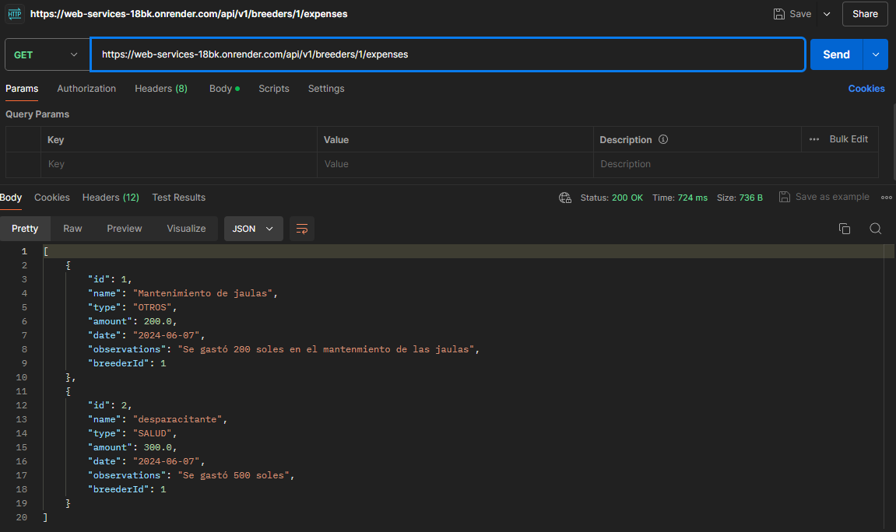|

|Método|GET {breederId}/cages|
|--|--|
|Parámetros|{breederId}: Id del criador|
|Resultado||

|Método|GET {breederId}/appointments|
|--|--|
|Parámetros|{breederId}: Id del criador|
|Resultado||

**Advisor Endpoints**

Endpoint: https://web-services-18bk.onrender.com/api/v1/advisors


|Método|GET|
|--|--|
|Parámetros|Ninguno|
|Resultado||

|Método|POST|
|--|--|
|Parámetros|Body: occupation, experience, photo, rating, userId|
|Resultado||

|Método|GET {advisorId}|
|--|--|
|Parámetros|{advisorId}: Id del asesor|
|Resultado||

|Método|GET {advisorId}/publications|
|--|--|
|Parámetros|{advisorId}: Id del asesor|
|Resultado||

|Método|GET {advisorId}/available-dates|
|--|--|
|Parámetros|{advisorId}: Id del asesor|
|Resultado||

|Método|GET {advisorId}/appointments|
|--|--|
|Parámetros|{advisorId}: Id del asesor|
|Resultado||


**Notification Endpoints**

Endpoint: https://web-services-18bk.onrender.com/api/v1/notifications


|Método|GET|
|--|--|
|Parámetros|Ninguno|
|Resultado||

|Método|GET {notificationId}|
|--|--|
|Parámetros|{notificationId}: Id de la notificacion|
|Resultado||

|Método|POST|
|--|--|
|Parámetros|Body: type, text, date, userId |
|Resultado||

|Método|DELETE {notificationId}|
|--|--|
|Parámetros|{notificationId}: Id de la notificacion|
|Resultado||

**Resources Endpoints**

Endpoint: https://web-services-18bk.onrender.com/api/v1/resources


|Método|POST|
|--|--|
|Parámetros|Body: name, type, quantity, date, observations y breederId|
|Resultado||

|Método|GET|
|--|--|
|Parámetros|Ninguno|
|Resultado||

|Método|GET {resourceId}|
|--|--|
|Parámetros|{resourceId}: Id del recurso|
|Resultado||

|Método|PUT {resourceId}|
|--|--|
|Parámetros|{resourceId}: Id del recurso|
|Resultado||

|Método|DELETE {resourceId}|
|--|--|
|Parámetros|{resourceId}: Id del recurso|
|Resultado||

**Expenses Endpoints**

Endpoint: https://web-services-18bk.onrender.com/api/v1/expenses


|Método|POST|
|--|--|
|Parámetros|Body: name, type, ammount, date, observations y breederId|
|Resultado||

|Método|GET|
|--|--|
|Parámetros|Ninguno|
|Resultado||

|Método|GET {expenseId}|
|--|--|
|Parámetros|{expenseId}: Id del gasto|
|Resultado||

|Método|PUT {expenseId}|
|--|--|
|Parámetros|{expenseId}: Id del gasto|
|Resultado||

|Método|DELETE {expenseId}|
|--|--|
|Parámetros|{expenseId}: Id del gasto|
|Resultado||


**Publications Endpoints**

Endpoint: https://web-services-18bk.onrender.com/api/v1/publications


|Método|POST|
|--|--|
|Parámetros|Body: title, description, image, date y advisorId|
|Resultado||

|Método|GET|
|--|--|
|Parámetros|Ninguno|
|Resultado||

|Método|GET {publicationId}|
|--|--|
|Parámetros|{publicationId}: Id de la publicación|
|Resultado||

|Método|DELETE {publicationId}|
|--|--|
|Parámetros|{publicationId}: Id de la publicación|
|Resultado||

**Appointments Endpoints**

Endpoint: https://web-services-18bk.onrender.com/api/v1/appointments


|Método|POST|
|--|--|
|Parámetros|Body: breederId, advisorId, date y status|
|Resultado||

|Método|GET|
|--|--|
|Parámetros|Ninguno|
|Resultado||

|Método|GET {appointmentId}|
|--|--|
|Parámetros|{appointmentId}: Id del appointment|
|Resultado||

|Método|PUT|
|--|--|
|Parámetros|{appointmentId}: Id del appointment|
|Resultado||


**Cages Endpoints**

Endpoint: https://web-services-18bk.onrender.com/api/v1/cages


|Método|POST|
|--|--|
|Parámetros|Body: name, type, ammount, date, observations y breederId|
|Resultado||

|Método|GET|
|--|--|
|Parámetros|Ninguno|
|Resultado||

|Método|GET|
|--|--|
|Parámetros|{cageId}: Id de la jaula|
|Resultado||

|Método|GET|
|--|--|
|Parámetros|{cageId}: Id de la jaula|
|Resultado||

|Método|PUT|
|--|--|
|Parámetros|{cageId}: Id de la jaula|
|Resultado|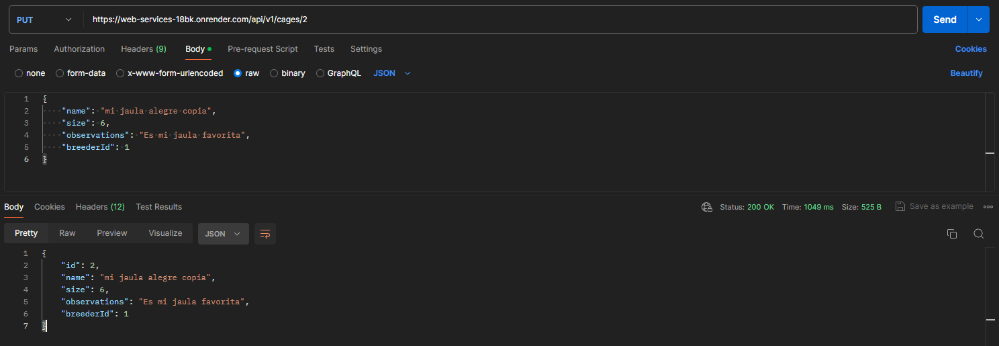|

|Método|DELETE|
|--|--|
|Parámetros|{cageId}: Id de la jaula|
|Resultado||

**Animals Endpoints**

Endpoint: https://web-services-18bk.onrender.com/api/v1/animals


|Método|POST|
|--|--|
|Parámetros|Body: name, breed, gender, birthdate, weight, isSick, observations, cageId|
|Resultado||

|Método|GET|
|--|--|
|Parámetros|Ninguno|
|Resultado||

|Método|GET|
|--|--|
|Parámetros|{animalId}: Id de la animal|
|Resultado||

|Método|PUT|
|--|--|
|Parámetros|{animalId}: Id de la animal|
|Resultado||

|Método|DELETE|
|--|--|
|Parámetros|{animalId}: Id de la animal|
|Resultado||

**AvailableDates Endpoints**

Endpoint: https://web-services-18bk.onrender.com/api/v1/available-dates


|Método|GET|
|--|--|
|Parámetros|{availableDateId}: Id del AvailableDate|
|Resultado||

|Método|PUT|
|--|--|
|Parámetros|{availableDateId}: Id del AvailableDate|
|Resultado||

|Método|DELETE|
|--|--|
|Parámetros|{availableDateId}: Id del AvailableDate|
|Resultado|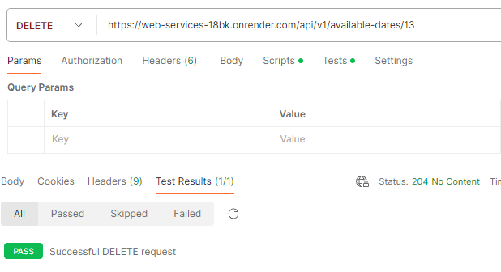|

|Método|GET|
|--|--|
|Parámetros|Ninguno|
|Resultado||

|Método|POST|
|--|--|
|Parámetros|Body: advisorId, date(YYYY-MM-DD), startime(hour, minute, second), endtime(hour, minute,second), status|
|Resultado||


**Reviews Endpoints**

Endpoint: https://web-services-18bk.onrender.com/api/v1/reviews


|Método|GET|
|--|--|
|Parámetros|Ninguno|
|Resultado||

|Método|POST|
|--|--|
|Parámetros|Body: appointmentID, comment, rating|
|Resultado||

|Método|GET|
|--|--|
|Parámetros|{reviewId}: Id del review|
|Resultado||

#### 5.2.3.7. Software Deployment Evidence for Sprint Review.
Se decidió desplegar el Web Service en Render. Para ello, se tuvo que hacer un archivo target donde están los archivos de salida de compilación y un archivo Docker que contiene la información para que se ejecute el proyecto en Java 22.


Entonces, con los archivos listos se entró a Render.com donde se configuró la creación del proyecto al conectarlo con la rama release del repositorio del Web Service.


Luego, se empezó con el desplegado al darle a ‘Crear Web Service’.


Finalmente, comprobamos el correcto funcionamiento del Web Service desplegado al entrar al swagger.


Enlace de Backend desplegado: https://web-services-18bk.onrender.com/swagger-ui/index.html

Por otro lado, también se desplegó el Frontend Web Applications con la conexión al Web Service y las mejoras realizadas en este Sprint. Para ello, primero se volvió a ejecutar el comando npm run build.


Se actualizaron los paquetes relacionados con firebase utilizando npm install firebase-tools.

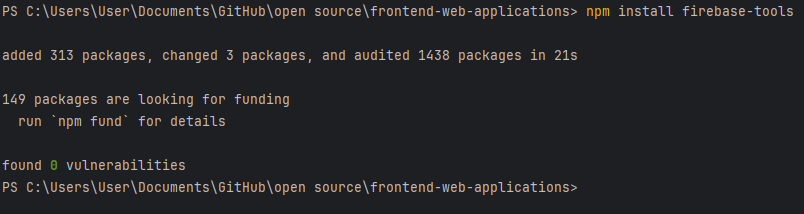

Se comprobó que se esté logueado en firebase para el despliegue y se empezó con el despliegue utilizando firebase init hosting.


Luego, se modificó el archivo firebase.json para que se desplieguen los archivos correctos.


Para terminar con el despliegue luego de tener el proyecto con Firebase se utiliza el comando firebase deploy --only hosting


Ahora, la integración es visible en nuestra aplicación web ya desplegada.


Enlace de Frontend desplegado: https://agroconnect-demo.web.app/login 

#### 5.2.3.8. Team Collaboration Insights during Sprint.

Para la elaboración del backend, donde se realizaron 5 historias de usuario pertenecientes a la épica 8, distribuimos las tareas entre los miembros del equipo. Cada integrante trabajó en ramas "feature" correspondientes a sus tareas asignadas. Posteriormente, realizamos los "merge" con la rama "develop", hicimos el "release" y finalmente integramos los cambios en la rama "main". Para asegurar la calidad y funcionalidad del código, realizamos reuniones virtuales a través de Google Meet. Durante estas sesiones, revisamos juntos los avances y los "merge" realizados, verificando que todo funcionara de acuerdo a lo esperado.


Para la elaboración del frontend, realizamos mejoras significativas. Implementamos un nuevo formato para las ramas, siguiendo la convención "feature/US{número de historia de usuario}", y también integramos la API de AgroConnect. Estas mejoras facilitaron la organización y la colaboración en el proyecto, asegurando una mayor coherencia en el desarrollo del frontend.


### 5.2.4. Sprint 4.

#### 5.2.4.1. Sprint Planning 4.

El cuarto sprint se planeó a través de una reunión virtual en Google Meet. Para ello, se hizo la siguiente tabla para registrar la información que se discutió.

|**Sprint #**|Sprint 4|
| :- | :- |
|**Sprint Planning Background**||
|Date|2024-06-10|
|Time|09: 00 PM|
|Location|Virtual (Google Meet)|
|Prepared by|Delgado Corrales, Piero Gonzalo|
|Attendees (to planning meeting)|<p>Delgado Corrales, Piero Gonzalo</p><p>Lucas Coronel, Nadia Alessandra</p><p>Paredes Puente, Sebastián Roberto</p><p>Salinas Torres, Salvador Antonio</p><p>Valverde Mozo, Andre Gabriel</p>|
|Sprint 3 Review Summary|En este tercer sprint, logramos realizar el deployment del frontend y backend, manejando adecuadamente la conexión entre ambas.|
|Sprint 3 Retrospective Summary|En retrospectiva, se debe implementar los endpoints faltantes al backend, así como implementar la autenticación (IAM) para brindar mayor seguridad, entre otras cosas.|
|**Sprint Goal & User Stories**||
|Sprint 4 Goal|Finalizar el desarrollo del Backend e implementar cambios en Frontend.|
|Sprint 4 Velocity|28|
|Sum of Story Points|28|

#### 5.2.4.2. Sprint Backlog 4.

El objetivo de este cuarto sprint es la finalización del Backend de la aplicación web, e igualmente implementar los cambios necesarios en Frontend. Al igual que anteriores sprints, trabajamos las tareas en una tabla en Trello:
<https://trello.com/b/A2LMtBvk/agrotech-sprint-backlog-4>


<table><tr><th valign="top">Sprint #</th><th colspan="7" valign="top">Sprint 4</th></tr>
<tr><td colspan="2" valign="top">User Story</td><td colspan="6" valign="top">Work-Item / Task</td></tr>
<tr><td valign="top">Id</td><td valign="top">Title</td><td valign="top">Id</td><td valign="top">Title</td><td valign="top">Description</td><td valign="top">Estimation</td><td valign="top">Assigned To</td><td valign="top">Status (To-Do / In-Process / Review / Done)</td></tr>
<tr><td valign="top">US34</td><td valign="top">Uso de nuestra API para manejar recursos y gastos	</td><td valign="top">TS01</td><td valign="top">Modificación de método de crear y actualizar recursos para evitar duplicados</td><td valign="top">Modificar la creación y actualización de recursos para evitar que haya recursos con un mismo nombre</td><td valign="top">5</td><td valign="top">Nadia Lucas</td><td valign="top">Done</td></tr>
<tr><td rowspan="2" valign="top">US35</td><td rowspan="2" valign="top">Uso de nuestra API para manejar la reserva de citas entre asesores y criadores</td><td valign="top">TS02</td><td valign="top">Implementación de método para calcular la puntuación promedio de asesores</td><td valign="top">Implementar una función para calcular la puntuación de un asesor cada vez que se agregue una nueva reseña sobre el asesor.</td><td rowspan="2" valign="top">5</td><td valign="top">André Valverde</td><td valign="top">Done</td></tr>
<tr><td valign="top">TS03</td><td valign="top">Implementación de método para crear notificaciones al crear una nueva cita</td><td valign="top">Implementar una función para crear notificaciones para los criadores y asesores cuando se haya reservado una nueva cita.</td><td valign="top">Sebastián Paredes</td><td valign="top">Done</td></tr>
<tr><td valign="top">US28</td><td valign="top">Uso de un API para videollamadas</td><td valign="top">TS04</td><td valign="top">Implementación de API externa para generar enlace de videollamada</td><td valign="top">Implementar el uso de la API de Jitsi Meet para generar los enlaces de Google Meet para las asesorías.</td><td valign="top">5</td><td valign="top">Piero Delgado</td><td valign="top">Done</td></tr>
<tr><td valign="top">US29</td><td valign="top">Uso de un API para alojar imágenes</td><td valign="top">TS05</td><td valign="top">Implementación de API externa para alojar imágenes</td><td valign="top">Implementar el uso de la API de Firebase Storage para subir y alojar las imágenes desde nuestra plataforma.</td><td valign="top">5</td><td valign="top">Salvador Salinas</td><td valign="top">Done</td></tr>
<tr><td rowspan="3" valign="top">US17</td><td rowspan="3" valign="top">Seguridad de información</td><td valign="top">TS06</td><td valign="top">Implementación de IAM en Backend</td><td valign="top">Implementar la autenticación con Token de seguridad para tener acceso a las peticiones HTTP.</td><td rowspan="3" valign="top">5</td><td valign="top">Piero Delgado</td><td valign="top">Done</td></tr>
<tr><td valign="top">TS07</td><td valign="top">Implementación de IAM en Frontend</td><td valign="top">Actualizar método de inicio de sesión y registro en Frontend para que funcione con IAM.</td><td valign="top">Salvador Salinas</td><td valign="top">Done</td></tr>
<tr><td valign="top">TS08</td><td valign="top">Modificación de modelos y servicios en Frontend </td><td valign="top">Modificar los modelos y servicios necesarios con la nueva forma de autenticación (IAM).</td><td valign="top">Salvador Salinas, Sebastián Paredes</td><td valign="top">Done</td></tr>
<tr><td rowspan="2" valign="top">US18</td><td rowspan="2" valign="top">Disponibilidad y confiabilidad</td><td valign="top">TS09</td><td valign="top">Despliegue de Frontend</td><td valign="top">Desplegar Frontend de la plataforma en un servidor adecuado para brindar acceso a la plataforma en cualquier lugar y momento.</td><td rowspan="2" valign="top">3</td><td valign="top">Piero Delgado, Salvador Salinas, Nadia Lucas, Sebastián Paredes, Andre Valverde</td><td valign="top">Done</td></tr>
<tr><td valign="top">TS10</td><td valign="top">Despliegue de Backend</td><td valign="top">Desplegar Backend de la plataforma en un servidor adecuado para brindar acceso a la plataforma en cualquier lugar y momento.</td><td valign="top">Piero Delgado, Salvador Salinas, Nadia Lucas, Sebastián Paredes, Andre Valverde</td><td valign="top">Done</td></tr>
</table>

#### 5.2.4.3. Development Evidence for Sprint Review.

A continuación, se detallan los commits realizados, los cuales se trabajaron a partir de las tareas asignadas a cada miembro como se muestra en el Sprint Backlog 4. De este modo, se trabajó mayormente en la parte de Frontend y Backend.

Repositorio Frontend: <https://github.com/AgroTech-UPC/Frontend-Web-Applications> 

Repositorio Backend: <https://github.com/AgroTech-UPC/Web-Services>


|**Repository**|**Branch**|**Commit Id**|**Commit Message**|**Commited on (Date)**|
| :- | :- | :- | :- | :- |
|AgroTech-UPC/Frontend-Web-Applications|feature/us14|c4c1ff8 |<p>feat: added criador/registro/animal/:id</p><p></p>|13/06/2024|
|AgroTech-UPC/Frontend-Web-Applications|feature/us14|f2aa9a5 |feat: creation of cuy inside a cage|13/06/2024|
|AgroTech-UPC/Frontend-Web-Applications|develop|55a1218 |<p>Merge pull request[ #65](https://github.com/AgroTech-UPC/Frontend-Web-Applications/pull/65) from AgroTech-UPC/release</p><p></p>|14/06/2024|
|AgroTech-UPC/Frontend-Web-Applications|feature/us14|dcf729b |<p>Merge branch 'develop' into feature/us14</p><p></p>|14/06/2024|
|AgroTech-UPC/Frontend-Web-Applications|feature/us14|5ed05da |fix: method to delete cages with cuyes inside fixed|14/06/2024|
|AgroTech-UPC/Frontend-Web-Applications|feature/us17|55a1218 |Merge pull request[ #65](https://github.com/AgroTech-UPC/Frontend-Web-Applications/pull/65) from AgroTech-UPC/release|19/06/2024|
|AgroTech-UPC/Frontend-Web-Applications|feature/us17|24358c4 |<p>feat(IAM): new login using token</p><p></p>|<p>19/06/2024</p><p></p>|
|AgroTech-UPC/Frontend-Web-Applications|feature/us17|21ad0e2 |<p>feat(IAM): update method to register new users + models</p><p></p>|<p>19/06/2024</p><p></p>|
|AgroTech-UPC/Frontend-Web-Applications|feature/us17|2d1b3c9 |<p>feat(IAM): created new AuthenticationApiService</p><p></p>|<p>20/06/2024</p><p></p>|
|AgroTech-UPC/Frontend-Web-Applications|feature/us17|506168c|<p>feat: Added button "Terminar Cita" in client-card.component"</p><p></p>|<p>22/06/2024</p><p></p>|
|AgroTech-UPC/Frontend-Web-Applications|feature/us17|e38d12a|<p>refactor(IAM): moved register and login components</p>|<p>22/06/2024</p><p></p>|
|AgroTech-UPC/Frontend-Web-Applications|feature/us17|0bc7328|<p>feat(iam): Fixed an error when assigning the role to the breeder</p>|<p>23/06/2024</p><p></p>|
|AgroTech-UPC/Frontend-Web-Applications|feature/us17|17b8309|<p>fix: Error message in my advisors</p>|<p>23/06/2024</p><p></p>|
|AgroTech-UPC/Frontend-Web-Applications|feature/us17|4e64538|<p>style(iam): login colors updated</p>|<p>23/06/2024</p><p></p>|
|AgroTech-UPC/Frontend-Web-Applications|feature/us17|c906bdf|<p>style(iam): login texts updated</p>|<p>23/06/2024</p><p></p>|
|AgroTech-UPC/Frontend-Web-Applications|feature/us29|7abdf6e|<p>feat: added image uploading to firebase storage</p>|<p>23/06/2024</p><p></p>|
|AgroTech-UPC/Frontend-Web-Applications|release|6556027|<p>feat: added netlify deploy files</p>|<p>23/06/2024</p><p></p>|
|AgroTech-UPC/Frontend-Web-Applications|main|795c385|<p>release v2.1.0</p>|<p>23/06/2024</p><p></p>|
|AgroTech-UPC/Frontend-Web-Applications|release|7f11ade|<p>fix: solved problems with deployed images</p>|<p>23/06/2024</p><p></p>|
|AgroTech-UPC/Frontend-Web-Applications|main|3a4fd6b|<p>release v.2.1.1</p>|<p>23/06/2024</p><p></p>|
|AgroTech-UPC/Frontend-Web-Applications|feature/us11|2cc17e9|<p>feat(management): show cage name on animal list</p>|<p>24/06/2024</p><p></p>|
|AgroTech-UPC/Frontend-Web-Applications|release|9737aec|<p>fix: fixed some snackBar messages</p>|<p>24/06/2024</p><p></p>|
|AgroTech-UPC/Frontend-Web-Applications|main|3a4fd6b|<p>Release V.2.1.2</p>|<p>24/06/2024</p><p></p>|
|AgroTech-UPC/Web-Services|feature/us17|7fd94f2|<p>feat: added IAM</p><p></p>|19/06/2024|
|AgroTech-UPC/Web-Services|feature/us17|738083e|<p>feat: updated breeder and advisor to have user information</p><p></p>|19/06/2024|
|AgroTech-UPC/Web-Services|feature/us17|89ba180|<p>feat: modify port and cors on IAM</p><p></p>|19/06/2024|
|AgroTech-UPC/Web-Services|feature/us35|571b5b2|<p>release v1.0.0</p><p></p>|19/06/2024|
|AgroTech-UPC/Web-Services|develop|5afba82|Merge pull request[ #21](https://github.com/AgroTech-UPC/Web-Services/pull/21) from AgroTech-UPC/feature/us17|19/06/2024|
|AgroTech-UPC/Web-Services|feature/us35|5afba82|<p>Merge pull request[ #21](https://github.com/AgroTech-UPC/Web-Services/pull/21) from AgroTech-UPC/feature/us17</p><p></p>|20/06/2024|
|AgroTech-UPC/Web-Services|feature/us35|b0d0352|feat(Appointment): Create an event to create a notification (for the …|20/06/2024|
|AgroTech-UPC/Web-Services|develop|7f8cd50|<p>Merge pull request[ #22](https://github.com/AgroTech-UPC/Web-Services/pull/22) from AgroTech-UPC/feature/us35</p><p></p>|20/06/2024|
|AgroTech-UPC/Web-Services|feature/us35|0c529f8|<p>feat(user): added eventhandler UserReadyEventHandler</p><p></p>|20/06/2024|
|AgroTech-UPC/Web-Services|feature/us35|6599e27|<p>fix: renamed eventhandler of bounded context User</p><p></p>|21/06/2024|
|AgroTech-UPC/Web-Services|develop|c196469|<p>Merge pull request[ #24](https://github.com/AgroTech-UPC/Web-Services/pull/24) from AgroTech-UPC/feature/us35</p><p></p>|21/06/2024|
|AgroTech-UPC/Web-Services|feature/us35|c196469|<p>Merge pull request[ #24](https://github.com/AgroTech-UPC/Web-Services/pull/24) from AgroTech-UPC/feature/us35</p><p></p>|21/06/2024|
|AgroTech-UPC/Web-Services|feature/us35|5523b6a|<p>feat: added meetingUrl to notifications</p><p></p>|21/06/2024|
|AgroTech-UPC/Web-Services|feature/us35|9d2b4ee|<p>feat: updated notification message</p><p></p>|21/06/2024|
|AgroTech-UPC/Web-Services|develop|30d772d|<p>Merge pull request[ #25](https://github.com/AgroTech-UPC/Web-Services/pull/25) from AgroTech-UPC/feature/us28</p><p></p>|21/06/2024|
|AgroTech-UPC/Web-Services|feature/us36|b4a0ac7|<p>feat(management): Added validation that does not allow repeating name…</p><p></p>|21/06/2024|
|AgroTech-UPC/Web-Services|feature/us36|94d0e66|<p>feat(management): Added javadocs in the</p><p></p>|21/06/2024|
|AgroTech-UPC/Web-Services|develop|b42ce72 |<p>Merge pull request[ #26](https://github.com/AgroTech-UPC/Web-Services/pull/26) from AgroTech-UPC/feature/us36</p><p></p>|21/06/2024|
|AgroTech-UPC/Web-Services|feature/us35|bcd7557|<p>feat: Added function that when a Review is created the rating of the respective Advisor is updated</p><p></p>|22/06/2024|
|AgroTech-UPC/Web-Services|feature/us17|c7f3918|<p>feat: updated to remote db</p><p></p>|22/06/2024|
|AgroTech-UPC/Web-Services|develop|8d29ac3|<p>feat: changed open api version</p><p></p>|22/06/2024|
|AgroTech-UPC/Web-Services|release|4ae1d87|<p>feat: update target folder for deployment</p><p></p>|22/06/2024|
|AgroTech-UPC/Web-Services|release|458df5d|<p>fix: fixed error when updating the name of an existing resource</p><p></p>|23/06/2024|
|AgroTech-UPC/Web-Services|release|f4f337a|<p>fix: solved problem with name verification</p><p></p>|23/06/2024|


#### 5.2.4.4. Testing Suite Evidence for Sprint Review.

Se realizaron los acceptance tests para las historias de usuario trabajadas y se registraron en el repositorio de la siguiente forma. Así como los Unit Tests en el Backend.

Repositorio Acceptance Tests: <https://github.com/AgroTech-UPC/Acceptance-Tests>

Repositorio Backend: <https://github.com/AgroTech-UPC/Web-Services>


|**Repository**|**Branch**|**Commit Id**|**Commit Message**|**Commited on (Date)**|
| :- | :- | :- | :- | :- |
|AgroTech-UPC/Acceptance-Tests|main|cf0775d |<p>feat: Added US28 US29</p><p></p>|24/06/2024|
|AgroTech-UPC/Acceptance-Tests|main|aa53fa3 |<p>feat: us17 and us18 added</p><p></p>|24/06/2024|
|AgroTech-UPC/Web-Services|release|5fbe76a |<p>feat: Appointment, Cage, Expense and Resource Tests added</p><p></p>|24/06/2024|
|AgroTech-UPC/Web-Services|release|564c0c9 |<p>feat: Added Publication, Advisor, Breeder, User tests</p><p></p>|24/06/2024|
|AgroTech-UPC/Web-Services|release|bc2baa1 |<p>fix: BreederTests fixed</p><p></p>|24/06/2024|


Se han implementado los Units Tests para los endpoints del Web Service creados en este Sprint. Para ello, se creó una carpeta llamada com.acme.web.services.unit.tests y se vinculó al proyecto del WebService para utilizar sus entidades y servicios.

 

Asimismo, cada Unit Test tiene distintas validaciones para cada situación como puede ser crear una entidad o realizar validaciones de ciertos valores que no pueden ser null o números negativos. Finalmente, se validó que los Unit Tests no devuelvan errores al ejecutarse.


#### 5.2.4.5. Execution Evidence for Sprint Review.

En esta sección, se detallará lo desarrollado en el cuarto sprint, el cual incluye la adición del IAM al Web Service, y la mejora del Frontend Web Application.

URL del video: [Execution Evidence](https://upcedupe-my.sharepoint.com/:v:/g/personal/u202210749_upc_edu_pe/EbyqV5h2BTJLhgiNMPzF7o8B4o5EvFqAVlI57C6oMFjwEg?e=732mhq)


#### 5.2.4.6. Services Documentation Evidence for Sprint Review.

Para este sprint, hemos implementado una versión actualizada de la API con IAM, la cual permitirá a los usuarios registrarse e iniciar sesión con un token de autenticidad, para que las llamadas HTTP se hagan de forma segura. Además, se cambió la forma en que se manejaba unos endpoints a comparación de la versión anterior, como los usuarios, asesores, criadores y notificaciones. A continuación, se detallan los cambios realizados en la API.

Enlace al repositorio de Web Services: https://github.com/AgroTech-UPC/Web-Services

|Método|Endpoint|Descripción|
|--|--|--|
|POST|/api/v1/authentication/sign-up|Se registra a un nuevo usuario con su nombre de usuario, contraseña y rol|
|POST|/api/v1/authentication/sign-in|Se inicia sesión con las credenciales de un usuario y devuelve el token de autenticidad|
|GET|/api/v1/users|Se obtiene la lista de usuarios|
|GET|/api/v1/users/{id}|Se obtiene un usuario por ID|
|GET|/api/v1/breeders|Se obtiene la lista de los criadores|
|POST|/api/v1/breeders|Se crea un nuevo criador|
|GET|/api/v1/breeders/{id}|Se obtiene un criador por ID|
|GET|/api/v1/advisors|Se obtiene la lista de los asesores|
|POST|/api/v1/advisors|Se crea un nuevo asesor|
|GET|/api/v1/advisors/{id}|Se obtiene un asesor por ID|
|GET|/api/v1/notifications|Se obtiene la lista de las notificaciones|
|POST|/api/v1/notifications|Se crea una nueva notificacion|
|GET|/api/v1/notifications/{id}|Se obtiene una notificacion por ID|

**Authentication Endpoints**

Endpoint: https://web-services-18bk.onrender.com/api/v1/authentication


**Sign Up: (api/v1/authentication/sign-up)**
|Método|POST|
|--|--|
|Parámetros|Body: username, password, roles|
|Resultado||

**Sign In: (api/v1/authentication/sign-in)**
|Método|POST|
|--|--|
|Parámetros|Body: username, password|
|Resultado||

El token que se brinda al iniciar sesión, es el que permite la autorización para que se pueda trabajar con los demás endpoints de la API.

**User Endpoints**

Endpoint: https://web-services-18bk.onrender.com/api/v1/users


Los usuarios ahora solo poseen el correo y contraseña, siguiendo lo implementado para la IAM.

|Método|GET|
|--|--|
|Parámetros|Ninguno|
|Resultado||

|Método|GET {userId}|
|--|--|
|Parámetros|{userId}: Id del usuario|
|Resultado||

**Breeder Endpoints**

Los criadores ahora poseen la información personal, como nombre, ubicación, fecha de nacimiento y descripción.

Endpoint: https://web-services-18bk.onrender.com/api/v1/breeders


|Método|POST|
|--|--|
|Parámetros|Body: fullname, location, birthdate, description, userId|
|Resultado||

|Método|GET {breederId}|
|--|--|
|Parámetros|{breederId}: Id del criador|
|Resultado||

**Advisor Endpoints**

Los asesores ahora poseen la información personal, como nombre, ubicación, fecha de nacimiento y descripción, a parte de lo que ya tenían como ocupación, experiencia, foto y puntuación.

Endpoint: https://web-services-18bk.onrender.com/api/v1/advisors


|Método|POST|
|--|--|
|Parámetros|Body: fullname, location, birthdate, description, occupation, experience, photo, rating, userId|
|Resultado||

|Método|GET {advisorId}|
|--|--|
|Parámetros|{advisorId}: Id del asesor|
|Resultado||

**Notification Endpoints**

Las notificaciones ahora incluyen el enlace para reunirse en Google Meet.

Endpoint: https://web-services-18bk.onrender.com/api/v1/notifications


|Método|POST|
|--|--|
|Parámetros|Body: type, text, date, userId, meetingUrl|
|Resultado||

|Método|GET {notificationId}|
|--|--|
|Parámetros|{notificationId}: Id de la notificación|
|Resultado||

#### 5.2.4.7. Software Deployment Evidence for Sprint Review.

Para desplegar el Web Service se volvió a utilizar Render.com. Por lo que, se generó la carpeta target con los archivos actualizados del proyecto.


Luego, se ingreso al dashboard de Render y se seleccionó 'Manual Deploy' y 'deploy latest commit' para que se actualize el Web Service deployado.


Con ello, se empezó con el despliegue del Web Service.


Finalmente, se comprobó el funcionamiento del Web Service al entrar al swagger desde el enlace del producto desplegado https://web-services-18bk.onrender.com/swagger-ui/index.html


Por otro lado, también se desplegó el Frontend Web Applications con la conexión al Web Service y las mejoras realizadas en este Sprint. Para ello, primero se volvió a ejecutar el comando npm run build.


Luego, se empieza con el despliegue utilizando el comando firebase init hosting.


Se actualiza el archivo firebase.json para que el despliegue utilize los archivos correctos.


Para terminar con el despliegue luego de tener el proyecto con Firebase se utiliza el comando firebase deploy --only hosting.


Finalmente, se comprueba que el proyecto se haya desplegado correctamente entrando al URL y comprobando que se visualize correctamente: https://agroconnect-demo.web.app


#### 5.2.4.8. Team Collaboration Insights during Sprint.

Para la mejora del backend, se realizaron las implementaciones del IAM bounded context y los unit tests, y se distribuyeron las tareas entre los miembros del equipo. Cada integrante trabajó en ramas "feature" correspondientes a sus tareas asignadas. Posteriormente, realizamos los "merge" con la rama "develop", hicimos el "release" y finalmente integramos los cambios en la rama "main". Para asegurar la calidad y funcionalidad del código, realizamos reuniones virtuales a través de Google Meet. Durante estas sesiones, revisamos juntos los avances y los "merge" realizados, verificando que todo funcionara de acuerdo a lo esperado.


Para la mejora del frontend, se implementó el bearer token en el header para la autenticación con el backend. Asimismo, hicimos mejoras en los mensajes de la página para estos sean uniformes. El formato de las ramas feature no tuvo cambio.


## 5.3. Validation Interviews.

### 5.3.1. Diseño de entrevistas.
Para esta entrevista, se comparte y detalla al entrevistado lo trabajado en Landing Page y Web Application.

#### Segmento Asesor
**User Flows:**
- Inicio de sesión
  - User Goal: Como usuario quiero acceder a mi cuenta registrada para acceder a las funciones de usuario
- Registro de usuario
  - User Goal: Como usuario quiero registrarme para acceder a las funciones de usuario
- Recuperación de cuenta
  - User Goal: Como usuario quiero recuperar mi contraseña en caso me olvide para no perder mi cuenta con mi información
- Vista de clientes
  - User Goal: Como asesor quiero poder visualizar a mis clientes para poder llevar un registro eficiente
- Vista y gestión de publicaciones
  - User Goal: Como asesor quiero poder crear publicaciones para poder promocionar el servicio de asesoramiento para la crianza de cuyes
- Vista de notificaciones
  - User Goal: Como asesor quiero recibir notificaciones de citas programadas por los criadores para mantenerme al tanto de mis ofertas laborales
- Gestión de horarios
  - User Goal: Como asesor quiero poder seleccionar y separar las fechas y horas en las que estoy disponible para ofrecer asesorías para que los usuarios interesados puedan ver mis horarios disponibles y agendar una cita en un momento conveniente
- Vista de calendario
  - User Goal: Como usuario quiero visualizar un calendario para ver de forma agradable y ordenada las asesorías programadas que tengo

**Preguntas sobre Landing Page**
1. ¿Encuentras útil la información presentada en la landing page?
2. ¿La información en la sección "Sobre Nosotros" te ayuda a confiar en la plataforma?
3. ¿Consideras que la información proporcionada es clara y concisa, o percibes que hay demasiada o muy poca?
4. ¿Qué opinas sobre la organización y disposición de los elementos en la página?
5. ¿Los elementos visuales, como imágenes y colores, son atractivos y relevantes?
6. ¿Es fácil comprender la naturaleza de nuestro producto al revisar la página?


**Preguntas sobre Web Application**
1. ¿Qué opinas de la forma de recibir notificaciones de recordatorios de citas próximas?
2. ¿Cómo te resulta la funcionalidad de ver la lista de clientes en la plataforma?
3. ¿Qué tan fácil te parece gestionar y organizar tus próximas citas usando la plataforma?
4. ¿Crees que la información sobre los criadores que te contactan es suficiente?
5. ¿Cómo evalúas la facilidad de uso para crear publicaciones en la plataforma?
6. ¿Los elementos visuales, como imágenes y colores, son atractivos y relevantes?
7. ¿Te parece bien recibir una reseña y calificación de los criadores sobre tus servicios para que lo vean otros criadores?
8. ¿Te parece que la organización de la aplicación web se entiende y comprende fácilmente?


#### Segmento Criador de Cuyes
**User Flows:**
- Inicio de sesión
  - User Goal: Como usuario quiero acceder a mi cuenta registrada para acceder a las funciones de usuario
- Registro de usuario
  - User Goal: Como usuario quiero registrarme para acceder a las funciones de usuario
- Recuperación de cuenta
  - User Goal: Como usuario quiero recuperar mi contraseña en caso me olvide para no perder mi cuenta con mi información
- Vista y gestión de “Mi Granja”
  - User Goal: Como criador de cuyes quiero gestionar los recursos de mi granja para tener un control sobre los recursos esenciales como alimentos y medicamentos
  - User Goal: Como criador de cuyes quiero gestionar los gastos relacionados con mi negocio para tener un control y poder tomar decisiones financieras que serán útiles para tener una mejor rentabilidad
- Vista y gestión de “Mis Animales”
  - User Goal: Como criador de cuyes quiero poder registrar una jaula en la plataforma para poder gestionar la información de mis cuyes de manera organizada
  - User Goal: Como criador de cuyes quiero contar con un sistema de registro de animales para almacenar información básica sobre cada animal, incluyendo su número de identificación, nombre, raza, género, peso y fecha de nacimiento
- Vista de publicaciones
  - User Goal: Como criador de cuyes quiero poder ver las publicaciones de la comunidad de asesores para obtener información útil y, si es necesario, solicitar asesoramiento en base a esas publicaciones
- Vista de notificaciones
  - User Goal: Como criador de cuyes quiero recibir notificaciones referentes al estado de mis citas para mantenerme al tanto de mi solicitud
- Vista de calendario
  - User Goal: Como usuario quiero visualizar un calendario para ver de forma agradable y ordenada las asesorías programadas que tengo

**Preguntas sobre Landing Page**
1. ¿Encuentras útil la información presentada en la landing page?
2. ¿La información en la sección "Sobre Nosotros" te ayuda a confiar en la plataforma?
3. ¿Consideras que la información proporcionada es clara y concisa, o percibes que hay demasiada o muy poca?
4. ¿Qué opinas sobre la organización y disposición de los elementos en la página?
5. ¿Los elementos visuales, como imágenes y colores, son atractivos y relevantes?
6. ¿Es fácil comprender la naturaleza de nuestro producto al revisar la página?


**Preguntas sobre Web Application**
1. ¿Qué opinas de la forma de ver las calificaciones y opiniones de otros criadores sobre un asesor?
2. ¿Te parece que la funcionalidad para registrar gastos, recursos, cuyes y jaulas es fácil de usar?
3. ¿Consideras que las funcionalidades actuales para gestionar tus gastos y recursos están organizadas de forma adecuada?
4. ¿Te parece bien cómo se organiza la información sobre las jaulas y cuyes en la plataforma?
5. ¿Te resulta fácil utilizar la opción de búsqueda de asesores en la plataforma?
6. ¿Te parece ordenada la forma en la que puedes revisar tus eventos dentro del calendario de la plataforma?
7. ¿Los elementos visuales, como imágenes y colores, son atractivos y relevantes?
8. ¿Te parece que la organización de la aplicación web se entiende y comprende fácilmente?


### 5.3.2. Registro de entrevistas.

**Entrevista N 1 - Asesor:** 

**Entrevistador:** Andre Valverde

**Entrevistado:** Rodrigo Guerra

**Link de la entrevista:** [Entrevista-Validación-1](https://youtu.be/qmgQ-3oI0fQ) 


**Resumen:** En la entrevista, el entrevistado expresó que encontraba útil la información presentada en la Landing Page, especialmente la sección "Sobre Nosotros", lo que le ayudó a confiar en la plataforma. Sin embargo, señaló que la información podría ser más clara y concisa. En cuanto a la Web Application, el entrevistado comentó que algunas funcionalidades, como ver calificaciones y opiniones de otros criadores sobre un asesor, eran útiles. Sin embargo, destacó que el diseño carecía de centrado en ciertos aspectos, lo que dificultaba la navegación y comprensión de la plataforma.

-----

**Entrevista N 2 - Asesor:** 

**Entrevistador:** Salvador Salinas

**Entrevistado:** Tamara García

**Link de la entrevista:** [Entrevista-Validación-2](https://youtu.be/Zg8tn_Wtw6U)


**Resumen:** En esta entrevista con Tamara, se le enseñó lo desarrollado en la Landing Page y Web Application. Ella menciona que le gustó mucho la organización, imágenes y colores utilizados, ya que se relacionan muy bien con la temática de la aplicación. Además, cree que es muy fácil de utilizar, así como para ver la lista de los clientes, notificaciones y establecer horarios para ofrecer asesorías.

-----

**Entrevista N 3 - Asesor:**

**Entrevistador:** Sebastian Paredes

**Entrevistado:** Belen Ramos

**Link de la entrevista:** [Entrevista-Validación-3](https://youtu.be/sDhv8AgRsm8)


**Resumen:** En una entrevista con Belén, se le mostró el diseño de la Landing Page y la Aplicación Web. Ella comentó que le gustaron mucho las imágenes, ya que le dan un toque especial tanto a la Landing Page como a la Aplicación Web, y los colores empleados también le parecieron adecuados. Sin embargo, hizo algunas observaciones sobre la sección de la Problemática de la landing page, mencionando que el efecto de las tarjetas es un poco confuso para el cliente, ya que no permite ver la información de forma inmediata. A pesar de esto, destacó que la aplicación es muy fácil de usar, especialmente para ver la lista de clientes, recibir notificaciones y crear publicaciones.

-----

**Entrevista N 4 - Asesor:** 

**Entrevistador:** Piero Delgado

**Entrevistado:** Adrian Espinoza

**Link de la entrevista:** [Entrevista-Validación-4](https://youtu.be/078AzxKUxCQ)


**Resumen:**

Adrián Espinoza encuentra la landing page como una buena forma de concientizar sobre el problema de la crianza de cuyes y la información proporcionada si le permite conocer más sobre la aplicación y menciona que le da confianza conocer quienes son las personas detrás del aplicativo. Asimismo, menciona que estéticamente la landing es atractiva y los elementos están bien distribuidos. Por otro lado, para la aplicación web que es intuitiva y fácil de manejar. Además, menciona que las funcionalidades cubren sus necesidades y son útiles.

**Entrevista N 5 - Asesor:**

**Entrevistador:** Nadia Lucas

**Entrevistado:** Romina Arana

**Link de la entrevista:** [Entrevista-Validación-5](https://youtu.be/6a6fM4r2ycQ)


**Resumen:** Romina Arana encuentra la landing page útil, bien organizada, visualmente atractiva y clara en la presentación del producto. La sección "Sobre Nosotros" le genera confianza al mostrar personas reales. La aplicación web le resulta fácil de usar, especialmente para gestionar citas y ver la lista de clientes, aunque sugiere mejorar la diferenciación de estados de citas con colores y añadir un filtro por estado. También recomienda incluir fotos de los criadores para una mejor identificación y mejorar el proceso de registro. Considera esenciales las reseñas y calificaciones para generar confianza y mejorar el servicio.

-----

**Entrevista N 6 - Criador:**

**Entrevistador:** Sebastian Paredes

**Entrevistado:** Alessandra Chaupis

**Link de la entrevista:** [Entrevista-Validación-6](https://youtu.be/qn3Zc1dMXnc)


**Resumen:** Durante la entrevista con Alessandra, se presentaron y explicaron tanto la página de inicio como la aplicación web frontend. Ella expresó una opinión favorable sobre el contenido y el diseño de la página de inicio, elogiando el uso efectivo de las imágenes de fondo para transmitir la temática de la start-up. Asimismo, señaló que las funcionalidades de la aplicación web se adaptan a sus necesidades, destacando su facilidad de uso y contribución a una experiencia de usuario positiva.

-----

**Entrevista N 7 - Criador:**

**Entrevistador:** Nadia Lucas

**Entrevistado:** Nayeli Chavez

**Link de la entrevista:** [Entrevista-Validación-7](https://youtu.be/rrRkUssM-VI)


**Resumen:** Durante la entrevista, Nayeli Chavez expresó una impresión general positiva sobre la landing page, encontrando información útil, clara y concisa. Apreció especialmente la sección "Sobre Nosotros" por generar confianza en la plataforma. En cuanto a la web application, elogió la facilidad de uso de las funcionalidades, cómo registrar gastos y recursos, y la organización de la información sobre jaulas y cuyes. Sugirió mejoras como mostrar la cantidad de calificaciones de los asesores y agregar filtros de búsqueda. En resumen, destacó la estética atractiva y la facilidad de comprensión de la plataforma, mostrando interés en registrarse cuando esté disponible.

-----

**Entrevista N 8 - Criador:** 

**Entrevistador:** Piero Delgado

**Entrevistado:** Daniel Ruiz

**Link de la entrevista:** [Entrevista-Validación-8](https://youtu.be/EkYptMkrss4)


**Resumen:** En esta entrevista realizada a Daniel Ruiz se le mostró tanto la Landing page como el Frontend Web Application. En primer lugar, él comenta como le impresionó positivamente tanto en el contenido como en diseño de la Landing page resaltando el buen uso de imágenes de fondo y diseño interactivo. Por otro lado, él menciona que las funcionalidades de la aplicación web se adecúan a sus necesidades, son intuitivas y fáciles de usar.

-----

**Entrevista N 9 - Criador:** 

**Entrevistador:** Salvador Salinas

**Entrevistado:** Anderson Morales

**Link de la entrevista:** [Entrevista-Validación-9](https://youtu.be/1SiASSaTnIQ)


**Resumen:** En esta segunda entrevista con Anderson, se le mostró la Landing Page y Web Application. Él nos comenta que le llamó mucho la atención los elementos visuales y organización usada, así como los colores, imágenes y estilos, y que la aplicación se muestra estructurada e intuitiva. Además, menciona que le gustó mucho la vista del calendario, ya que es una vista amigable y ordenada para poder ver las citas programadas.

### 5.3.3. Evaluaciones según heurísticas.

**Site o App a Evaluar:**

AgroConnect

**Tareas a evaluar:**

El alcance de esta evaluación incluye la revisión de usabilidad de las siguientes tareas:
1. Creación de usuario
2. Inicio de sesión
3. Gestión de recursos y gastos
4. Gestión de jaulas y animales
5. Visualización de catálogo de asesores
6. Búsqueda de asesores en el catálogo
7. Reserva de citas
8. Visualización y creación de reseñas
9. Visualización de notificaciones
10. Visualización de calendario
11. Gestión de publicaciones
12. Visualización de información de clientes
13. Gestión de horarios disponibles

No están incluidas en esta versión de la evaluación las siguientes tareas:
1. Landing Page
2. Recuperación de cuenta

**ESCALA DE SEVERIDAD:**
*Los errores serán puntuados tomando en cuenta la siguiente escala de severidad*
|***Nivel***|***Descripción***|
| :-: | :-: |
|*1*|*Problema superficial: puede ser fácilmente superado por el usuario o ocurre con muy poca frecuencia. No necesita ser arreglado a no ser que exista disponibilidad de tiempo.*|
|*2*|*Problema menor: puede ocurrir un poco más frecuentemente o es un poco más difícil de superar para el usuario. Se le debería asignar una prioridad baja resolverlo de cara al siguiente reléase*|
|*3*|*Problema mayor: ocurre frecuentemente o los usuarios no son capaces de resolverlos. Es importante que sean corregidos y se les debe asignar una prioridad alta.*|
|*4*|*Problema muy grave: un error de gran impacto que impide al usuario continuar con el uso de la herramienta. Es imperativo que sea corregido antes del lanzamiento.*|

**TABLA DE RESUMEN:**

|**#**|**Problema**|**Escala de severidad**|**Heurística/principio violada(o)**|
| :- | :- | :- | :- |
|1|Poca legibilidad del título de horarios disponibles en teléfonos móviles|2|Inclusive Design: Proporciona experiencias comparables|
|2|Sobreposición del calendario a la barra de navegación|3|Usability: Usabilidad y control del usuario|
|3|Desbordamiento de la información en la visualización de reseñas |2|Inclusive Design: Proporciona experiencias comparables|
|4|Fallo en visualización de horarios de asesores para reserva|3|Inclusive Design: Proporciona experiencias comparables|
|5|Botones de formularios de registro con diferentes diseños|2|Usability: Consistencia y estándares|

**DESCRIPCIÓN DE PROBLEMAS:**

**PROBLEMA #1:** Poca legibilidad del título de horarios disponibles en teléfonos móviles

**Severidad:** 3

**Heurística violada:** Inclusive Design: Proporciona experiencias comparables

Problema: Si el asesor está entrando desde un dispositivo móvil y va a la sección de Horarios, se le puede dificultar la lectura del título al estar pegado.

**Imagen:**


**Recomendación:** Aumentar el interlineado del título.

-----

**PROBLEMA #2:** Sobreposición del calendario a la barra de navegación

**Severidad:** 3

**Heurística violada:** Usability: Usabilidad y control del usuario

**Problema:** Si se va a la sección de calendario en una pantalla de tamaño mediano o pequeño, el calendario se sobrepone a la barra lateral de navegación.

**Imagen:**


-----

**PROBLEMA #3:** Desbordamiento de la información en la visualización de reseñas

**Severidad:** 2

**Heurística violada:** Inclusive Design: Proporciona experiencias comparables

**Problema:** Si un criador ingresa a la aplicación en un celular y va a revisar la información de un asesor, la información de las reseñas como el mensaje y las estrellas se desborda del recuadro al que está asignado.

**Imagen:**


**Recomendación:** Aumentar el ancho de la caja de reseñas para que incluya todo el texto en pantallas pequeñas.

-----

**PROBLEMA #4:** Fallo en visualización de horarios de asesores para reserva

**Severidad:** 3

**Heurística violada:** Inclusive Design: Proporciona experiencias comparables

**Problema:** Si un criador ingresa a la aplicación en un celular y va a reservar una cita, la vista de la reserva no se muestra en su totalidad.

**Imagen:**


**Recomendación:** Adaptar la disposición de los elementos en la vista de reserva de cita para que se visualice correctamente en la pantalla de un teléfono móvil.

-----

**PROBLEMA #5:** Botones de formularios de registro con diferentes diseños

**Severidad:** 3

**Heurística violada:** Usability: Consistencia y estándares

**Problema:** Los botones al registrar una nueva jaula, animal, gasto o recurso son diferentes, lo que puede dificultar al criador acostumbrarse a la interfaz.

**Imagen:**


**Recomendación:** Actualizar los botones de los registros para que todos tengan el mismo estilo y tener consistencia entre distintas vistas.


## 5.4. Video About-The-Product

En el vídeo se proporciona información sobre el producto AgroConnect. Se mencionan las diferentes funcionalidades de la aplicación como son la visualización del catálogo de asesores, la creación de publicaciones y la gestión de la granja. Asimismo, se incluye el testimonio positivo de una asesora especializada.

Screenshot del video:


**Enlace al vídeo de YouTube:** [Video About-The-Product Open Source UPC YouTube](https://youtube.com/shorts/PJiVdbOyj1s?si=sjVnvqluE7vOP8bp)

**Enlace al vídeo de Microsoft Stream:** [Video About-The-Product Open Source UPC.mp4](https://upcedupe-my.sharepoint.com/:v:/g/personal/u202120430_upc_edu_pe/EWIpOVJ41GdBlHCwN581pnUBuGb_Y6LXdw49NgSSD5-H3w?e=2pBDnM&nav=eyJyZWZlcnJhbEluZm8iOnsicmVmZXJyYWxBcHAiOiJTdHJlYW1XZWJBcHAiLCJyZWZlcnJhbFZpZXciOiJTaGFyZURpYWxvZy1MaW5rIiwicmVmZXJyYWxBcHBQbGF0Zm9ybSI6IldlYiIsInJlZmVycmFsTW9kZSI6InZpZXcifX0%3D)

**Duración del vídeo:** 0:38


# Conclusiones

## Conclusiones y recomendaciones

* La estructura realizada del proceso Lean UX ha permitido a nuestra startup AgroTech identificar los segmentos objetivos, competidores y necesidades del mercado, entre otros aspectos clave. Desde la formulación inicial de los problem statements hasta la elaboración de hypothesis statements y la creación del Lean UX canvas, cada paso ha contribuido a mejorar la eficiencia y la agilidad en el desarrollo de la aplicación AgroConnect.

* AgroTech ha realizado un análisis exhaustivo de sus competidores, así como entrevistas y actividades de needfinding para comprender las necesidades de sus usuarios. Lo anteriormente desarrollado se realizó en el capítulo II, dónde se realizó dicha investigación y análisis que aportaron con la creación de una solución como lo es AgroConnect, para que satisfaga las necesidades reales de sus usuarios.

* Plantear e identificar los requisitos del proyecto al inicial fue crucial, ya que establecieron las bases sólidas sobre las cuales se construirá la aplicación AgroConnect de AgroTech, estas se lograron identificar gracias a los empathy mappings, impact mappings y user personas ayudaron a empatizar y estar en el lugar de nuestro públic objetivo, As-is y To-Be Scenario Mappings que permiten visualizar el proceso en el que realiza una tarea sin y con AgroConnect respectivamente. Además, las user stories proporcionaron una descripción detallada de las interacciones que los usuarios tendrán con la aplicación, lo que es fundamental para brindar una experiencia de usuario satisfactoria. Finalmente, el product backlog estableció la lista priorizada de todas las funcionalidades y características que se implementarán en la aplicación y reducir los esfuerzos en el desarrollo de la aplicación.

* Al desarrollar el backend con Spring Boot y alinear los bounded contexts utilizando la arquitectura DDD, conseguimos establecer una estructura sólida y modularizada. La exhaustiva documentación en Swagger nos sirvió como una guía clara para comprender y trabajar con cada componente, lo que no solo optimiza la organización y mantenimiento del código, sino que también promueve la colaboración entre equipos y facilita la escalabilidad del proyecto a medida que avanza. Por otro lado, las entrevistas de validación del producto brindaron una visión completa de cómo perciben y qué necesitan los usuarios. Aunque se reconocieron aspectos positivos como la utilidad de la Landing Page y la facilidad de uso de la Web Application, también se identificaron áreas de mejora en términos de claridad de la información, diseño y navegación. Estos insights proporcionan una base sólida para implementar ajustes significativos y perfeccionar la experiencia del usuario en futuras iteraciones del producto, garantizando así una mayor satisfacción y usabilidad.
  
* Finalmente, durante el desarrollo del trabajo aprendimos a planificar mejor la arquitectura del backend y optimizar las consultas a la base de datos desde el inicio para manejar eficientemente grandes volúmenes de datos. Asimismo, mejoramos la comunicación entre equipos para asegurar una integración fluida del frontend y backend, implementando estrategias de integración continua para facilitar actualizaciones rápidas y consistentes del sistema. Del mismo modo, nuestra startup AgroTech ha podido lograr una implementación exitosa de AgroConnect, demostrando competencia en la aplicación de metodologías como Lean UX y principios ágiles. Además, Hemos integrado eficientemente el frontend y backend mediante tecnologías open-source y prácticas colaborativas como GitFlow, garantizando estándares de seguridad y funcionalidad necesarios para cumplir con las expectativas del usuario final.

* Para finalizar, la primera recomendación que se da para un futuro es implementar un sistema de retroalimentación continua para recoger comentarios de los usuarios de manera sistemática. Esto permitirá identificar rápidamente áreas de mejora en la experiencia del usuario y priorizar las actualizaciones y ajustes necesarios para optimizar AgroConnect. Luego, recomendamos considerar la implementación de pruebas de carga, esto ayudará a asegurar que AgroConnect pueda manejar de manera eficiente el aumento esperado en el número de usuarios y transacciones, garantizando así un rendimiento óptimo y una experiencia fluida para todos los usuarios.

## Video About-The-Team

En el video About-The-Team cada miembro de la Startup ha mencionado cuales han sido sus roles en el desarrollo de este trabajo, que objetivos han alcanzado y como han desarrollado el Student Outcome a lo largo del proyecto.

Screenshot del video: 

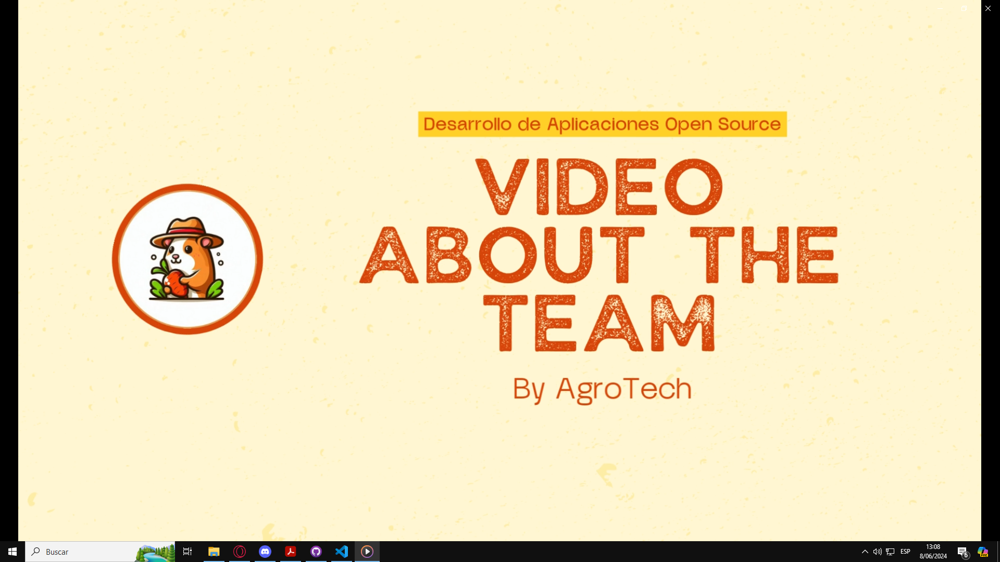

**Enlace al vídeo de YouTube:** [Video About-the-Team Youtube](https://youtu.be/Fbaa3aUjwbM)

**Enlace al vídeo de Microsoft Stream:** [Video About-The-Team Microsoft Stream](https://upcedupe-my.sharepoint.com/:v:/g/personal/u202210749_upc_edu_pe/ESc3Cl-aC29Jjx7C62HlACAB2WcFdE5CjFFBwOL6-Y2jaQ)

**Duración del vídeo:** 8:01

# Bibliografía

Aguilar, G., Bustamante, J., Bazán, V. y Falcón, N. (2011). Diagnóstico situacional de la crianza de cuyes en una zona de Cajamarca. _Revista de Investigaciones Veterinarias del Perú, 22_(1), 09-14. http://www.scielo.org.pe/scielo.php?script=sci_arttext&pid=S1609-91172011000100002&lng=es&tlng=es

Guerra, C. (2009). _Manual técnico de crianza de cuyes_. Cedepas. https://www.cedepas.org.pe/sites/default/files/manual_tecnico_de_crianza_de_cuyes.pdf

Instituto Nacional de Innovación Agraria. (23 de enero de 2023). Razas de cuyes del INIA mejoran un 20% la productividad de la crianza familiar y consumo de carne. _El Peruano_. https://www.elperuano.pe/noticia/225260-razas-de-cuyes-del-inia-mejoran-un-20-la-productividad-de-la-crianza-familiar-y-consumo-de-carne

Luque, R. (2023). _Meta Tags | Las 7 más importantes en SEO_. SEOcrawl. https://seocrawl.com/meta-tags/

Ministerio de Desarrollo Agrario y Riego. (2023). _Cadena productiva de cuyes_. https://cdn.www.gob.pe/uploads/document/file/4061856/Cadena%20productiva%20de%20cuy.pdf

SENASA. (2019). _Cajamarca es el principal productor de cuy en el Perú_. https://www.senasa.gob.pe/senasacontigo/cajamarca-es-el-principal-productor-de-cuy-en-el-peru/


# Anexos

## Anexo N°1: Gráfico de evolución de población de cuyes


_Imagen 141. Gráfico - poblacion de cuyes_

Recuperado de: https://cdn.www.gob.pe/uploads/document/file/4061856/Cadena%20productiva%20de%20cuy.pdf

## Anexo N°2: Diagrama de problemas en la crianza de cuyes


_Imagen 142. Cuadro - problemas de la crianza de cuyes_

## Anexo N°3: Web Style Guidelines

[https://www.figma.com/file/y65W2Fnk2IreDIFC3yPTAl/Open--Web-Style-Guidelines?type=design&node-id=0%3A1&mode=design&t=wpjgQEwVQwYdQHGP-1 ](https://www.figma.com/file/y65W2Fnk2IreDIFC3yPTAl/Open--Web-Style-Guidelines?type=design&node-id=0%3A1&mode=design&t=wpjgQEwVQwYdQHGP-1 )

## Anexo N°4: Video de exposiciones

Exposición del TB1: [upc-pre-202401-si729-wx52-agrotech-expo-tb1.mp4](https://upcedupe-my.sharepoint.com/:v:/g/personal/u202210749_upc_edu_pe/EZz3pjA0mJhDvymuSBI8WywBb2DCa7RrK25a5osiHJz_zw?e=aeuDy3)

Exposición del TP: [upc-pre-202401-si729-wx52-agrotech-expo-tp1.mp4](https://upcedupe-my.sharepoint.com/:v:/g/personal/u202210749_upc_edu_pe/EcuWnAtFFa5Aseqn8_glQZwBhxi1acBsSWeR7ko-zFCT3g?e=yVgPhv)

Exposición del TB2: [upc-pre-202401-si729-wx52-agrotech-expo-tb2.mp4](https://upcedupe-my.sharepoint.com/:v:/g/personal/u202210749_upc_edu_pe/ES9uwdm_9EVLuGhG0Eq8vr4BtDQAMua3VUAgJa6rG9_aDg?e=lp8w4q)

Exposición del TF: [upc-pre-202401-si729-wx52-agrotech-expo-tf.mp4](https://upcedupe-my.sharepoint.com/:v:/g/personal/u202210749_upc_edu_pe/Ecy-E60f3tFJtB1LQq7OyXkB9GsLixigLJtHB-0MmL9AUQ?nav=eyJyZWZlcnJhbEluZm8iOnsicmVmZXJyYWxBcHAiOiJPbmVEcml2ZUZvckJ1c2luZXNzIiwicmVmZXJyYWxBcHBQbGF0Zm9ybSI6IldlYiIsInJlZmVycmFsTW9kZSI6InZpZXciLCJyZWZlcnJhbFZpZXciOiJNeUZpbGVzTGlua0NvcHkifX0&e=iDRpwM)

## Anexo N°5: Prototipo de la aplicación web
Enlace del prototipo en figma: [https://www.figma.com/proto/y65W2Fnk2IreDIFC3yPTAl/Open--Web-Style-Guidelines?type=design&node-id=296-1548&t=75RhDMIrAZo5uqGx-1&scaling=contain&page-id=112%3A67&starting-point-node-id=296%3A1548](https://www.figma.com/proto/y65W2Fnk2IreDIFC3yPTAl/Open--Web-Style-Guidelines?type=design&node-id=296-1548&t=75RhDMIrAZo5uqGx-1&scaling=contain&page-id=112%3A67&starting-point-node-id=296%3A1548)

## Anexo N°6: Explicación del prototipo
Enlace: [Explicación del prototipo](https://youtu.be/lTo_Pz0j2vc)
